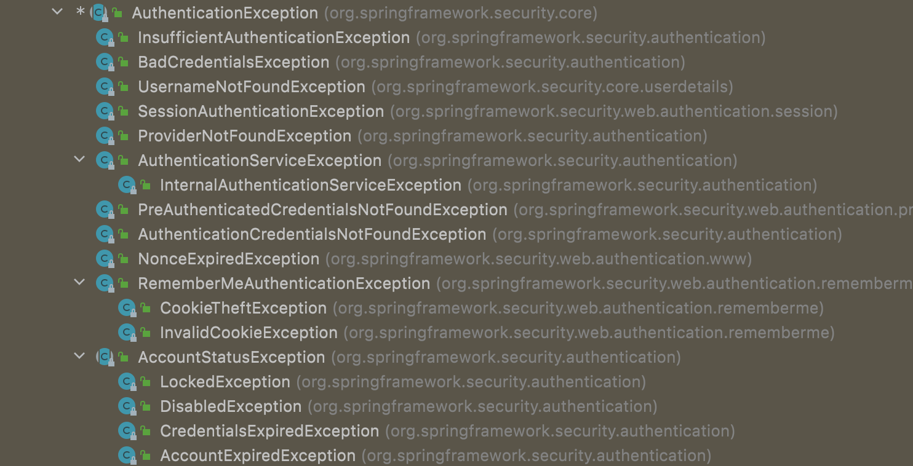
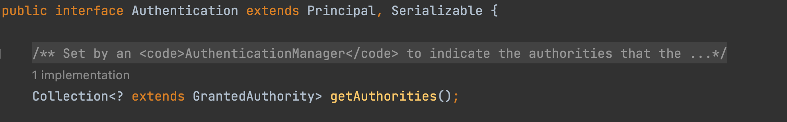
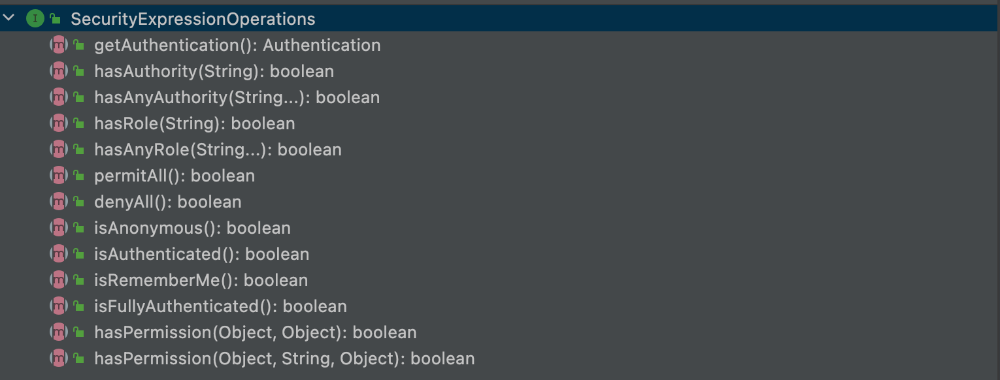
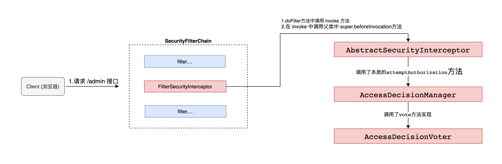

# 异常处理

- Spring Security 异常体系
- 自定义异常配置

### 异常体系

Spring Security 中异常主要分为两大类:

- AuthenticationException:  认证异常
- AccessDeniedException:    授权异常

其中认证所涉及异常类型比较多，默认提供的异常类型如下：



相比于认证异常，权限异常类就要少了很多，默认提供的权限异常如下：


在实际项目开发中，如果默认提供异常无法满足需求时，就需要根据实际需要来自定义异常类。

### 自定义异常处理配置

```java
@Configuration
public class SecurityConfig extends WebSecurityConfigurerAdapter {
    @Override
    protected void configure(HttpSecurity http) throws Exception {
        http.authorizeRequests().anyRequest()
                .authenticated()
          			//.....
                .and()
                .exceptionHandling()//异常处理
                .authenticationEntryPoint((request, response, e) -> {
                  response.setContentType("application/json;charset=UTF-8");
                  response.setStatus(HttpStatus.UNAUTHORIZED.value());
                  response.getWriter().write("尚未认证，请进行认证操作！");
                })
                .accessDeniedHandler((request, response, e) -> {
                  response.setContentType("application/json;charset=UTF-8");
                  response.setStatus(HttpStatus.FORBIDDEN.value());
                  response.getWriter().write("无权访问!");
                });
    }
}
```

# 第十一章 授权

- 什么是权限管理
- 权限管理核心概念
- Spring Security 权限管理策略
- 基于 URL 地址的权限管理
- 基于方法的权限管理
- 实战

### 权限管理

#### 认证

**`身份认证`**，就是判断一个用户是否为合法用户的处理过程。Spring Security 中支持多种不同方式的认证，但是无论开发者使用那种方式认证，都不会影响授权功能使用。因为 Spring Security 很好做到了认证和授权解耦。

#### 授权

**`授权`**，即访问控制，控制谁能访问哪些资源。简单的理解授权就是根据系统提前设置好的规则，给用户分配可以访问某一个资源的权限，用户根据自己所具有权限，去执行相应操作。

### 授权核心概念

在前面学习认证过程中，我们得知认证成功之后会将当前登录用户信息保存到 Authentication 对象中，Authentication 对象中有一个 getAuthorities() 方法，用来返回当前登录用户具备的权限信息，也就是当前用户具有权限信息。该方法的返回值为 Collection<? extends GrantedAuthority>，当需要进行权限判断时，就回根据集合返回权限信息调用相应方法进行判断。



那么问题来了，针对于这个返回值 GrantedAuthority 应该如何理解呢? 是角色还是权限?

我们针对于授权可以是`基于角色权限管理`和`基于资源权限管理` ，从设计层面上来说，角色和权限是两个完全不同的东西：权限是一些具体操作，角色则是某些权限集合。如：READ_BOOK 和 ROLE_ADMIN 是完全不同的。因此至于返回值是什么取决于你的业务设计情况：

- 基于角色权限设计就是: `用户<=>角色<=>资源` 三者关系 返回就是用户的`角色` 

- 基于资源权限设计就是: `用户<=>权限<=>资源` 三者关系 返回就是用户的`权限` 

- 基于角色和资源权限设计就是: `用户<=>角色<=>权限<=>资源` 返回统称为用户的`权限`

为什么可以统称为权限，因为从代码层面角色和权限没有太大不同都是权限，特别是在 Spring Security 中，角色和权限处理方式基本上都是一样的。唯一区别 SpringSecurity 在很多时候会自动给角色添加一个`ROLE_`前缀，而权限则不会自动添加。

### 权限管理策略

Spring Security 中提供的权限管理策略主要有两种类型:

- 基于过滤器(URL)的权限管理 (FilterSecurityInterceptor)
  - 基于过滤器的权限管理主要是用来拦截 HTTP 请求，拦截下来之后，根据 HTTP 请求地址进行权限校验。

- 基于 AOP (方法)的权限管理   (MethodSecurityInterceptor)
  - 基于 AOP 权限管理主要是用来处理方法级别的权限问题。当需要调用某一个方法时，通过 AOP 将操作拦截下来，然后判断用户是否具备相关的权限。


### 基于 URL 权限管理

- 开发 controller

```java
@RestController
public class DemoController {

    @GetMapping("/admin")
    public String admin() {
        return "admin ok";
    }

    @GetMapping("/user")
    public String user() {
        return "user ok";
    }

    @GetMapping("/getInfo")
    public String getInfo() {
        return "info ok";
    }
}
```

- 配置授权

```java
package com.blr.config;

import org.springframework.context.annotation.Configuration;
import org.springframework.security.config.annotation.authentication.builders.AuthenticationManagerBuilder;
import org.springframework.security.config.annotation.web.builders.HttpSecurity;
import org.springframework.security.config.annotation.web.configuration.WebSecurityConfigurerAdapter;
import org.springframework.security.core.userdetails.User;
import org.springframework.security.core.userdetails.UserDetailsService;
import org.springframework.security.provisioning.InMemoryUserDetailsManager;

@Configuration
public class SecurityConfig extends WebSecurityConfigurerAdapter {


    //创建内存数据源
    public UserDetailsService userDetailsService() {
        InMemoryUserDetailsManager inMemoryUserDetailsManager = new InMemoryUserDetailsManager();
        inMemoryUserDetailsManager.createUser(User.withUsername("root").password("{noop}123").roles("ADMIN").build());
        inMemoryUserDetailsManager.createUser(User.withUsername("win7").password("{noop}123").roles("USER").build());
        inMemoryUserDetailsManager.createUser(User.withUsername("lisi").password("{noop}123").roles("READ_BOOK").build());
        return inMemoryUserDetailsManager;
    }

    @Override
    protected void configure(AuthenticationManagerBuilder auth) throws Exception {
        auth.userDetailsService(userDetailsService());
    }

    @Override
    protected void configure(HttpSecurity http) throws Exception {
        http.authorizeHttpRequests()
                .antMatchers("/admin/**").hasRole("ADMIN")
                .antMatchers("/user/**").hasAnyRole("USER", "ADMIN")
                .antMatchers("/getInfo").hasRole("READ_BOOK")
                .anyRequest().authenticated()
                .and().formLogin()
                .and().csrf().disable();
    }
}
```

- 启动项目测试

#### 权限表达式



| 方法                                                         | 说明                                                        |
| ------------------------------------------------------------ | ----------------------------------------------------------- |
| hasAuthority(String authority)                               | 当前用户是否具备指定权限                                    |
| hasAnyAuthority(String... authorities)                       | 当前用户是否具备指定权限中任意一个                          |
| hasRole(String role)                                         | 当前用户是否具备指定角色                                    |
| hasAnyRole(String... roles);                                 | 当前用户是否具备指定角色中任意一个                          |
| permitAll();                                                 | 放行所有请求/调用                                           |
| denyAll();                                                   | 拒绝所有请求/调用                                           |
| isAnonymous();                                               | 当前用户是否是一个匿名用户                                  |
| isAuthenticated();                                           | 当前用户是否已经认证成功                                    |
| isRememberMe();                                              | 当前用户是否通过 Remember-Me 自动登录                       |
| isFullyAuthenticated();                                      | 当前用户是否既不是匿名用户又不是通过 Remember-Me 自动登录的 |
| hasPermission(Object targetId, Object permission);           | 当前用户是否具备指定目标的指定权限信息                      |
| hasPermission(Object targetId, String targetType, Object permission); | 当前用户是否具备指定目标的指定权限信息                      |

### 基于 方法 权限管理

基于方法的权限管理主要是通过 A0P 来实现的，Spring Security 中通过 MethodSecurityInterceptor 来提供相关的实现。不同在于 FilterSecurityInterceptor 只是在请求之前进行前置处理，MethodSecurityInterceptor 除了前置处理之外还可以进行后置处理。前置处理就是在请求之前判断是否具备相应的权限，后置处理则是对方法的执行结果进行二次过滤。前置处理和后置处理分别对应了不同的实现类。

#### @EnableGlobalMethodSecurity 

EnableGlobalMethodSecurity 该注解是用来开启权限注解，用法如下：

```java
@Configuration
@EnableGlobalMethodSecurity(prePostEnabled=true,securedEnabled=true, jsr250Enabled=true)
public class SecurityConfig extends WebsecurityConfigurerAdapter{}
```

- **perPostEnabled**: 开启 Spring Security 提供的四个权限注解，@PostAuthorize、@PostFilter、@PreAuthorize 以及@PreFilter。
- **securedEnabled**: 开启 Spring Security 提供的 @Secured 注解支持，该注解不支持权限表达式
- **jsr250Enabled**: 开启 JSR-250 提供的注解，主要是@DenyAll、@PermitAll、@RolesAll 同样这些注解也不支持权限表达式

```markdown
# 以上注解含义如下:
- @PostAuthorize： 在目前标方法执行之后进行权限校验。
- @PostFiter： 在目标方法执行之后对方法的返回结果进行过滤。
- @PreAuthorize：在目标方法执行之前进行权限校验。
- @PreFiter：在目前标方法执行之前对方法参数进行过滤。
- @Secured：访问目标方法必须具各相应的角色。
- @DenyAll：拒绝所有访问。
- @PermitAll：允许所有访问。
- @RolesAllowed：访问目标方法必须具备相应的角色。
```

这些基于方法的权限管理相关的注解，一般来说只要设置 **`prePostEnabled=true`** 就够用了。

#### 基本用法

- 开启注解使用

```java
@Configuration
@EnableGlobalMethodSecurity(prePostEnabled=true,securedEnabled=true, jsr250Enabled=true)
public class SecurityConfig extends WebsecurityConfigurerAdapter{}
```

- 使用注解

```java
@RestController
@RequestMapping("/hello")
public class AuthorizeMethodController {

    @PreAuthorize("hasRole('ADMIN') and authentication.name=='root'")
    @GetMapping
    public String hello() {
        return "hello";
    }

    @PreAuthorize("authentication.name==#name")
    @GetMapping("/name")
    public String hello(String name) {
        return "hello:" + name;
    }

    @PreFilter(value = "filterObject.id%2!=0",filterTarget = "users")
    @PostMapping("/users")  //filterTarget 必须是 数组  集合
    public void addUsers(@RequestBody List<User> users) {
        System.out.println("users = " + users);
    }

    @PostAuthorize("returnObject.id==1")
    @GetMapping("/userId")
    public User getUserById(Integer id) {
        return new User(id, "blr");
    }

    @PostFilter("filterObject.id%2==0")
    @GetMapping("/lists")
    public List<User> getAll() {
        List<User> users = new ArrayList<>();
        for (int i = 0; i < 10; i++) {
            users.add(new User(i, "blr:" + i));
        }
        return users;
    }

    @Secured({"ROLE_USER"}) //只能判断角色
    @GetMapping("/secured")
    public User getUserByUsername() {
        return new User(99, "secured");
    }

    @Secured({"ROLE_ADMIN","ROLE_USER"}) //具有其中一个即可
    @GetMapping("/username")
    public User getUserByUsername2(String username) {
        return new User(99, username);
    }

    @PermitAll
    @GetMapping("/permitAll")
    public String permitAll() {
        return "PermitAll";
    }

    @DenyAll
    @GetMapping("/denyAll")
    public String denyAll() {
        return "DenyAll";
    }

    @RolesAllowed({"ROLE_ADMIN","ROLE_USER"}) //具有其中一个角色即可
    @GetMapping("/rolesAllowed")
    public String rolesAllowed() {
        return "RolesAllowed";
    }
}
```

## 原理分析



- **`ConfigAttribute`** 在 Spring Security 中，用户请求一个资源(通常是一个接口或者一个 Java 方法)需要的角色会被封装成一个 ConfigAttribute 对象，在 ConfigAttribute 中只有一个 getAttribute方法，该方法返回一个 String 字符串，就是角色的名称。一般来说，角色名称都带有一个 `ROLE_` 前缀，投票器 AccessDecisionVoter 所做的事情，其实就是比较用户所具各的角色和请求某个资源所需的 ConfigAtuibute 之间的关系。
- **`AccesDecisionVoter 和 AccessDecisionManager`** 都有众多的实现类，在 AccessDecisionManager 中会换个遍历 AccessDecisionVoter，进而决定是否允许用户访问，因而 AaccesDecisionVoter 和 AccessDecisionManager 两者的关系类似于 AuthenticationProvider 和 ProviderManager 的关系。


## 实战

在前面的案例中，我们配置的 URL 拦截规则和请求 URL 所需要的权限都是通过代码来配置的，这样就比较死板，如果想要调整访问某一个 URL 所需要的权限，就需要修改代码。

动态管理权限规则就是我们将 URL 拦截规则和访问 URI 所需要的权限都保存在数据库中，这样，在不修改源代码的情况下，只需要修改数据库中的数据，就可以对权限进行调整。

`用户<--中间表--> 角色 <--中间表--> 菜单`

### 库表设计

```sql
SET NAMES utf8mb4;
SET FOREIGN_KEY_CHECKS = 0;
-- ----------------------------
-- Table structure for menu
-- ----------------------------
DROP TABLE IF EXISTS `menu`;
CREATE TABLE `menu` (
  `id` int(11) NOT NULL AUTO_INCREMENT,
  `pattern` varchar(128) DEFAULT NULL,
  PRIMARY KEY (`id`)
) ENGINE=InnoDB AUTO_INCREMENT=4 DEFAULT CHARSET=utf8;

-- ----------------------------
-- Records of menu
-- ----------------------------
BEGIN;
INSERT INTO `menu` VALUES (1, '/admin/**');
INSERT INTO `menu` VALUES (2, '/user/**');
INSERT INTO `menu` VALUES (3, '/guest/**');
COMMIT;

-- ----------------------------
-- Table structure for menu_role
-- ----------------------------
DROP TABLE IF EXISTS `menu_role`;
CREATE TABLE `menu_role` (
  `id` int(11) NOT NULL AUTO_INCREMENT,
  `mid` int(11) DEFAULT NULL,
  `rid` int(11) DEFAULT NULL,
  PRIMARY KEY (`id`),
  KEY `mid` (`mid`),
  KEY `rid` (`rid`),
  CONSTRAINT `menu_role_ibfk_1` FOREIGN KEY (`mid`) REFERENCES `menu` (`id`),
  CONSTRAINT `menu_role_ibfk_2` FOREIGN KEY (`rid`) REFERENCES `role` (`id`)
) ENGINE=InnoDB AUTO_INCREMENT=5 DEFAULT CHARSET=utf8;

-- ----------------------------
-- Records of menu_role
-- ----------------------------
BEGIN;
INSERT INTO `menu_role` VALUES (1, 1, 1);
INSERT INTO `menu_role` VALUES (2, 2, 2);
INSERT INTO `menu_role` VALUES (3, 3, 3);
INSERT INTO `menu_role` VALUES (4, 3, 2);
COMMIT;

-- ----------------------------
-- Table structure for role
-- ----------------------------
DROP TABLE IF EXISTS `role`;
CREATE TABLE `role` (
  `id` int(11) NOT NULL AUTO_INCREMENT,
  `name` varchar(32) DEFAULT NULL,
  `nameZh` varchar(32) DEFAULT NULL,
  PRIMARY KEY (`id`)
) ENGINE=InnoDB AUTO_INCREMENT=4 DEFAULT CHARSET=utf8;

-- ----------------------------
-- Records of role
-- ----------------------------
BEGIN;
INSERT INTO `role` VALUES (1, 'ROLE_ADMIN', '系统管理员');
INSERT INTO `role` VALUES (2, 'ROLE_USER', '普通用户');
INSERT INTO `role` VALUES (3, 'ROLE_GUEST', '游客');
COMMIT;

-- ----------------------------
-- Table structure for user
-- ----------------------------
DROP TABLE IF EXISTS `user`;
CREATE TABLE `user` (
  `id` int(11) NOT NULL AUTO_INCREMENT,
  `username` varchar(32) DEFAULT NULL,
  `password` varchar(255) DEFAULT NULL,
  `enabled` tinyint(1) DEFAULT NULL,
  `locked` tinyint(1) DEFAULT NULL,
  PRIMARY KEY (`id`)
) ENGINE=InnoDB AUTO_INCREMENT=4 DEFAULT CHARSET=utf8;

-- ----------------------------
-- Records of user
-- ----------------------------
BEGIN;
INSERT INTO `user` VALUES (1, 'admin', '{noop}123', 1, 0);
INSERT INTO `user` VALUES (2, 'user', '{noop}123', 1, 0);
INSERT INTO `user` VALUES (3, 'blr', '{noop}123', 1, 0);
COMMIT;

-- ----------------------------
-- Table structure for user_role
-- ----------------------------
DROP TABLE IF EXISTS `user_role`;
CREATE TABLE `user_role` (
  `id` int(11) NOT NULL AUTO_INCREMENT,
  `uid` int(11) DEFAULT NULL,
  `rid` int(11) DEFAULT NULL,
  PRIMARY KEY (`id`),
  KEY `uid` (`uid`),
  KEY `rid` (`rid`),
  CONSTRAINT `user_role_ibfk_1` FOREIGN KEY (`uid`) REFERENCES `user` (`id`),
  CONSTRAINT `user_role_ibfk_2` FOREIGN KEY (`rid`) REFERENCES `role` (`id`)
) ENGINE=InnoDB AUTO_INCREMENT=5 DEFAULT CHARSET=utf8;

-- ----------------------------
-- Records of user_role
-- ----------------------------
BEGIN;
INSERT INTO `user_role` VALUES (1, 1, 1);
INSERT INTO `user_role` VALUES (2, 1, 2);
INSERT INTO `user_role` VALUES (3, 2, 2);
INSERT INTO `user_role` VALUES (4, 3, 3);
COMMIT;
SET FOREIGN_KEY_CHECKS = 1;
```

### 创建 springboot 应用

- 引入依赖

  ```xml
  <dependency>
    <groupId>org.springframework.boot</groupId>
    <artifactId>spring-boot-starter-security</artifactId>
  </dependency>
  <dependency>
    <groupId>org.springframework.boot</groupId>
    <artifactId>spring-boot-starter-web</artifactId>
  </dependency>
  
  <dependency>
    <groupId>mysql</groupId>
    <artifactId>mysql-connector-java</artifactId>
    <version>5.1.38</version>
  </dependency>
  <dependency>
    <groupId>com.alibaba</groupId>
    <artifactId>druid</artifactId>
    <version>1.2.8</version>
  </dependency>
  <dependency>
    <groupId>org.mybatis.spring.boot</groupId>
    <artifactId>mybatis-spring-boot-starter</artifactId>
    <version>2.2.2</version>
  </dependency>
  ```

- 配置配置文件

  ```properties
  server.port=8080
  spring.datasource.type=com.alibaba.druid.pool.DruidDataSource
  spring.datasource.driver-class-name=com.mysql.jdbc.Driver
  spring.datasource.url=jdbc:mysql://localhost:3306/security?characterEncoding=UTF-8
  spring.datasource.username=root
  spring.datasource.password=root
  mybatis.mapper-locations=classpath:com/blr/mapper/*.xml
  mybatis.type-aliases-package=com.blr.entity
  ```

- 创建实体类

  ```java
  public class User implements UserDetails {
      private Integer id;
      private String password;
      private String username;
      private boolean enabled;
      private boolean locked;
      private List<Role> roles;
  
      @Override
      public Collection<? extends GrantedAuthority> getAuthorities() {
          return roles.stream().map(r -> new SimpleGrantedAuthority(r.getName())).collect(Collectors.toList());
      }
  
      @Override
      public String getPassword() {
          return password;
      }
  
      @Override
      public String getUsername() {
          return username;
      }
  
      @Override
      public boolean isAccountNonExpired() {
          return true;
      }
  
      @Override
      public boolean isAccountNonLocked() {
          return !locked;
      }
  
      @Override
      public boolean isCredentialsNonExpired() {
          return true;
      }
  
      @Override
      public boolean isEnabled() {
          return enabled;
      }
  
      public void setId(Integer id) {
          this.id = id;
      }
  
      public void setPassword(String password) {
          this.password = password;
      }
  
      public void setUsername(String username) {
          this.username = username;
      }
  
      public void setEnabled(boolean enabled) {
          this.enabled = enabled;
      }
  
      public void setLocked(boolean locked) {
          this.locked = locked;
      }
  
      public void setRoles(List<Role> roles) {
          this.roles = roles;
      }
  
      public Integer getId() {
          return id;
      }
  
      public List<Role> getRoles() {
          return roles;
      }
  }
  ```

  ```java
  public class Role {
      private Integer id;
      private String name;
      private String nameZh;
  
      public Integer getId() {
          return id;
      }
  
      public void setId(Integer id) {
          this.id = id;
      }
  
      public String getName() {
          return name;
      }
  
      public void setName(String name) {
          this.name = name;
      }
  
      public String getNameZh() {
          return nameZh;
      }
  
      public void setNameZh(String nameZh) {
          this.nameZh = nameZh;
      }
  }
  ```

  ```java
  public class Menu {
      private Integer id;
      private String pattern;
      private List<Role> roles;
  
      public List<Role> getRoles() {
          return roles;
      }
  
      public void setRoles(List<Role> roles) {
          this.roles = roles;
      }
  
      public Integer getId() {
          return id;
      }
  
      public void setId(Integer id) {
          this.id = id;
      }
  
      public String getPattern() {
          return pattern;
      }
  
      public void setPattern(String pattern) {
          this.pattern = pattern;
      }
  }
  ```

- 创建 mapper 接口

  ```java
  @Mapper
  public interface UserMapper {
      List<Role> getUserRoleByUid(Integer uid);
      User loadUserByUsername(String username);
  }
  ```

  ```java
  @Mapper
  public interface MenuMapper {
      List<Menu> getAllMenu();
  }
  ```

- 创建 mapper 文件

  ```xml
  <!DOCTYPE mapper
          PUBLIC "-//mybatis.org//DTD Mapper 3.0//EN"
          "http://mybatis.org/dtd/mybatis-3-mapper.dtd">
  <mapper namespace="com.blr.mapper.UserMapper">
  
      <select id="loadUserByUsername" resultType="com.blr.entity.User">
          select *
          from user
          where username = #{username};
      </select>
  
      <select id="getUserRoleByUid" resultType="com.blr.entity.Role">
          select r.*
          from role r,
               user_role ur
          where ur.uid = #{uid}
            and ur.rid = r.id
      </select>
  </mapper>
  ```

  ```xml
  <mapper namespace="com.blr.mapper.MenuMapper">
      <resultMap id="MenuResultMap" type="com.blr.entity.Menu">
          <id property="id" column="id"/>
          <result property="pattern" column="pattern"></result>
          <collection property="roles" ofType="com.blr.entity.Role">
              <id column="rid" property="id"/>
              <result column="rname" property="name"/>
              <result column="rnameZh" property="nameZh"/>
          </collection>
      </resultMap>
    
      <select id="getAllMenu" resultMap="MenuResultMap">
          select m.*, r.id as rid, r.name as rname, r.nameZh as rnameZh
          from menu m
                   left join menu_role mr on m.`id` = mr.`mid`
                   left join role r on r.`id` = mr.`rid`
      </select>
  </mapper>
  ```

- 创建 service 接口

  ```java
  @Service
  public class UserService implements UserDetailsService {
      private final UserMapper userMapper;
  
      @Autowired
      public UserService(UserMapper userMapper) {
          this.userMapper = userMapper;
      }
  
      @Override
      public UserDetails loadUserByUsername(String username) throws UsernameNotFoundException {
          User user = userMapper.loadUserByUsername(username);
          if (user == null) {
              throw new UsernameNotFoundException("用户不存在");
          }
          user.setRoles(userMapper.getUserRoleByUid(user.getId()));
          return user;
      }
  }
  ```

  ```java
  @Service
  public class MenuService {
      private final MenuMapper menuMapper;
  
      @Autowired
      public MenuService(MenuMapper menuMapper) {
          this.menuMapper = menuMapper;
      }
  
      public List<Menu> getAllMenu() {
          return menuMapper.getAllMenu();
      }
  }
  ```

- 创建测试 controller

  ```java
  @RestController
  public class HelloController {
      @GetMapping("/admin/hello")
      public String admin() {
          return "hello admin";
      }
  
      @GetMapping("/user/hello")
      public String user() {
          return "hello user";
      }
  
      @GetMapping("/guest/hello")
      public String guest() {
          return "hello guest";
      }
  
      @GetMapping("/hello")
      public String hello() {
          return "hello";
      }
  }
  ```

- 创建 CustomSecurityMetadataSource

  ```java
  @Component
  public class CustomSecurityMetadataSource implements FilterInvocationSecurityMetadataSource {
      private final MenuService menuService;
  
      @Autowired
      public CustomSecurityMetadataSource(MenuService menuService) {
          this.menuService = menuService;
      }
  
      AntPathMatcher antPathMatcher = new AntPathMatcher();
  
      @Override
      public Collection<ConfigAttribute> getAttributes(Object object) throws IllegalArgumentException {
          String requestURI = ((FilterInvocation) object).getRequest().getRequestURI();
          List<Menu> allMenu = menuService.getAllMenu();
          for (Menu menu : allMenu) {
              if (antPathMatcher.match(menu.getPattern(), requestURI)) {
                  String[] roles = menu.getRoles().stream().map(r -> r.getName()).toArray(String[]::new);
                  return SecurityConfig.createList(roles);
              }
          }
          return null;
      }
  
      @Override
      public Collection<ConfigAttribute> getAllConfigAttributes() {
          return null;
      }
  
      @Override
      public boolean supports(Class<?> clazz) {
          return FilterInvocation.class.isAssignableFrom(clazz);
      }
  }
  ```

- 配置 Security 配置

  ```java
  @Configuration
  public class SecurityConfig extends WebSecurityConfigurerAdapter {
      private final CustomSecurityMetadataSource customSecurityMetadataSource;
      private final UserService userService;
  
      @Autowired
      public SecurityConfig(CustomSecurityMetadataSource customSecurityMetadataSource, UserService userService) {
          this.customSecurityMetadataSource = customSecurityMetadataSource;
          this.userService = userService;
      }
  
      @Override
      protected void configure(AuthenticationManagerBuilder auth) throws Exception {
          auth.userDetailsService(userService);
      }
  
      @Override
      protected void configure(HttpSecurity http) throws Exception {
          ApplicationContext applicationContext = http.getSharedObject(ApplicationContext.class);
          http.apply(new UrlAuthorizationConfigurer<>(applicationContext))
                  .withObjectPostProcessor(new ObjectPostProcessor<FilterSecurityInterceptor>() {
                      @Override
                      public <O extends FilterSecurityInterceptor> O postProcess(O object) {
                          object.setSecurityMetadataSource(customSecurityMetadataSource);
                          object.setRejectPublicInvocations(true);
                          return object;
                      }
                  });
          http.formLogin()
                  .and()
                  .csrf().disable();
      }
  }
  ```

- 启动入口类进行测试