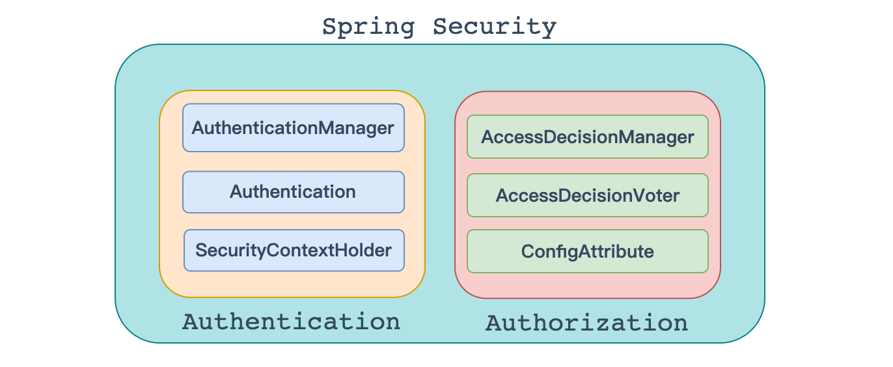
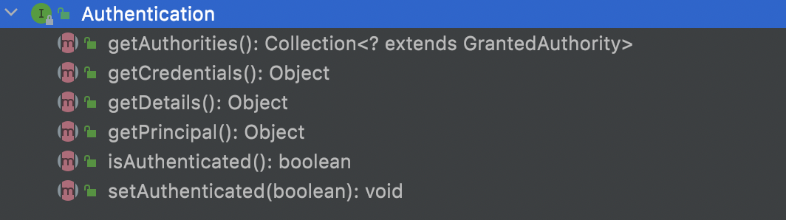

# 权限管理

---

基本上涉及到用户参与的系统都要进行权限管理，权限管理属于系统安全的范畴，权限管理实现`对用户访问系统的控制`，按照`安全规则`或者`安全策略`控制用户`可以访问而且只能访问自己被授权的资源`。

权限管理包括用户**身份认证**和**授权**两部分，简称**认证授权**。对于需要访问控制的资源用户首先经过身份认证，认证通过后用户具有该资源的访问权限方可访问。

### 认证

**`身份认证`**，就是判断一个用户是否为合法用户的处理过程。最常用的简单身份认证方式是系统通过核对用户输入的用户名和口令，看其是否与系统中存储的该用户的用户名和口令一致，来判断用户身份是否正确。对于采用[指纹](http://baike.baidu.com/view/5628.htm)等系统，则出示指纹；对于硬件Key等刷卡系统，则需要刷卡。

### 授权

**`授权`**，即访问控制，控制谁能访问哪些资源。主体进行身份认证后需要分配权限方可访问系统的资源，对于某些资源没有权限是无法访问的

### 解决方案

和其他领域不同，在 Java 企业级开发中，安全管理框架非常少，目前比较常见的就是：

- Shiro
  - Shiro 本身是一个老牌的安全管理框架，有着众多的优点，例如轻量、简单、易于集成、可以在JavaSE环境中使用等。不过，在微服务时代，Shiro 就显得力不从心了，在微服务面前和扩展方面，无法充分展示自己的优势。
- 开发者自定义
  - 也有很多公司选择自定义权限，即自己开发权限管理。但是一个系统的安全，不仅仅是登录和权限控制这么简单，我们还要考虑种各样可能存在的网络政击以及防彻策略，从这个角度来说，开发者白己实现安全管理也并非是一件容易的事情，只有大公司才有足够的人力物力去支持这件事情。
- Spring Security
  - Spring Security,作为spring 家族的一员，在和 Spring 家族的其他成员如 Spring Boot Spring Clond等进行整合时，具有其他框架无可比拟的优势，同时对 OAuth2 有着良好的支持，再加上Spring Cloud对 Spring Security的不断加持（如推出 Spring Cloud Security )，让 Spring Securiy 不知不觉中成为微服务项目的首选安全管理方案。

## 简介

### 官方定义

- https://spring.io/projects/spring-security

Spring Security is a powerful and highly customizable authentication and access-control framework. It is the de-facto standard for securing Spring-based applications.

Spring Security is a framework that focuses on providing both authentication and authorization to Java applications. Like all Spring projects, the real power of Spring Security is found in how easily it can be extended to meet custom requirements

Spring Security是一个功能强大、可高度定制的身份验证和访问控制框架。它是保护基于Spring的应用程序的事实标准。

Spring Security是一个面向Java应用程序提供身份验证和安全性的框架。与所有Spring项目一样，Spring Security的真正威力在于它可以轻松地扩展以满足定制需求。

- 总结

> Spring Security是一个功能强大、可高度定制的`身份验证`和`访问控制`的框架。或者说用来实现系统中权限管理的框架。

### 历史

Spring Security 最早叫 Acegi Security， 这个名称并不是说它和 Spring 就没有关系，它依然是为Spring 框架提供安全支持的。Acegi Security 基于 Spring，可以帮助我们为项目建立丰富的角色与权限管理系统。Acegi security 虽然好用，但是最为人诟病的则是它臃肿烦琐的配置这一问题最终也遗传给了 Spring Security。

​	Acegi Security 最终被并入 Spring Security 项目中，并于 2008 年4月发布了改名后的第一个版本 Spring Security 2.0.0，到目前为止，Spring Security 的最新版本己经到了 5.6.1。和 Shiro 相比，Spring Security重量级并且配置烦琐，直至今天，依然有人以此为理由而拒绝了解 Spring Security。其实，自从 Spring Boot 推出后，就彻底颠覆了传统了 JavaEE 开发，自动化配置让许多事情变得非常容易，包括 Spring Security 的配置。在一个 Spring Boot 项目中，我们甚至只需要引入一个依赖，不需要任何额外配置，项目的所有接口就会被自动保护起来了。在 Spring Cloud中，很多涉及安全管理的问题，也是一个 Spring Security 依赖两行配置就能搞定，在和 Spring 家族的产品一起使用时，Spring Security 的优势就非常明显了。

​	因此，在微服务时代，我们不需要纠结要不要学习 Spring Security，我们要考虑的是如何快速掌握Spring Security， 并且能够使用 Spring Security 实现我们微服务的安全管理。

## 整体架构

在<Spring Security>的架构设计中，**`认证`**<Authentication>和**`授权`** <Authorization>是分开的，无论使用什么样的认证方式。都不会影响授权，这是两个独立的存在，这种独立带来的好处之一，就是可以非常方便地整合一些外部的解决方案。



### 认证

#### AuthenticationManager

在Spring Security中认证是由`AuthenticationManager`接口来负责的，接口定义为：


```java
public interface AuthenticationManager { 
	Authentication authenticate(Authentication authentication) 
  														throws AuthenticationException;
}
```

- 返回 Authentication 表示认证成功
- 返回 AuthenticationException 异常，表示认证失败。

AuthenticationManager 主要实现类为 ProviderManager，在 ProviderManager 中管理了众多 AuthenticationProvider 实例。在一次完整的认证流程中，Spring Security 允许存在多个 AuthenticationProvider ，用来实现多种认证方式，这些 AuthenticationProvider 都是由 ProviderManager 进行统一管理的。


#### Authentication

认证以及认证成功的信息主要是由 Authentication 的实现类进行保存的，其接口定义为：



```java
public interface Authentication extends Principal, Serializable {
	Collection<? extends GrantedAuthority> getAuthorities();
	Object getCredentials();
	Object getDetails();
	Object getPrincipal();
	boolean isAuthenticated();
	void setAuthenticated(boolean isAuthenticated) throws IllegalArgumentException;
}
```

- getAuthorities 	 获取用户权限信息
- getCredentials 	获取用户凭证信息，一般指密码
- getDetails 			 获取用户详细信息
- getPrincipal 		 获取用户身份信息，用户名、用户对象等
- isAuthenticated   用户是否认证成功

#### SecurityContextHolder

SecurityContextHolder 用来获取登录之后用户信息。Spring Security 会将登录用户数据保存在 Session 中。但是，为了使用方便,Spring Security在此基础上还做了一些改进，其中最主要的一个变化就是线程绑定。当用户登录成功后,Spring Security 会将登录成功的用户信息保存到 SecurityContextHolder 中。SecurityContextHolder 中的数据保存默认是通过ThreadLocal 来实现的，使用 ThreadLocal 创建的变量只能被当前线程访问，不能被其他线程访问和修改，也就是用户数据和请求线程绑定在一起。当登录请求处理完毕后，Spring Security 会将 SecurityContextHolder 中的数据拿出来保存到 Session 中，同时将 SecurityContexHolder 中的数据清空。以后每当有请求到来时，Spring Security 就会先从 Session 中取出用户登录数据，保存到 SecurityContextHolder 中，方便在该请求的后续处理过程中使用，同时在请求结束时将 SecurityContextHolder 中的数据拿出来保存到 Session 中，然后将 Security SecurityContextHolder 中的数据清空。这一策略非常方便用户在 Controller、Service 层以及任何代码中获取当前登录用户数据。

### 授权

当完成认证后，接下来就是授权了。在 Spring Security 的授权体系中，有两个关键接口，

#### AccessDecisionManager

>  AccessDecisionManager (访问决策管理器)，用来决定此次访问是否被允许。


#### AccessDecisionVoter

> AccessDecisionVoter (访问决定投票器)，投票器会检查用户是否具备应有的角色，进而投出赞成、反对或者弃权票。


AccesDecisionVoter 和 AccessDecisionManager 都有众多的实现类，在 AccessDecisionManager 中会换个遍历 AccessDecisionVoter，进而决定是否允许用户访问，因而 AaccesDecisionVoter 和 AccessDecisionManager 两者的关系类似于 AuthenticationProvider 和 ProviderManager 的关系。

#### ConfigAttribute

> ConfigAttribute，用来保存授权时的角色信息


在 Spring Security 中，用户请求一个资源(通常是一个接口或者一个 Java 方法)需要的角色会被封装成一个 ConfigAttribute 对象，在 ConfigAttribute 中只有一个 getAttribute方法，该方法返回一个 String 字符串，就是角色的名称。一般来说，角色名称都带有一个 `ROLE_` 前缀，投票器 AccessDecisionVoter 所做的事情，其实就是比较用户所具各的角色和请求某个
资源所需的 ConfigAtuibute 之间的关系。