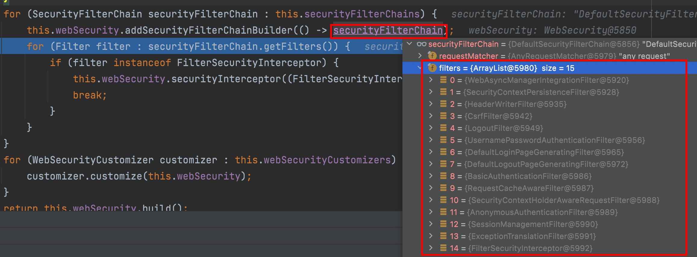
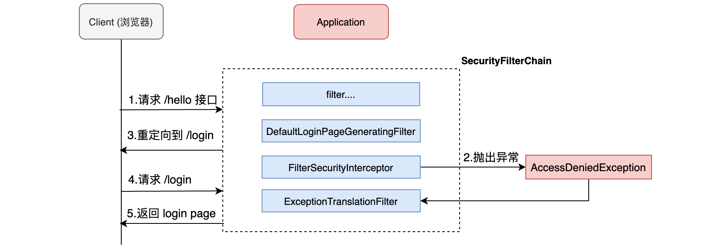
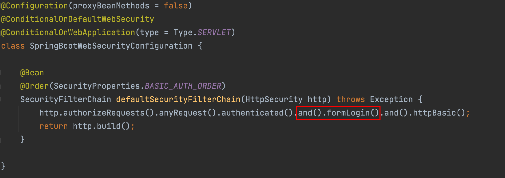
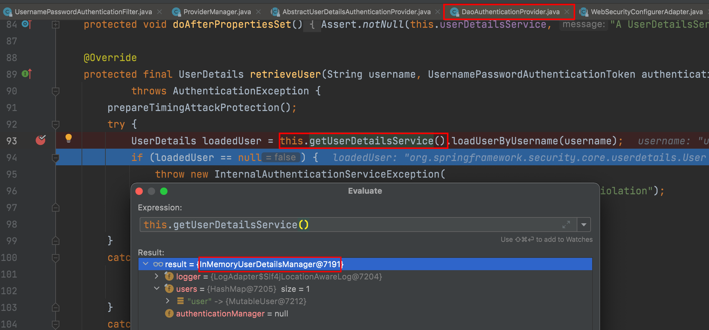
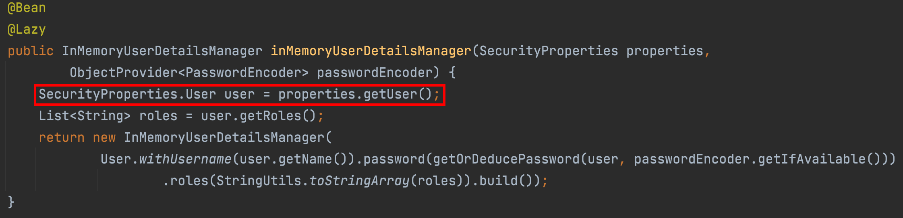

# 实现原理

---


https://docs.spring.io/spring-security/site/docs/5.5.4/reference/html5/#servlet-architecture

虽然开发者只需要引入一个依赖，就可以让 Spring Security 对应用进行保护。Spring Security 又是如何做到的呢？

在 Spring Security 中 `认证、授权` 等功能都是基于[过滤器](https://docs.spring.io/spring-security/site/docs/5.5.4/reference/html5/#servlet-architecture)完成的。


需要注意的是，默认过滤器并不是直接放在 Web 项目的原生过滤器链中，而是通过一个
FlterChainProxy 来统一管理。Spring Security 中的过滤器链通过 FilterChainProxy 嵌入到 Web项目的原生过滤器链中。FilterChainProxy  作为一个顶层的管理者，将统一管理 Security Filter。FilterChainProxy 本身是通过 Spring 框架提供的 DelegatingFilterProxy 整合到原生的过滤器链中。

### Security Filters

那么在 Spring Security 中给我们提供那些过滤器? 默认情况下那些过滤器会被加载呢？

| 过滤器                                     | 过滤器作用                                               | 默认是否加载 |
| ------------------------------------------ | -------------------------------------------------------- | ------------ |
| ChannelProcessingFilter                    | 过滤请求协议 HTTP 、HTTPS                                | NO           |
| `WebAsyncManagerIntegrationFilter`         | 将 WebAsyncManger 与 SpringSecurity 上下文进行集成       | YES          |
| `SecurityContextPersistenceFilter`         | 在处理请求之前,将安全信息加载到 SecurityContextHolder 中 | YES          |
| `HeaderWriterFilter`                       | 处理头信息加入响应中                                     | YES          |
| CorsFilter                                 | 处理跨域问题                                             | NO           |
| `CsrfFilter`                               | 处理 CSRF 攻击                                           | YES          |
| `LogoutFilter`                             | 处理注销登录                                             | YES          |
| OAuth2AuthorizationRequestRedirectFilter   | 处理 OAuth2 认证重定向                                   | NO           |
| Saml2WebSsoAuthenticationRequestFilter     | 处理 SAML 认证                                           | NO           |
| X509AuthenticationFilter                   | 处理 X509 认证                                           | NO           |
| AbstractPreAuthenticatedProcessingFilter   | 处理预认证问题                                           | NO           |
| CasAuthenticationFilter                    | 处理 CAS 单点登录                                        | NO           |
| `OAuth2LoginAuthenticationFilter`          | 处理 OAuth2 认证                                         | NO           |
| Saml2WebSsoAuthenticationFilter            | 处理 SAML 认证                                           | NO           |
| `UsernamePasswordAuthenticationFilter`     | 处理表单登录                                             | YES          |
| OpenIDAuthenticationFilter                 | 处理 OpenID 认证                                         | NO           |
| `DefaultLoginPageGeneratingFilter`         | 配置默认登录页面                                         | YES          |
| DefaultLogoutPageGeneratingFilter          | 配置默认注销页面                                         | YES          |
| ConcurrentSessionFilter                    | 处理 Session 有效期                                      | NO           |
| DigestAuthenticationFilter                 | 处理 HTTP 摘要认证                                       | NO           |
| BearerTokenAuthenticationFilter            | 处理 OAuth2 认证的 Access Token                          | NO           |
| `BasicAuthenticationFilter`                | 处理 HttpBasic 登录                                      | YES          |
| `RequestCacheAwareFilter`                  | 处理请求缓存                                             | YES          |
| `SecurityContextHolder `AwareRequestFilter | 包装原始请求                                             | YES          |
| JaasApiIntegrationFilter                   | 处理 JAAS 认证                                           | NO           |
| `RememberMeAuthenticationFilter`           | 处理 RememberMe 登录                                     | NO           |
| `AnonymousAuthenticationFilter`            | 配置匿名认证                                             | YES          |
| `OAuth2AuthorizationCodeGrantFilter`       | 处理OAuth2认证中授权码                                   | NO           |
| `SessionManagementFilter`                  | 处理 session 并发问题                                    | YES          |
| `ExceptionTranslationFilter`               | 处理认证/授权中的异常                                    | YES          |
| `FilterSecurityInterceptor`                | 处理授权相关                                             | YES          |
| SwitchUserFilter                           | 处理账户切换                                             | NO           |

可以看出，Spring Security 提供了 30 多个过滤器。默认情况下Spring Boot 在对 Spring Security 进入自动化配置时，会创建一个名为 SpringSecurityFilerChain 的过滤器，并注入到 Spring 容器中，这个过滤器将负责所有的安全管理，包括用户认证、授权、重定向到登录页面等。具体可以参考WebSecurityConfiguration的源码:




### SpringBootWebSecurityConfiguration

这个类是 spring boot 自动配置类，通过这个源码得知，默认情况下对所有请求进行权限控制:

```java
@Configuration(proxyBeanMethods = false)
@ConditionalOnDefaultWebSecurity
@ConditionalOnWebApplication(type = Type.SERVLET)
class SpringBootWebSecurityConfiguration {
	@Bean
	@Order(SecurityProperties.BASIC_AUTH_ORDER)
	SecurityFilterChain defaultSecurityFilterChain(HttpSecurity http) 
    throws Exception {
			http.authorizeRequests().anyRequest()
      .authenticated().and().formLogin().and().httpBasic();
		return http.build();
	}
}
```


**这就是为什么在引入 Spring Security 中没有任何配置情况下，请求会被拦截的原因！**

通过上面对自动配置分析，我们也能看出默认生效条件为:

```java
class DefaultWebSecurityCondition extends AllNestedConditions {

	DefaultWebSecurityCondition() {
		super(ConfigurationPhase.REGISTER_BEAN);
	}

	@ConditionalOnClass({ SecurityFilterChain.class, HttpSecurity.class })
	static class Classes {

	}

	@ConditionalOnMissingBean({ WebSecurityConfigurerAdapter.class, SecurityFilterChain.class })
	static class Beans {

	}

}
```

- 条件一 classpath中存在 SecurityFilterChain.class, HttpSecurity.class
- 条件二 没有自定义 WebSecurityConfigurerAdapter.class, SecurityFilterChain.class

默认情况下，条件都是满足的。WebSecurityConfigurerAdapter 这个类极其重要，Spring Security 核心配置都在这个类中:


如果要对 Spring Security 进行自定义配置，就要自定义这个类实例，通过覆盖类中方法达到修改默认配置的目的。

### 流程分析



1. 请求 /hello 接口，在引入 spring security 之后会先经过一些列过滤器
2. 在请求到达 FilterSecurityInterceptor时，发现请求并未认证。请求拦截下来，并抛出 AccessDeniedException 异常。
3. 抛出 AccessDeniedException 的异常会被 ExceptionTranslationFilter 捕获，这个 Filter 中会调用 LoginUrlAuthenticationEntryPoint#commence 方法给客户端返回 302，要求客户端进行重定向到 /login 页面。
4. 客户端发送 /login 请求。
5. /login 请求会再次被拦截器中 DefaultLoginPageGeneratingFilter 拦截到，并在拦截器中返回生成登录页面。

**就是通过这种方式，Spring Security 默认过滤器中生成了登录页面，并返回！**

### 默认用户生成

1. 查看 SpringBootWebSecurityConfiguration#defaultSecurityFilterChain 方法表单登录



2. 处理登录为 FormLoginConfigurer 类中 调用 UsernamePasswordAuthenticationFilter这个类实例


3. 查看类中 UsernamePasswordAuthenticationFilter#attempAuthentication 方法得知实际调用 AuthenticationManager 中 authenticate 方法


4. 调用 ProviderManager 类中方法 authenticate


5. 调用了 ProviderManager 实现类中 AbstractUserDetailsAuthenticationProvider类中方法


6. 最终调用实现类 DaoAuthenticationProvider 类中方法比较




**看到这里就知道默认实现是基于 InMemoryUserDetailsManager 这个类,也就是内存的实现!**

### UserDetailService

通过刚才源码分析也能得知 UserDetailService 是顶层父接口，接口中 loadUserByUserName 方法是用来在认证时进行用户名认证方法，默认实现使用是内存实现，如果想要修改数据库实现我们只需要自定义 UserDetailService 实现，最终返回 UserDetails 实例即可。

```java
public interface UserDetailsService {
	UserDetails loadUserByUsername(String username) throws UsernameNotFoundException;
}
```


### UserDetailServiceAutoConfigutation

这个源码非常多，这里梳理了关键部分：

```java
@Configuration(proxyBeanMethods = false)
@ConditionalOnClass(AuthenticationManager.class)
@ConditionalOnBean(ObjectPostProcessor.class)
@ConditionalOnMissingBean(
		value = { AuthenticationManager.class, AuthenticationProvider.class, UserDetailsService.class,
				AuthenticationManagerResolver.class },
		type = { "org.springframework.security.oauth2.jwt.JwtDecoder",
				"org.springframework.security.oauth2.server.resource.introspection.OpaqueTokenIntrospector",
				"org.springframework.security.oauth2.client.registration.ClientRegistrationRepository" })
public class UserDetailsServiceAutoConfiguration {
  //....
  @Bean
	@Lazy
	public InMemoryUserDetailsManager inMemoryUserDetailsManager(SecurityProperties properties,
			ObjectProvider<PasswordEncoder> passwordEncoder) {
		SecurityProperties.User user = properties.getUser();
		List<String> roles = user.getRoles();
		return new InMemoryUserDetailsManager(
				User.withUsername(user.getName()).password(getOrDeducePassword(user, passwordEncoder.getIfAvailable()))
						.roles(StringUtils.toStringArray(roles)).build());
	}
  //...
}
```

**结论**

1. 从自动配置源码中得知当 classpath 下存在 AuthenticationManager 类
2. 当前项目中，系统没有提供 AuthenticationManager.class、 AuthenticationProvider.class、UserDetailsService.class、
   	AuthenticationManagerResolver.class、实例

**默认情况下都会满足，此时Spring Security会提供一个 InMemoryUserDetailManager 实例**



```java
@ConfigurationProperties(prefix = "spring.security")
public class SecurityProperties {
	private final User user = new User();
	public User getUser() {
		return this.user;
  }
  //....
	public static class User {
		private String name = "user";
		private String password = UUID.randomUUID().toString();
		private List<String> roles = new ArrayList<>();
		private boolean passwordGenerated = true;
		//get set ...
	}
}
```

**这就是默认生成 user 以及 uuid 密码过程! 另外看明白源码之后，就知道只要在配置文件中加入如下配置可以对内存中用户和密码进行覆盖。**

```properties
spring.security.user.name=root
spring.security.user.password=root
spring.security.user.roles=admin,users
```

### 总结

- AuthenticationManager、ProviderManger、以及 AuthenticationProvider 关系


- **WebSecurityConfigurerAdapter** 扩展 Spring Security 所有默认配置

  

- **UserDetailService** 用来修改默认认证的数据源信息

  


