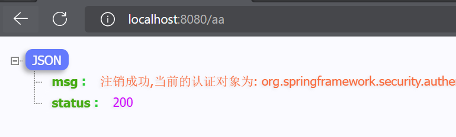
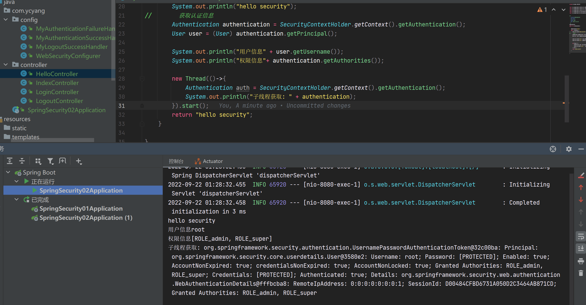

# 自定义认证

---

- 认证配置
- 表单认证
- 注销登录
- 前后端分离认证
- 添加验证码

### 自定义资源权限规则

- /index  公共资源
- /hello .... 受保护资源 权限管理

在项目中添加如下配置就可以实现对资源权限规则设定:

```java
@Configuration
public class WebSecurityConfigurer extends WebSecurityConfigurerAdapter {
    @Override
    protected void configure(HttpSecurity http) throws Exception {
        http.authorizeHttpRequests()
                .mvcMatchers("/index").permitAll()
                .anyRequest().authenticated()
                .and().formLogin();
    }
}
```


```markdown
# 说明
- permitAll() 代表放行该资源,该资源为公共资源 无需认证和授权可以直接访问
- anyRequest().authenticated() 代表所有请求,必须认证之后才能访问
- formLogin() 代表开启表单认证
## 注意: 放行资源必须放在所有认证请求之前!
```

### 自定义登录界面

- 引入模板依赖

  ```xml
  <!--thymeleaf-->
  <dependency>
    <groupId>org.springframework.boot</groupId>
    <artifactId>spring-boot-starter-thymeleaf</artifactId>
  </dependency>
  ```

- 定义登录页面 controller

  ```java
  @Controller
  public class LoginController {
  
      @RequestMapping("/login.html")
      public String login() {
          return "login";
      }
  }
  ```

- 在 templates 中定义登录界面

  ```html
  <!DOCTYPE html>
  <html lang="en" xmlns:th="https://www.thymeleaf.org">
  <head>
      <meta charset="UTF-8">
      <title>登录</title>
  </head>
  <body>
  <h1>用户登录</h1>
  <form method="post" th:action="@{/doLogin}">
      用户名:<input name="uname" type="text"/><br>
      密码:<input name="passwd" type="password"/><br>
      <input type="submit" value="登录"/>
  </form>
  </body>
  </html>
  ```

  **需要注意的是**

  - 登录表单 method 必须为 `post`，action 的请求路径为 `/doLogin`
  - 用户名的 name 属性为 `uname`
  - 密码的 name 属性为 `passwd`

- 配置 Spring Security 配置类

  ```java
  @Configuration
  public class WebSecurityConfigurer extends WebSecurityConfigurerAdapter {
      @Override
      protected void configure(HttpSecurity http) throws Exception {
           http.authorizeHttpRequests()
                  .mvcMatchers("/login.html").permitAll()
                  .mvcMatchers("/index").permitAll()
                  .anyRequest().authenticated()
                  .and()
                  .formLogin()
                  .loginPage("/login.html")
                  .loginProcessingUrl("/doLogin")
                  .usernameParameter("uname")
                  .passwordParameter("passwd")
                  .successForwardUrl("/index") 		 //forward 跳转           注意:不会跳转到之前请求路径
                  //.defaultSuccessUrl("/index")   //redirect 重定向    注意:如果之前请求路径,会有优先跳转之前请求路径
                  .failureUrl("/login.html")
                  .and()
                  .csrf().disable();//这里先关闭 CSRF
      }
  }
  ```

  - successForwardUrl 、defaultSuccessUrl 这两个方法都可以实现成功之后跳转
    - successForwardUrl  默认使用 `forward `跳转      `注意:不会跳转到之前请求路径`
    - defaultSuccessUrl   默认使用 `redirect` 跳转      `注意:如果之前请求路径,会有优先跳转之前请求路径,可以传入第二个参数进行修改`

### 自定义登录成功处理

有时候页面跳转并不能满足我们，特别是在前后端分离开发中就不需要成功之后跳转页面。只需要给前端返回一个 JSON 通知登录成功还是失败与否。这个时候可以通过自定义 `AuthenticationSucccessHandler` 实现

```java
public interface AuthenticationSuccessHandler {

	/**
	 * Called when a user has been successfully authenticated.
	 * @param request the request which caused the successful authentication
	 * @param response the response
	 * @param authentication the <tt>Authentication</tt> object which was created during
	 * the authentication process.
	 */
	void onAuthenticationSuccess(HttpServletRequest request, HttpServletResponse response,
			Authentication authentication) throws IOException, ServletException;
}
```

**根据接口的描述信息,也可以得知登录成功会自动回调这个方法，进一步查看它的默认实现，你会发现successForwardUrl、defaultSuccessUrl也是由它的子类实现的**


- 自定义 AuthenticationSuccessHandler 实现

```java
public class MyAuthenticationSuccessHandler implements AuthenticationSuccessHandler {
    @Override
    public void onAuthenticationSuccess(HttpServletRequest request, HttpServletResponse response, Authentication authentication) throws IOException, ServletException {
        Map<String, Object> result = new HashMap<String, Object>();
        result.put("msg", "登录成功");
        result.put("status", 200);
        response.setContentType("application/json;charset=UTF-8");
        String s = new ObjectMapper().writeValueAsString(result);
        response.getWriter().println(s);
    }
}
```

- 配置 AuthenticationSuccessHandler

```java
@Configuration
public class WebSecurityConfigurer extends WebSecurityConfigurerAdapter {
    @Override
    protected void configure(HttpSecurity http) throws Exception {
        http.authorizeHttpRequests()
                //...
                .and()
                .formLogin()
                //....
                .successHandler(new MyAuthenticationSuccessHandler())
                .failureUrl("/login.html")
                .and()
                .csrf().disable();//这里先关闭 CSRF
    }
}
```


### 显示登录失败信息

为了能更直观在登录页面看到异常错误信息，可以在登录页面中直接获取异常信息。Spring Security 在登录失败之后会将异常信息存储到 `request` 、`session`作用域中 key 为 `SPRING_SECURITY_LAST_EXCEPTION` 命名属性中，源码可以参考 SimpleUrlAuthenticationFailureHandler ：


- 显示异常信息

  ```html
  <!DOCTYPE html>
  <html lang="en" xmlns:th="https://www.thymeleaf.org">
  <head>
      <meta charset="UTF-8">
      <title>登录</title>
  </head>
  <body>
    ....
  <!--    <div th:text="${SPRING_SECURITY_LAST_EXCEPTION}"></div>-->
    <div th:text="${#session.SPRING_SECURITY_LAST_EXCEPTION}"></div>
  </body>
  </html>
  ```

- 配置

  ```java
  @Configuration
  public class WebSecurityConfigurer extends WebSecurityConfigurerAdapter {
  
      @Override
      protected void configure(HttpSecurity http) throws Exception {
          http.authorizeHttpRequests()
                	//..
                  .and()
                  .formLogin()
                  //....
                  //.failureUrl("/login.html")
                  .failureForwardUrl("/login.html")
                  .and()
                  .csrf().disable();//这里先关闭 CSRF
      }
  }
  
  ```

  - failureUrl、failureForwardUrl 关系类似于之前提到的 successForwardUrl 、defaultSuccessUrl 方法
    - failureUrl 失败以后的重定向跳转
    - failureForwardUrl 失败以后的 forward 跳转 `注意:因此获取 request 中异常信息,这里只能使用failureForwardUrl`

### 自定义登录失败处理

和自定义登录成功处理一样，Spring Security 同样为前后端分离开发提供了登录失败的处理，这个类就是  AuthenticationFailureHandler，源码为：

```java
public interface AuthenticationFailureHandler {

	/**
	 * Called when an authentication attempt fails.
	 * @param request the request during which the authentication attempt occurred.
	 * @param response the response.
	 * @param exception the exception which was thrown to reject the authentication
	 * request.
	 */
	void onAuthenticationFailure(HttpServletRequest request, HttpServletResponse response,
			AuthenticationException exception) throws IOException, ServletException;

}
```

**根据接口的描述信息,也可以得知登录失败会自动回调这个方法，进一步查看它的默认实现，你会发现failureUrl、failureForwardUrl也是由它的子类实现的。**


- 自定义 AuthenticationFailureHandler 实现

```java
public class MyAuthenticationFailureHandler implements AuthenticationFailureHandler {

    @Override
    public void onAuthenticationFailure(HttpServletRequest request, HttpServletResponse response, AuthenticationException exception) throws IOException, ServletException {
        Map<String, Object> result = new HashMap<String, Object>();
        result.put("msg", "登录失败: "+exception.getMessage());
        result.put("status", 500);
        response.setContentType("application/json;charset=UTF-8");
        String s = new ObjectMapper().writeValueAsString(result);
        response.getWriter().println(s);
    }
}
```

- 配置 AuthenticationFailureHandler

```java
@Configuration
public class WebSecurityConfigurer extends WebSecurityConfigurerAdapter {

    @Override
    protected void configure(HttpSecurity http) throws Exception {
        http.authorizeHttpRequests()
	              //...
                .and()
                .formLogin()
               	//..
                .failureHandler(new MyAuthenticationFailureHandler())
                .and()
                .csrf().disable();//这里先关闭 CSRF
    }
}
```


### 注销登录

Spring Security 中也提供了默认的注销登录配置，在开发时也可以按照自己需求对注销进行个性化定制。

- 开启注销登录`默认开启`

  ```java
  @Configuration
  public class WebSecurityConfigurer extends WebSecurityConfigurerAdapter {
  @Override
      protected void configure(HttpSecurity http) throws Exception {
          http.authorizeHttpRequests()
                  //...
                  .and()
                  .formLogin()
                  //...
                  .and()
                  .logout()
                  .logoutUrl("/logout")
                  .invalidateHttpSession(true)
                  .clearAuthentication(true)
                  .logoutSuccessUrl("/login.html")
                  .and()
                  .csrf().disable();//这里先关闭 CSRF
      }
  }
  ```

  - 通过 logout() 方法开启注销配置
  - logoutUrl 指定退出登录请求地址，默认是 GET 请求，路径为 `/logout`
  - invalidateHttpSession 退出时是否使 session 失效，默认值为 true
  - clearAuthentication 退出时是否清除认证信息，默认值为 true
  - logoutSuccessUrl 退出登录时跳转地址

- 配置多个注销登录请求

  如果项目中有需要，开发者还可以配置多个注销登录的请求，同时还可以指定请求的方法：

  ```java
  @Configuration
  public class WebSecurityConfigurer extends WebSecurityConfigurerAdapter {
  		@Override
      protected void configure(HttpSecurity http) throws Exception {
          http.authorizeHttpRequests()
                  //...
                  .and()
                  .formLogin()
                  //...
                  .and()
                  .logout()
                  .logoutRequestMatcher(new OrRequestMatcher(
                          new AntPathRequestMatcher("/logout1","GET"),
                          new AntPathRequestMatcher("/logout","GET")
                  ))
                  .invalidateHttpSession(true)
                  .clearAuthentication(true)
                  .logoutSuccessUrl("/login.html")
                  .and()
                  .csrf().disable();//这里先关闭 CSRF
      }
  }
  ```

- 前后端分离注销登录配置

  如果是前后端分离开发，注销成功之后就不需要页面跳转了，只需要将注销成功的信息返回前端即可，此时我们可以通过自定义 LogoutSuccessHandler  实现来返回注销之后信息：

  ```java
  public class MyLogoutSuccessHandler implements LogoutSuccessHandler {
      @Override
      public void onLogoutSuccess(HttpServletRequest request, HttpServletResponse response, Authentication authentication) throws IOException, ServletException {
          Map<String, Object> result = new HashMap<String, Object>();
          result.put("msg", "注销成功");
          result.put("status", 200);
          response.setContentType("application/json;charset=UTF-8");
          String s = new ObjectMapper().writeValueAsString(result);
          response.getWriter().println(s);
      }
  }
  ```

  ```java
  @Configuration
  public class WebSecurityConfigurer extends WebSecurityConfigurerAdapter {
      @Override
      protected void configure(HttpSecurity http) throws Exception {
          http.authorizeHttpRequests()
            			//....
                  .and()
                  .formLogin()
   								//...
                  .and()
                  .logout()
                  //.logoutUrl("/logout")
                  .logoutRequestMatcher(new OrRequestMatcher(
                          new AntPathRequestMatcher("/logout1","GET"),
                          new AntPathRequestMatcher("/logout","GET")
                  ))
                  .invalidateHttpSession(true)
                  .clearAuthentication(true)
                  //.logoutSuccessUrl("/login.html")
                  .logoutSuccessHandler(new MyLogoutSuccessHandler())
                  .and()
                  .csrf().disable();//这里先关闭 CSRF
      }
  }
  ```

  

### 登录用户数据获取

#### SecurityContextHolder

​	Spring Security 会将登录用户数据保存在 Session 中。但是，为了使用方便,Spring Security在此基础上还做了一些改进，其中最主要的一个变化就是线程绑定。当用户登录成功后,Spring Security 会将登录成功的用户信息保存到 SecurityContextHolder 中。

​	SecurityContextHolder 中的数据保存默认是通过ThreadLocal 来实现的，使用 ThreadLocal 创建的变量只能被当前线程访问，不能被其他线程访问和修改，也就是用户数据和请求线程绑定在一起。当登录请求处理完毕后，Spring Security 会将 SecurityContextHolder 中的数据拿出来保存到 Session 中，同时将 SecurityContexHolder 中的数据清空。以后每当有请求到来时，Spring Security 就会先从 Session 中取出用户登录数据，保存到SecurityContextHolder 中，方便在该请求的后续处理过程中使用，同时在请求结束时将 SecurityContextHolder 中的数据拿出来保存到 Session 中，然后将SecurityContextHolder 中的数据清空。

​	实际上 SecurityContextHolder 中存储是 SecurityContext，在 SecurityContext 中存储是 Authentication。


这种设计是典型的策略设计模式:

```java
public class SecurityContextHolder {
	public static final String MODE_THREADLOCAL = "MODE_THREADLOCAL";
	public static final String MODE_INHERITABLETHREADLOCAL = "MODE_INHERITABLETHREADLOCAL";
	public static final String MODE_GLOBAL = "MODE_GLOBAL";
	private static final String MODE_PRE_INITIALIZED = "MODE_PRE_INITIALIZED";
	private static SecurityContextHolderStrategy strategy;
  //....
	private static void initializeStrategy() {
		if (MODE_PRE_INITIALIZED.equals(strategyName)) {
			Assert.state(strategy != null, "When using " + MODE_PRE_INITIALIZED
					+ ", setContextHolderStrategy must be called with the fully constructed strategy");
			return;
		}
		if (!StringUtils.hasText(strategyName)) {
			// Set default
			strategyName = MODE_THREADLOCAL;
		}
		if (strategyName.equals(MODE_THREADLOCAL)) {
			strategy = new ThreadLocalSecurityContextHolderStrategy();
			return;
		}
		if (strategyName.equals(MODE_INHERITABLETHREADLOCAL)) {
			strategy = new InheritableThreadLocalSecurityContextHolderStrategy();
			return;
		}
		if (strategyName.equals(MODE_GLOBAL)) {
			strategy = new GlobalSecurityContextHolderStrategy();
			return;
		}
    //.....
  }
}
```

1. `MODE THREADLOCAL`：这种存放策略是将 SecurityContext 存放在 ThreadLocal中，大家知道 Threadlocal 的特点是在哪个线程中存储就要在哪个线程中读取，这其实非常适合 web 应用，因为在默认情况下，一个请求无论经过多少 Filter 到达 Servlet，都是由一个线程来处理的。这也是 SecurityContextHolder 的默认存储策略，这种存储策略意味着如果在具体的业务处理代码中，开启了子线程，在子线程中去获取登录用户数据，就会获取不到。
2. `MODE INHERITABLETHREADLOCAL`：这种存储模式适用于多线程环境，如果希望在子线程中也能够获取到登录用户数据，那么可以使用这种存储模式。
3. `MODE GLOBAL`：这种存储模式实际上是将数据保存在一个静态变量中，在 JavaWeb开发中，这种模式很少使用到。

#### SecurityContextHolderStrategy

通过 SecurityContextHolder 可以得知，SecurityContextHolderStrategy 接口用来定义存储策略方法

```java
public interface SecurityContextHolderStrategy {
	void clearContext();
	SecurityContext getContext();
	void setContext(SecurityContext context);
	SecurityContext createEmptyContext();
}
```

接口中一共定义了四个方法：

- `clearContext`：该方法用来清除存储的 SecurityContext对象。
- `getContext`：该方法用来获取存储的 SecurityContext 对象。
- `setContext`：该方法用来设置存储的 SecurityContext 对象。
- `create Empty Context`：该方法则用来创建一个空的 SecurityContext 对象。


从上面可以看出每一个实现类对应一种策略的实现。

####  代码中获取认证之后用户数据

设定权限

```yml
  security:
    user:
      name: root
      password: 123
      roles: admin,super
```


```java
@RestController
public class HelloController {
    @RequestMapping("/hello")
    public String hello() {
      Authentication authentication = SecurityContextHolder
        .getContext().getAuthentication();
      User principal = (User) authentication.getPrincipal();
      System.out.println("身份 :"+principal.getUsername());
      System.out.println("凭证 :"+authentication.getCredentials());
      System.out.println("权限 :"+authentication.getAuthorities());
      return "hello security";
    }
}
```

#### 多线程情况下获取用户数据

```java
@RestController
public class HelloController {
    @RequestMapping("/hello")
    public String hello() {
      new Thread(()->{
        Authentication authentication = SecurityContextHolder
          .getContext().getAuthentication();
        User principal = (User) authentication.getPrincipal();
        System.out.println("身份 :"+principal.getUsername());
        System.out.println("凭证 :"+authentication.getCredentials());
        System.out.println("权限 :"+authentication.getAuthorities());
      }).start();
      return "hello security";
    }
}
```


**可以看到默认策略，是无法在子线程中获取用户信息，如果需要在子线程中获取必须使用第二种策略，默认策略是通过 System.getProperty 加载的，因此我们可以通过增加 VM Options 参数进行修改。**

```properties
-Dspring.security.strategy=MODE_INHERITABLETHREADLOCAL
```


==寒舞==注：当前版本security 默认策略



#### 页面上获取用户信息

- 引入依赖

  ```xml
  <dependency>
    <groupId>org.thymeleaf.extras</groupId>
    <artifactId>thymeleaf-extras-springsecurity5</artifactId>
    <version>3.0.4.RELEASE</version>
  </dependency>
  ```

- 页面加入命名空间

  ```html
  <html lang="en" xmlns:th="https://www.thymeleaf.org" 
  xmlns:sec="http://www.thymeleaf.org/extras/spring-security">
  ```

- 页面中使用

  ```html
  <!--获取认证用户名-->
  <ul>
    <li sec:authentication="principal.username"></li>
    <li sec:authentication="principal.authorities"></li>
    <li sec:authentication="principal.accountNonExpired"></li>
    <li sec:authentication="principal.accountNonLocked"></li>
    <li sec:authentication="principal.credentialsNonExpired"></li>
  </ul>
  ```

### 自定义认证数据源

#### 认证流程分析

https://docs.spring.io/spring-security/reference/servlet/authentication/architecture.html


- 发起认证请求，请求中携带用户名、密码，该请求会被`UsernamePasswordAuthenticationFilter` 拦截
- 在`UsernamePasswordAuthenticationFilter`的`attemptAuthentication`方法中将请求中用户名和密码，封装为`Authentication`对象，并交给`AuthenticationManager` 进行认证
- 认证成功，将认证信息存储到 SecurityContextHodler 以及调用记住我等，并回调 `AuthenticationSuccessHandler` 处理
- 认证失败，清除 SecurityContextHodler 以及 记住我中信息，回调 `AuthenticationFailureHandler` 处理

#### 三者关系

从上面分析中得知，AuthenticationManager 是认证的核心类，但实际上在底层真正认证时还离不开 ProviderManager 以及  AuthenticationProvider 。他们三者关系是样的呢？

- `AuthenticationManager` 是一个认证管理器，它定义了 Spring Security 过滤器要执行认证操作。
- `ProviderManager` AuthenticationManager接口的实现类。Spring Security 认证时默认使用就是 ProviderManager。
- `AuthenticationProvider` 就是针对不同的身份类型执行的具体的身份认证。

**AuthenticationManager 与 ProviderManager**


​	ProviderManager 是 AuthenticationManager 的唯一实现，也是 Spring Security 默认使用实现。从这里不难看出默认情况下AuthenticationManager 就是一个ProviderManager。

**ProviderManager 与 AuthenticationProvider**

摘自官方: https://docs.spring.io/spring-security/reference/servlet/authentication/architecture.html


​	在 Spring Seourity 中，允许系统同时支持多种不同的认证方式，例如同时支持用户名/密码认证、ReremberMe 认证、手机号码动态认证等，而不同的认证方式对应了不同的 AuthenticationProvider，所以一个完整的认证流程可能由多个 AuthenticationProvider 来提供。

​	多个 AuthenticationProvider 将组成一个列表，这个列表将由 ProviderManager 代理。换句话说，在ProviderManager 中存在一个 AuthenticationProvider 列表，在Provider Manager 中遍历列表中的每一个 AuthenticationProvider 去执行身份认证，最终得到认证结果。

​	ProviderManager 本身也可以再配置一个 AuthenticationManager 作为 parent，这样当ProviderManager 认证失败之后，就可以进入到 parent 中再次进行认证。理论上来说，ProviderManager 的 parent 可以是任意类型的 AuthenticationManager，但是通常都是由
ProviderManager 来扮演 parent 的角色，也就是 ProviderManager 是 ProviderManager 的 parent。

​	ProviderManager 本身也可以有多个，多个ProviderManager 共用同一个 parent。有时，一个应用程序有受保护资源的逻辑组（例如，所有符合路径模式的网络资源，如/api/**），每个组可以有自己的专用 AuthenticationManager。通常，每个组都是一个ProviderManager，它们共享一个父级。然后，父级是一种 ` 全局 `资源，作为所有提供者的后备资源。

根据上面的介绍，我们绘出新的 AuthenticationManager、ProvideManager 和 AuthentictionProvider 关系

摘自官网: https://spring.io/guides/topicals/spring-security-architecture


 弄清楚认证原理之后我们来看下具体认证时数据源的获取。`默认情况下 AuthenticationProvider  是由 DaoAuthenticationProvider 类来实现认证的，在DaoAuthenticationProvider 认证时又通过 UserDetailsService 完成数据源的校验。`他们之间调用关系如下：


**总结: AuthenticationManager 是认证管理器，在 Spring Security 中有全局AuthenticationManager，也可以有局部AuthenticationManager。全局的AuthenticationManager用来对全局认证进行处理，局部的AuthenticationManager用来对某些特殊资源认证处理。当然无论是全局认证管理器还是局部认证管理器都是由 ProviderManger 进行实现。 每一个ProviderManger中都代理一个AuthenticationProvider的列表，列表中每一个实现代表一种身份认证方式。认证时底层数据源需要调用 UserDetailService 来实现。**

#### 配置全局 AuthenticationManager

https://spring.io/guides/topicals/spring-security-architecture

- 默认的全局 AuthenticationManager

  ```java
  @Configuration
  public class WebSecurityConfigurer extends WebSecurityConfigurerAdapter {
    @Autowired
    public void initialize(AuthenticationManagerBuilder builder) {
      //builder..
    }
  }
  ```

  - springboot 对 security 进行自动配置时自动在工厂中创建一个全局AuthenticationManager

  **总结**

  1. 默认自动配置创建全局AuthenticationManager 默认找当前项目中是否存在自定义 UserDetailService 实例 自动将当前项目 UserDetailService 实例设置为数据源
  2. 默认自动配置创建全局AuthenticationManager 在工厂中使用时直接在代码中注入即可

- 自定义全局 AuthenticationManager

  ```java
  @Configuration
  public class WebSecurityConfigurer extends WebSecurityConfigurerAdapter {
    @Override
    public void configure(AuthenticationManagerBuilder builder) {
    	//builder ....
    }
  }
  ```

  - 自定义全局 AuthenticationManager

  **总结**

  1. 一旦通过 configure 方法自定义 AuthenticationManager实现 就回将工厂中自动配置AuthenticationManager 进行覆盖
  2. 一旦通过 configure 方法自定义 AuthenticationManager实现 需要在实现中指定认证数据源对象 UserDetaiService 实例
  3. 一旦通过 configure 方法自定义 AuthenticationManager实现 这种方式创建AuthenticationManager对象工厂内部本地一个 AuthenticationManager 对象 不允许在其他自定义组件中进行注入

- 用来在工厂中暴露自定义AuthenticationManager 实例

  ```java
  @Configuration
  public class WebSecurityConfigurer extends WebSecurityConfigurerAdapter {
    
      //1.自定义AuthenticationManager  推荐  并没有在工厂中暴露出来
      @Override
      public void configure(AuthenticationManagerBuilder builder) throws Exception {
          System.out.println("自定义AuthenticationManager: " + builder);
          builder.userDetailsService(userDetailsService());
      }
  
      //作用: 用来将自定义AuthenticationManager在工厂中进行暴露,可以在任何位置注入
      @Override
      @Bean
      public AuthenticationManager authenticationManagerBean() throws Exception {
          return super.authenticationManagerBean();
      }
  }
  
  ```

#### 自定义内存数据源

```java
@Configuration
public class WebSecurityConfigurer extends WebSecurityConfigurerAdapter {

    @Bean
    public UserDetailsService userDetailsService(){
        InMemoryUserDetailsManager inMemoryUserDetailsManager
                = new InMemoryUserDetailsManager();
        UserDetails u1 = User.withUsername("zhangs")
                .password("{noop}111").roles("USER").build();
        inMemoryUserDetailsManager.createUser(u1);
        return inMemoryUserDetailsManager;
    }

    @Override
    protected void configure(AuthenticationManagerBuilder auth) 
      throws Exception {
        auth.userDetailsService(userDetailsService());
    }  	
}
```

#### 自定义数据库数据源

- 设计表结构

  ```sql
  -- 用户表
  CREATE TABLE `user`
  (
      `id`                    int(11) NOT NULL AUTO_INCREMENT,
      `username`              varchar(32)  DEFAULT NULL,
      `password`              varchar(255) DEFAULT NULL,
      `enabled`               tinyint(1) DEFAULT NULL,
      `accountNonExpired`     tinyint(1) DEFAULT NULL,
      `accountNonLocked`      tinyint(1) DEFAULT NULL,
      `credentialsNonExpired` tinyint(1) DEFAULT NULL,
      PRIMARY KEY (`id`)
  ) ENGINE=InnoDB AUTO_INCREMENT=4 DEFAULT CHARSET=utf8;
  -- 角色表
  CREATE TABLE `role`
  (
      `id`      int(11) NOT NULL AUTO_INCREMENT,
      `name`    varchar(32) DEFAULT NULL,
      `name_zh` varchar(32) DEFAULT NULL,
      PRIMARY KEY (`id`)
  ) ENGINE=InnoDB AUTO_INCREMENT=4 DEFAULT CHARSET=utf8;
  -- 用户角色关系表
  CREATE TABLE `user_role`
  (
      `id`  int(11) NOT NULL AUTO_INCREMENT,
      `uid` int(11) DEFAULT NULL,
      `rid` int(11) DEFAULT NULL,
      PRIMARY KEY (`id`),
      KEY   `uid` (`uid`),
      KEY   `rid` (`rid`)
  ) ENGINE=InnoDB AUTO_INCREMENT=5 DEFAULT CHARSET=utf8;
  ```

- 插入测试数据

  ```sql
  -- 插入用户数据
  BEGIN;
    INSERT INTO `user`
    VALUES (1, 'root', '{noop}123', 1, 1, 1, 1);
    INSERT INTO `user`
    VALUES (2, 'admin', '{noop}123', 1, 1, 1, 1);
    INSERT INTO `user`
    VALUES (3, 'blr', '{noop}123', 1, 1, 1, 1);
  COMMIT;
  -- 插入角色数据
  BEGIN;
    INSERT INTO `role`
    VALUES (1, 'ROLE_product', '商品管理员');
    INSERT INTO `role`
    VALUES (2, 'ROLE_admin', '系统管理员');
    INSERT INTO `role`
    VALUES (3, 'ROLE_user', '用户管理员');
  COMMIT;
  -- 插入用户角色数据
  BEGIN;
    INSERT INTO `user_role`
    VALUES (1, 1, 1);
    INSERT INTO `user_role`
    VALUES (2, 1, 2);
    INSERT INTO `user_role`
    VALUES (3, 2, 2);
    INSERT INTO `user_role`
    VALUES (4, 3, 3);
  COMMIT;
  ```

- 项目中引入依赖

  ```xml
  <dependency>
    <groupId>org.mybatis.spring.boot</groupId>
    <artifactId>mybatis-spring-boot-starter</artifactId>
    <version>2.2.0</version>
  </dependency>
  <dependency>
    <groupId>mysql</groupId>
    <artifactId>mysql-connector-java</artifactId>
    <version>5.1.38</version>
  </dependency>
  <dependency>
    <groupId>com.alibaba</groupId>
    <artifactId>druid</artifactId>
    <version>1.2.7</version>
  </dependency>
  ```

- 配置 springboot 配置文件

  ```properties
  # datasource
  spring.datasource.type=com.alibaba.druid.pool.DruidDataSource
  spring.datasource.driver-class-name=com.mysql.jdbc.Driver
  spring.datasource.url=jdbc:mysql://localhost:3306/security?characterEncoding=UTF-8&useSSL=false
  spring.datasource.username=root
  spring.datasource.password=root
  
  # mybatis
  mybatis.mapper-locations=classpath:com/baizhi/mapper/*.xml
  mybatis.type-aliases-package=com.baizhi.entity
  
  # log
  logging.level.com.baizhi=debug
  ```

- 创建 entity

  - 创建 user 对象

    ```java
    public class User  implements UserDetails {
        private Integer id;
        private String username;
        private String password;
        private Boolean enabled;
        private Boolean accountNonExpired;
        private Boolean accountNonLocked;
        private Boolean credentialsNonExpired;
        private List<Role> roles = new ArrayList<>();
    
        @Override
        public Collection<? extends GrantedAuthority> getAuthorities() {
            List<GrantedAuthority> grantedAuthorities = new ArrayList<>();
            roles.forEach(role->grantedAuthorities.add(new SimpleGrantedAuthority(role.getName())));
            return grantedAuthorities;
        }
    
        @Override
        public String getPassword() {
            return password;
        }
    
        @Override
        public String getUsername() {
            return username;
        }
    
        @Override
        public boolean isAccountNonExpired() {
            return accountNonExpired;
        }
    
        @Override
        public boolean isAccountNonLocked() {
            return accountNonLocked;
        }
    
        @Override
        public boolean isCredentialsNonExpired() {
            return credentialsNonExpired;
        }
    
        @Override
        public boolean isEnabled() {
            return enabled;
        }
    		//get/set....
    }
    ```

  - 创建 role 对象

    ```java
    public class Role {
        private Integer id;
        private String name;
        private String nameZh;
      	//get set..
    }
    ```

- 创建 UserDao 接口

  ```java
  @Mapper
  public interface UserDao {
      //根据用户名查询用户
      User loadUserByUsername(String username);
    	
    	//根据用户id查询角色
    	List<Role> getRolesByUid(Integer uid);
  }
  ```

- 创建 UserMapper 实现

  ```xml
  <?xml version="1.0" encoding="UTF-8"?>
  <!DOCTYPE mapper PUBLIC "-//mybatis.org//DTD Mapper 3.0//EN" "http://mybatis.org/dtd/mybatis-3-mapper.dtd">
  <mapper namespace="com.baizhi.dao.UserDao">
      <!--查询单个-->
      <select id="loadUserByUsername" resultType="User">
          select id,
                 username,
                 password,
                 enabled,
                 accountNonExpired,
                 accountNonLocked,
                 credentialsNonExpired
          from user
          where username = #{username}
      </select>
  
      <!--查询指定行数据-->
      <select id="getRolesByUid" resultType="Role">
          select r.id,
                 r.name,
                 r.name_zh nameZh
          from role r,
               user_role ur
          where r.id = ur.rid
            and ur.uid = #{uid}
      </select>
  </mapper>
  ```

- 创建 UserDetailService 实例

  ```java
  @Component
  public class MyUserDetailService implements UserDetailsService {
  
      private  final UserDao userDao;
  
      @Autowired
      public MyUserDetailService(UserDao userDao) {
          this.userDao = userDao;
      }
  
      @Override
      public UserDetails loadUserByUsername(String username) throws UsernameNotFoundException {
          User user = userDao.loadUserByUsername(username);
          if(ObjectUtils.isEmpty(user))throw new RuntimeException("用户不存在");
          user.setRoles(userDao.getRolesByUid(user.getId()));
          return user;
      }
  }
  ```

- 配置 authenticationManager 使用自定义UserDetailService

  ```java
  @Configuration
  public class WebSecurityConfigurer extends WebSecurityConfigurerAdapter {
    
      private final UserDetailsService userDetailsService;
  
      @Autowired
      public WebSecurityConfigurer(UserDetailsService userDetailsService) {
          this.userDetailsService = userDetailsService;
      }
  
      @Override
      protected void configure(AuthenticationManagerBuilder builder) throws Exception {
          builder.userDetailsService(userDetailsService);
      }
    
    	
    	@Override
      protected void configure(HttpSecurity http) throws Exception {
        //web security..
      }
  }
  ```

启动测试


-----

### 添加认证验证码

#### 配置验证码

```xml
<dependency>
  <groupId>com.github.penggle</groupId>
  <artifactId>kaptcha</artifactId>
  <version>2.3.2</version>
</dependency>
```

```java
@Configuration
public class KaptchaConfig {
    @Bean
    public Producer kaptcha() {
        Properties properties = new Properties();
        //1.验证码宽度
        properties.setProperty("kaptcha.image.width", "150");
        //2.验证码高度
        properties.setProperty("kaptcha.image.height", "50");
        //3.验证码字符串
        properties.setProperty("kaptcha.textproducer.char.string", "0123456789qazwsxedcrfvtgbyhnujmikolpQAZWSXEDCRFVTGBYHNUJMIKOLP");
        //4.验证码长度
        properties.setProperty("kaptcha.textproducer.char.length", "4");
        Config config = new Config(properties);
        DefaultKaptcha defaultKaptcha = new DefaultKaptcha();
        defaultKaptcha.setConfig(config);
        return defaultKaptcha;
    }
}
```

#### 传统 web 开发

- 生成验证码 controller

  ```java
  @Controller
  public class KaptchaController {
      private final Producer producer;
  
      @Autowired
      public KaptchaController(Producer producer) {
          this.producer = producer;
      }
  
      @GetMapping("/vc.jpg")
      public void getVerifyCode(HttpServletResponse response, HttpSession session) throws IOException {
          response.setContentType("image/png");
          String code = producer.createText();
          session.setAttribute("kaptcha", code);//可以更换成 redis 实现
          BufferedImage bi = producer.createImage(code);
          ServletOutputStream os = response.getOutputStream();
          ImageIO.write(bi, "jpg", os);
      }
  }
  ```

- 自定义验证码异常类

  ```java
  public class KaptchaNotMatchException extends AuthenticationException {
  
      public KaptchaNotMatchException(String msg) {
          super(msg);
      }
  
      public KaptchaNotMatchException(String msg, Throwable cause) {
          super(msg, cause);
      }
  }
  ```

- 自定义filter验证验证码

  ```java
  public class KaptchaFilter extends UsernamePasswordAuthenticationFilter {
  
      public static final String KAPTCHA_KEY = "kaptcha";//默认值
      private String kaptcha = KAPTCHA_KEY;
  
      public String getKaptcha() {
          return kaptcha;
      }
  
      public void setKaptcha(String kaptcha) {
          this.kaptcha = kaptcha;
      }
  
      @Override
      public Authentication attemptAuthentication(HttpServletRequest request, HttpServletResponse response) throws AuthenticationException {
          //1.判断是否是 post 方式
          if (request.getMethod().equals("POST")) {
              throw new AuthenticationServiceException("Authentication method not supported: " + request.getMethod());
          }
          //2.获取表单name为kaptcha的值
          String kaptcha = request.getParameter(getKaptcha());
          //存放到session中
          String sessionKaptcha = (String) request.getSession().getAttribute("kaptcha");
          if (!ObjectUtils.isEmpty(kaptcha) && !ObjectUtils.isEmpty(sessionKaptcha) &&
                  kaptcha.equalsIgnoreCase(sessionKaptcha)) {
              return super.attemptAuthentication(request, response);
          }
          throw new KaptchaNotMatchException("验证码输入错误!");
      }
  }
  ```

- 放行以及配置验证码 filter

  ```java
  @Configuration
  public class WebSecurityConfigurer extends WebSecurityConfigurerAdapter {
  
      private final UserDetailsService userDetailsService;
  
      @Autowired
      public WebSecurityConfigurer(UserDetailsService userDetailsService) {
          this.userDetailsService = userDetailsService;
      }
  
      @Override
      protected void configure(AuthenticationManagerBuilder builder) throws Exception {
          builder.userDetailsService(userDetailsService);
      }
  
      @Override
      @Bean
      public AuthenticationManager authenticationManagerBean() throws Exception {
          return super.authenticationManagerBean();
      }
  
      @Bean
      public KaptchaFilter kaptchaFilter() throws Exception {
          KaptchaFilter kaptchaFilter = new KaptchaFilter();
          //指定接收验证码请求参数名
          kaptchaFilter.setKaptcha("kaptcha");
          //指定认证管理器
          kaptchaFilter.setAuthenticationManager(authenticationManagerBean());
          //指定认证成功和失败处理
          kaptchaFilter.setAuthenticationSuccessHandler(new MyAuthenticationSuccessHandler());
          kaptchaFilter.setAuthenticationFailureHandler(new MyAuthenticationFailureHandler());
          //指定处理登录
          kaptchaFilter.setFilterProcessesUrl("/doLogin");
          kaptchaFilter.setUsernameParameter("uname");
          kaptchaFilter.setPasswordParameter("passwd");
          return kaptchaFilter;
      }
  
      @Override
      protected void configure(HttpSecurity http) throws Exception {
          http.authorizeHttpRequests()
                  .mvcMatchers("/vc.jpg").permitAll()
                  .mvcMatchers("/login.html").permitAll()
                  .anyRequest().authenticated()
                  .and()
                  .formLogin()
                  .loginPage("/login.html")
                	...
          http.addFilterAt(kaptchaFilter(), UsernamePasswordAuthenticationFilter.class);
      }
  }
  ```

- 登录页面添加验证码

  ```html
  <form method="post" th:action="@{/doLogin}">
      用户名:<input name="uname" type="text"/><br>
      密码:<input name="passwd" type="password"/><br>
      验证码: <input name="kaptcha" type="text"/> <br>
      <input type="submit" value="登录"/>
  </form>
  ```

#### 前后端分离开发

- 生成验证码 controller

  ```java
  @RestController
  public class KaptchaController {
      private final Producer producer;
  
      @Autowired
      public KaptchaController(Producer producer) {
          this.producer = producer;
      }
  
      @GetMapping("/vc.png")
      public String getVerifyCode(HttpSession session) throws IOException {
          //1.生成验证码
          String text = producer.createText();
          //2.放入 session redis 实现
          session.setAttribute("kaptcha", text);
          //3.生成图片
          BufferedImage bi = producer.createImage(text);
  //      写入内存  快速数组字节输出流
          FastByteArrayOutputStream fos = new FastByteArrayOutputStream();
  //        写入IO流
          ImageIO.write(bi, "jpg", fos);
          //4.返回 base64
          return Base64.encodeBase64String(fos.toByteArray());
      }
      }
  }
  ```

- 定义验证码异常类

  ```java
  public class KaptchaNotMatchException extends AuthenticationException {
  
      public KaptchaNotMatchException(String msg) {
          super(msg);
      }
  
      public KaptchaNotMatchException(String msg, Throwable cause) {
          super(msg, cause);
      }
  }
  ```

- 在自定义LoginKaptchaFilter中加入验证码验证

  ```java
  //自定义 filter
  public class LoginKaptchaFilter extends UsernamePasswordAuthenticationFilter {
  
      public static final String FORM_KAPTCHA_KEY = "kaptcha";
  
      private String kaptchaParameter = FORM_KAPTCHA_KEY;
  
      public String getKaptchaParameter() {
          return kaptchaParameter;
      }
  
      public void setKaptchaParameter(String kaptchaParameter) {
          this.kaptchaParameter = kaptchaParameter;
      }
  
      @Override
      public Authentication attemptAuthentication(HttpServletRequest request, HttpServletResponse response) throws AuthenticationException {
          if (!request.getMethod().equals("POST")) {
              throw new AuthenticationServiceException("Authentication method not supported: " + request.getMethod());
          }
          try {
              //1.获取请求数据
              Map<String, String> userInfo = new ObjectMapper().readValue(request.getInputStream(), Map.class);
              String kaptcha = userInfo.get(getKaptchaParameter());//用来获取数据中验证码
              String username = userInfo.get(getUsernameParameter());//用来接收用户名
              String password = userInfo.get(getPasswordParameter());//用来接收密码
              //2.获取 session 中验证码
              String sessionVerifyCode = (String) request.getSession().getAttribute("kaptcha");
              if (!ObjectUtils.isEmpty(kaptcha) && !ObjectUtils.isEmpty(sessionVerifyCode) &&
                      kaptcha.equalsIgnoreCase(sessionVerifyCode)) {
                  //3.获取用户名 和密码认证
                  UsernamePasswordAuthenticationToken authRequest = new UsernamePasswordAuthenticationToken(username, password);
                  setDetails(request, authRequest);
                  return this.getAuthenticationManager().authenticate(authRequest);
              }
          } catch (IOException e) {
              e.printStackTrace();
          }
          throw new KaptchaNotMatchException("验证码不匹配!");
      }
  }
  ```

- 配置

  ```java
  @Configuration
  public class SecurityConfig extends WebSecurityConfigurerAdapter {
  
      //自定义内存数据源
      @Bean
      public UserDetailsService userDetailsService() {
          InMemoryUserDetailsManager inMemoryUserDetailsManager = new InMemoryUserDetailsManager();
          inMemoryUserDetailsManager.createUser(User.withUsername("root").password("{noop}123").roles("admin").build());
          return inMemoryUserDetailsManager;
      }
  
      @Override
      protected void configure(AuthenticationManagerBuilder auth) throws Exception {
          auth.userDetailsService(userDetailsService());
      }
  
      @Override
      @Bean
      public AuthenticationManager authenticationManagerBean() throws Exception {
          return super.authenticationManagerBean();
      }
  
      //配置
      @Bean
      public LoginKaptchaFilter loginKaptchaFilter() throws Exception {
          LoginKaptchaFilter loginKaptchaFilter = new LoginKaptchaFilter();
          //1.认证 url
          loginKaptchaFilter.setFilterProcessesUrl("/doLogin");
          //2.认证 接收参数
          loginKaptchaFilter.setUsernameParameter("uname");
          loginKaptchaFilter.setPasswordParameter("passwd");
          loginKaptchaFilter.setKaptchaParameter("kaptcha");
          //3.指定认证管理器
          loginKaptchaFilter.setAuthenticationManager(authenticationManagerBean());
          //4.指定成功时处理
          loginKaptchaFilter.setAuthenticationSuccessHandler((req, resp, authentication) -> {
              Map<String, Object> result = new HashMap<String, Object>();
              result.put("msg", "登录成功");
              result.put("用户信息", authentication.getPrincipal());
              resp.setContentType("application/json;charset=UTF-8");
              resp.setStatus(HttpStatus.OK.value());
              String s = new ObjectMapper().writeValueAsString(result);
              resp.getWriter().println(s);
          });
          //5.认证失败处理
          loginKaptchaFilter.setAuthenticationFailureHandler((req, resp, ex) -> {
              Map<String, Object> result = new HashMap<String, Object>();
              result.put("msg", "登录失败: " + ex.getMessage());
              resp.setStatus(HttpStatus.INTERNAL_SERVER_ERROR.value());
              resp.setContentType("application/json;charset=UTF-8");
              String s = new ObjectMapper().writeValueAsString(result);
              resp.getWriter().println(s);
          });
          return loginKaptchaFilter;
      }
  
      @Override
      protected void configure(HttpSecurity http) throws Exception {
          http.authorizeRequests()
                  .mvcMatchers("/vc.jpg").permitAll()
                  .anyRequest().authenticated()
                  .and()
                  .formLogin()
                  .and()
                  .exceptionHandling()
                  .authenticationEntryPoint((req, resp, ex) -> {
                      resp.setContentType("application/json;charset=UTF-8");
                      resp.setStatus(HttpStatus.UNAUTHORIZED.value());
                      resp.getWriter().println("必须认证之后才能访问!");
                  })
                  .and()
                  .logout()
                  .and()
                  .csrf().disable();
  
          http.addFilterAt(loginKaptchaFilter(), UsernamePasswordAuthenticationFilter.class);
      }
  
  ```

- 测试验证