# RememberMe

---

- 简介
- 基本使用
- 原理分析
- 持久化令牌

## 简介 

RememberMe 这个功能非常常见，下图就是QQ 邮箱登录时的“记住我” 选项。提到 RememberMe，一些初学者往往会有一些误解，认为 RememberMe 功能就是把用户名/密码用 Cookie 保存在浏览器中，下次登录时不用再次输入用户名/密码。这个理解显然是不对的。我们这里所说的 RememberMe 是一种服务器端的行为。传统的登录方式基于 Session会话，一旦用户的会话超时过期，就要再次登录，这样太过于烦琐。如果能有一种机制，让用户会话过期之后，还能继续保持认证状态，就会方便很多，RememberMe 就是为了解决这一需求而生的。

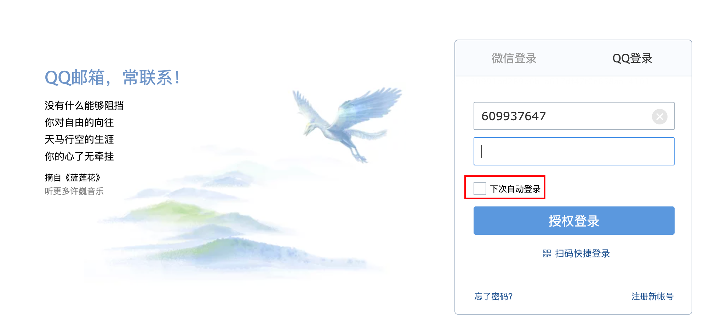

具体的实现思路就是通过 Cookie 来记录当前用户身份。当用户登录成功之后，会通过一定算法，将用户信息、时间戳等进行加密，加密完成后，通过响应头带回前端存储在cookie中，当浏览器会话过期之后，如果再次访问该网站，会自动将 Cookie 中的信息发送给服务器，服务器对 Cookie中的信息进行校验分析，进而确定出用户的身份，Cookie中所保存的用户信息也是有时效的，例如三天、一周等。

## 基本使用

### 开启记住我

```java
@Configuration
public class SecurityConfig extends WebSecurityConfigurerAdapter {
    //....
    @Override
    protected void configure(HttpSecurity http) throws Exception {
        http.authorizeRequests()
                .mvcMatchers("/login.html").permitAll()
                .anyRequest().authenticated()
                .and()
                .formLogin()
                //...
                .and()
                .rememberMe() //开启记住我功能
                .and()
                .csrf().disable();
    }
}
```

### 使用记住我

可以看到一旦打开了记住我功能，登录页面中会多出一个 RememberMe 选项。

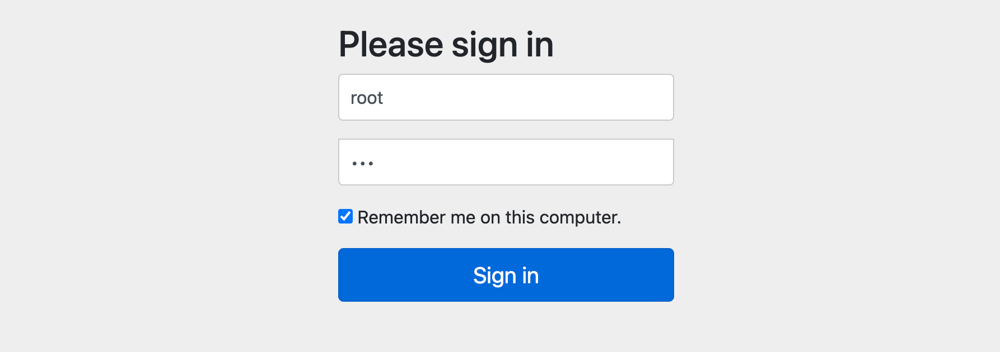

### 测试记住我

登录时勾选 RememberMe 选项，然后重启服务端之后，在测试接口是否能免登录访问。

## 原理分析

### RememberMeAuthenticationFilter

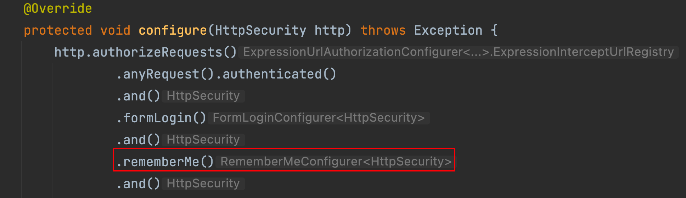

从上图中，当在SecurityConfig配置中开启了"记住我"功能之后,在进行认证时如果勾选了"记住我"选项，此时打开浏览器控制台，分析整个登录过程。首先当我们登录时，在登录请求中多了一个 RememberMe 的参数。

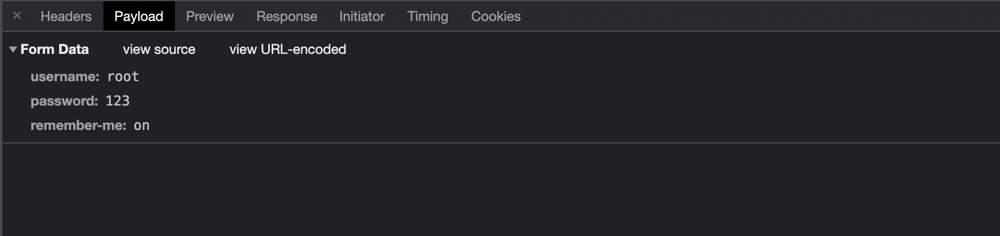

很显然，这个参数就是告诉服务器应该开启 RememberMe功能的。如果自定义登录页面开启 RememberMe 功能应该多加入一个一样的请求参数就可以啦。该请求会被 `RememberMeAuthenticationFilter`进行拦截然后自动登录具体参见源码:

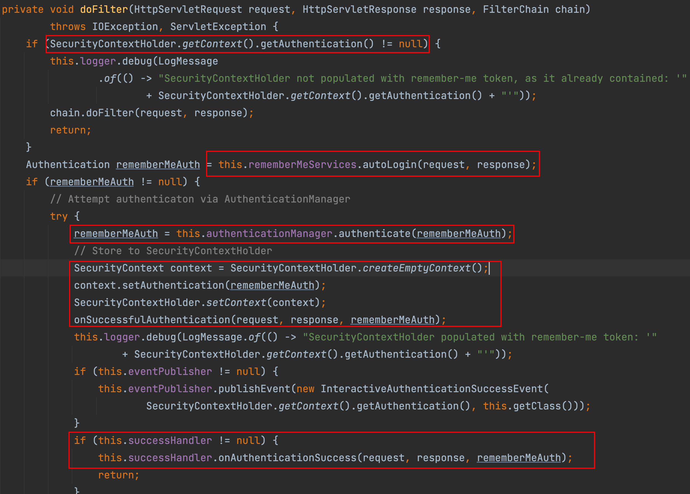

- (1）请求到达过滤器之后，首先判断 SecurityContextHolder 中是否有值，没值的话表示用户尚未登录，此时调用 autoLogin 方法进行自动登录。

  

- (2）当自动登录成功后返回的rememberMeAuth 不为null 时，表示自动登录成功，此时调用 authenticate 方法对 key 进行校验，并且将登录成功的用户信息保存到 SecurityContextHolder 对象中，然后调用登录成功回调，并发布登录成功事件。需要注意的是，登录成功的回调并不包含 RememberMeServices 中的 1oginSuccess 方法。

  

- (3）如果自动登录失败，则调用 remenberMeServices.loginFail方法处理登录失败回调。onUnsuccessfulAuthentication 和 onSuccessfulAuthentication 都是该过滤器中定义的空方法，并没有任何实现这就是 RememberMeAuthenticationFilter 过滤器所做的事情，成功将 RememberMeServices的服务集成进来。


### RememberMeServices

这里一共定义了三个方法：

1. autoLogin 方法可以从请求中提取出需要的参数，完成自动登录功能。
2. loginFail 方法是自动登录失败的回调。
3. 1oginSuccess 方法是自动登录成功的回调。

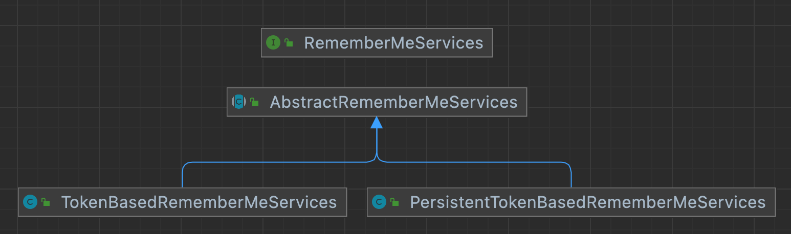

### TokenBasedRememberMeServices

在开启记住我后如果没有加入额外配置默认实现就是由TokenBasedRememberMeServices进行的实现。查看这个类源码中 processAutoLoginCookie 方法实现:

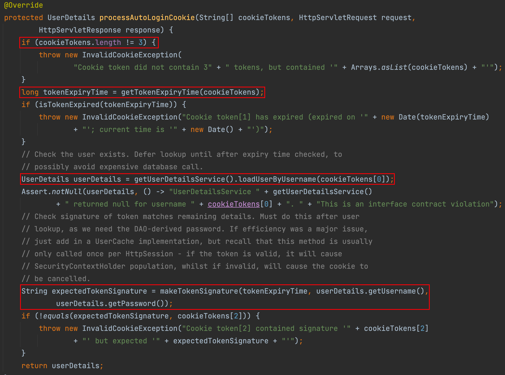

processAutoLoginCookie 方法主要用来验证 Cookie 中的令牌信息是否合法：

1. 首先判断 cookieTokens 长度是否为了，不为了说明格式不对，则直接抛出异常。

2. 从cookieTokens 数组中提取出第 1项，也就是过期时间，判断令牌是否过期，如果己经过期，则拋出异常。
3. 根据用户名 （cookieTokens 数组的第。项）查询出当前用户对象。
4. 调用 makeTokenSignature 方法生成一个签名，签名的生成过程如下：首先将用户名、令牌过期时间、用户密码以及 key 组成一个宇符串，中间用“：”隔开，然后通过 MD5 消息摘要算法对该宇符串进行加密，并将加密结果转为一个字符串返回。
5. 判断第4 步生成的签名和通过 Cookie 传来的签名是否相等（即 cookieTokens 数组
   的第2项），如果相等，表示令牌合法，则直接返回用户对象，否则拋出异常。

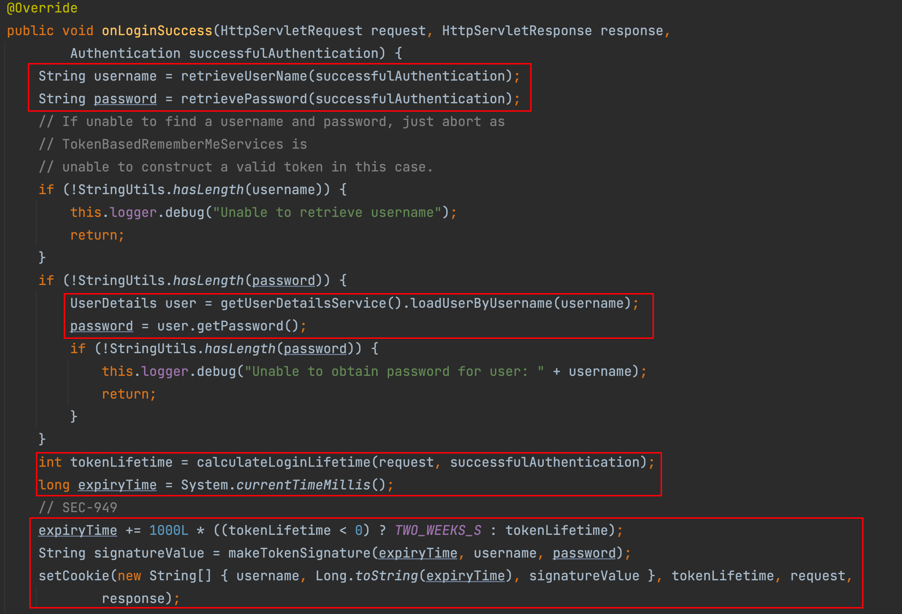

1. 在这个回调中，首先获取用户经和密码信息，如果用户密码在用户登录成功后从successfulAuthentication对象中擦除，则从数据库中重新加载出用户密码。

2. 计算出令牌的过期时间，令牌默认有效期是两周。
3. 根据令牌的过期时间、用户名以及用户密码，计算出一个签名。
4. 调用 setCookie 方法设置 Cookie， 第一个参数是一个数组，数组中一共包含三项。用户名、过期时间以及签名，在setCookie 方法中会将数组转为字符串，并进行 Base64编码后响应给前端。

### 总结

当用户通过用户名/密码的形式登录成功后，系统会根据用户的用户名、密码以及令牌的过期时间计算出一个签名，这个签名使用 MD5 消息摘要算法生成，是不可逆的。然后再将用户名、令牌过期时间以及签名拼接成一个字符串，中间用“:” 隔开，对拼接好的字符串进行Base64 编码，然后将编码后的结果返回到前端，也就是我们在浏览器中看到的令牌。当会话过期之后，访问系统资源时会自动携带上Cookie中的令牌，服务端拿到 Cookie中的令牌后，先进行 Bae64解码，解码后分别提取出令牌中的三项数据：接着根据令牌中的数据判断令牌是否已经过期，如果没有过期，则根据令牌中的用户名查询出用户信息：接着再计算出一个签名和令牌中的签名进行对比，如果一致，表示会牌是合法令牌，自动登录成功，否则自动登录失败。

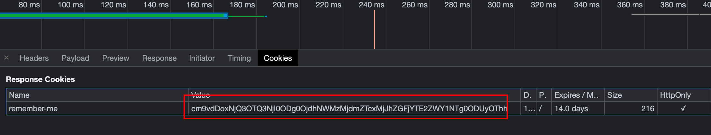

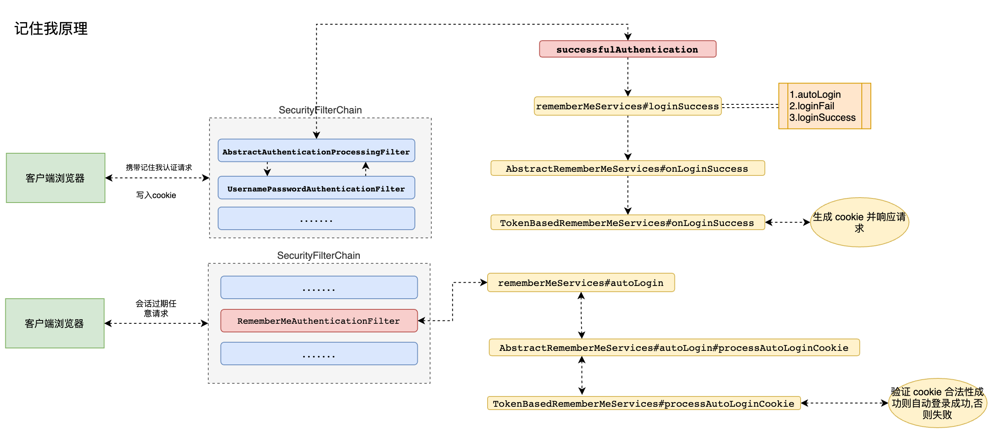

## 内存令牌

### PersistentTokenBasedRememberMeServices

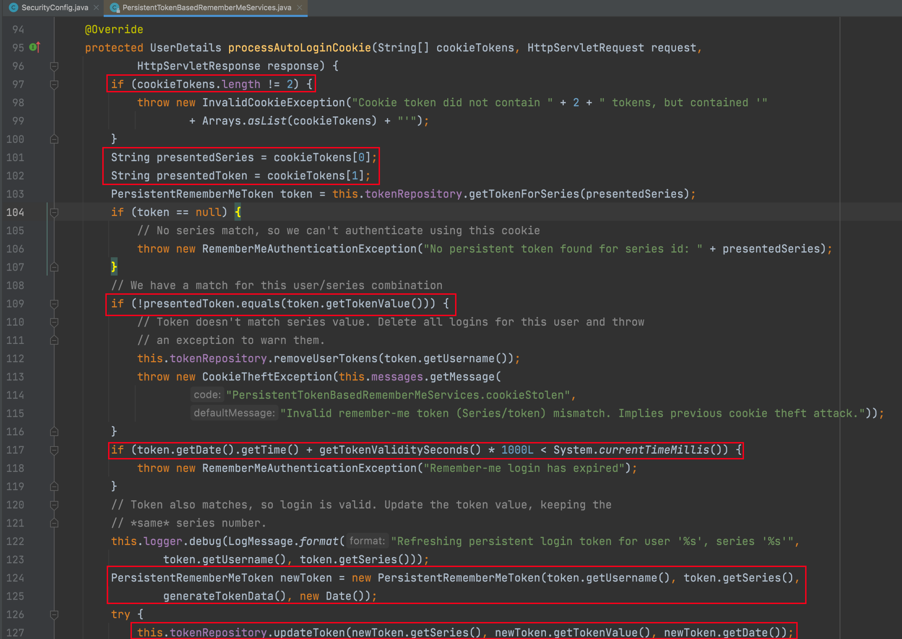

1. 不同于 TokonBasedRemornberMeServices 中的 processAutologinCookie 方法，这里cookieTokens 数组的长度为2，第一项是series，第二项是 token。
2. 从cookieTokens数组中分到提取出 series 和 token． 然后根据 series 去内存中查询出一个 PersistentRememberMeToken对象。如果查询出来的对象为null，表示内存中并没有series对应的值，本次自动登录失败。如果查询出来的 token 和从 cookieTokens 中解析出来的token不相同，说明自动登录会牌已经泄漏（恶意用户利用令牌登录后，内存中的token变了)，此时移除当前用户的所有自动登录记录并抛出异常。
3. 根据数据库中查询出来的结果判断令牌是否过期，如果过期就抛出异常。
4. 生成一个新的 PersistentRememberMeToken 对象，用户名和series 不变，token 重新
   生成，date 也使用当前时间。newToken 生成后，根据 series 去修改内存中的 token 和 date(即每次自动登录后都会产生新的 token 和 date）
5. 调用 addCookie 方法添加 Cookie， 在addCookie 方法中，会调用到我们前面所说的
   setCookie 方法，但是要注意第一个数组参数中只有两项：series 和 token（即返回到前端的令牌是通过对 series 和 token 进行 Base64 编码得到的）
6. 最后将根据用户名查询用户对象并返回。

### 使用内存中令牌实现

```java
@Configuration
public class SecurityConfig extends WebSecurityConfigurerAdapter { 
@Override
    protected void configure(HttpSecurity http) throws Exception {
        http.authorizeRequests()
                .anyRequest().authenticated()
                .and()
                .formLogin()
                .and()
                .rememberMe() //开启记住我功能
                .rememberMeServices(rememberMeServices())
                .and()
                .csrf().disable();
    }

    @Bean
    public RememberMeServices rememberMeServices() {
        return new PersistentTokenBasedRememberMeServices(
          	   "key",//参数 1: 自定义一个生成令牌 key 默认 UUID  
               userDetailsService(), //参数 2:认证数据源  
               new InMemoryTokenRepositoryImpl());//参数 3:令牌存储方式
    }
}
```

## 持久化令牌

### 引入依赖

```xml
<dependency>
  <groupId>com.alibaba</groupId>
  <artifactId>druid</artifactId>
  <version>1.2.8</version>
</dependency>

<dependency>
  <groupId>mysql</groupId>
  <artifactId>mysql-connector-java</artifactId>
  <version>5.1.38</version>
</dependency>

<dependency>
  <groupId>org.mybatis.spring.boot</groupId>
  <artifactId>mybatis-spring-boot-starter</artifactId>
  <version>2.2.0</version>
</dependency>
```

### 配置数据源

```properties
spring.thymeleaf.cache=false
spring.datasource.type=com.alibaba.druid.pool.DruidDataSource
spring.datasource.driver-class-name=com.mysql.jdbc.Driver
spring.datasource.url=jdbc:mysql://localhost:3306/security?characterEncoding=UTF-8
spring.datasource.username=root
spring.datasource.password=root
mybatis.mapper-locations=classpath:mapper/*.xml
mybatis.type-aliases-package=com.entity
```

### 配置持久化令牌

```java
@Configuration
public class SecurityConfig extends WebSecurityConfigurerAdapter {
    //...
    @Autowired
    private DataSource dataSource;
    @Bean
    public PersistentTokenRepository persistentTokenRepository(){
        JdbcTokenRepositoryImpl jdbcTokenRepository = new JdbcTokenRepositoryImpl();
        jdbcTokenRepository.setCreateTableOnStartup(false);//只需要没有表时设置为 true
        jdbcTokenRepository.setDataSource(dataSource);
        return jdbcTokenRepository;
    }
  	//..
    @Override
    protected void configure(HttpSecurity http) throws Exception {

        http.authorizeRequests()
                .mvcMatchers("/login.html").permitAll()
                .anyRequest().authenticated()
								 //...
                .logout()
                .and()
                .rememberMe() //开启记住我功能
                .tokenRepository(persistentTokenRepository())
                .and()
                .csrf().disable();
    }
}
```

### 启动项目并查看数据库

**`注意:启动项目会自动创建一个表,用来保存记住我的 token 信息 `**

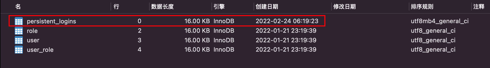

### 再次测试记住我

在测试发现即使服务器重新启动，依然可以自动登录。

## 自定义记住我

### 查看记住我源码

AbstractUserDetailsAuthenticationProvider类中authenticate方法在最后认证成功之后实现了记住我功能，但是查看源码得知如果开启记住我,必须进行相关的设置 

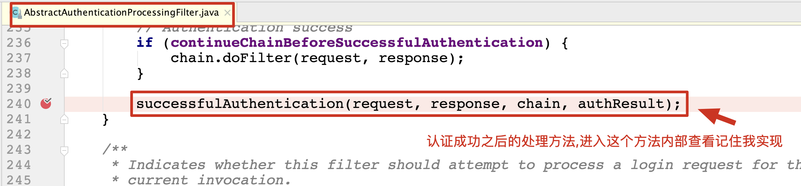

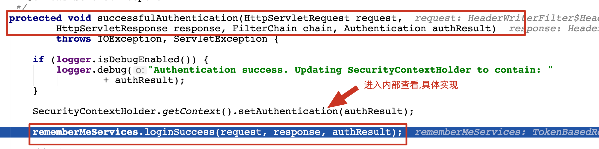

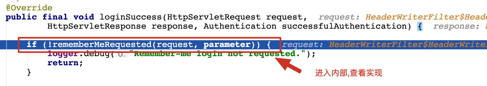

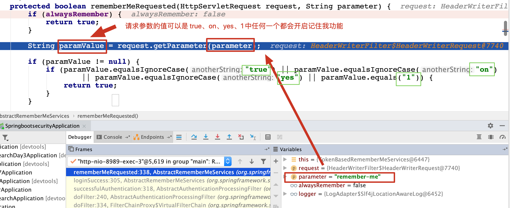

### 传统 web 开发记住我实现

通过源码分析得知必须在认证请求中加入参数remember-me值为"true,on,yes,1"其中任意一个才可以完成记住我功能,这个时候修改认证界面:

```html
<!DOCTYPE html>
<html lang="en">
<head>
    <meta charset="UTF-8">
    <title>登录</title>
</head>
<body>
<h1>用户登录</h1>
<form method="post" th:action="@{/doLogin}">
    用户名:<input name="uname" type="text"/><br>
    密码:<input name="passwd" type="password"/><br>
  	记住我: <input type="checkbox" name="remember-me" value="on|yes|true|1"/><br>
    <input type="submit" value="登录"/>
</form>
</body>
</html>
```

配置中开启记住我

```java
@Configuration
public class SecurityConfig extends WebSecurityConfigurerAdapter {
		@Override
    protected void configure(HttpSecurity http) throws Exception {
        http.authorizeRequests()
                .....
                .and()
                .rememberMe() //开启记住我
                //.alwaysRemember(true) 总是记住我
                .and()
                .csrf().disable();
    }
}
```

### 前后端分离开发记住我实现

#### 自定义认证类 LoginFilter

```java
/**
 * 自定义前后端分离认证 Filter
 */
public class LoginFilter extends UsernamePasswordAuthenticationFilter {

    @Override
    public Authentication attemptAuthentication(HttpServletRequest request, HttpServletResponse response) throws AuthenticationException {
        System.out.println("========================================");
        //1.判断是否是 post 方式请求
        if (!request.getMethod().equals("POST")) {
            throw new AuthenticationServiceException("Authentication method not supported: " + request.getMethod());
        }
        //2.判断是否是 json 格式请求类型
        if (request.getContentType().equalsIgnoreCase(MediaType.APPLICATION_JSON_VALUE)) {
            //3.从 json 数据中获取用户输入用户名和密码进行认证 {"uname":"xxx","password":"xxx","remember-me":true}
            try {
                Map<String, String> userInfo = new ObjectMapper().readValue(request.getInputStream(), Map.class);
                String username = userInfo.get(getUsernameParameter());
                String password = userInfo.get(getPasswordParameter());
                String rememberValue = userInfo.get(AbstractRememberMeServices.DEFAULT_PARAMETER);
                if (!ObjectUtils.isEmpty(rememberValue)) {
                    request.setAttribute(AbstractRememberMeServices.DEFAULT_PARAMETER, rememberValue);
                }
                System.out.println("用户名: " + username + " 密码: " + password + " 是否记住我: " + rememberValue);
                UsernamePasswordAuthenticationToken authRequest = new UsernamePasswordAuthenticationToken(username, password);
                setDetails(request, authRequest);
                return this.getAuthenticationManager().authenticate(authRequest);
            } catch (IOException e) {
                e.printStackTrace();
            }
        }
        return super.attemptAuthentication(request, response);
    }
}
```

#### 自定义 RememberMeService

```java
/**
 * 自定义记住我 services 实现类
 */
public class MyPersistentTokenBasedRememberMeServices extends PersistentTokenBasedRememberMeServices {
    public MyPersistentTokenBasedRememberMeServices(String key, UserDetailsService userDetailsService, PersistentTokenRepository tokenRepository) {
        super(key, userDetailsService, tokenRepository);
    }
    /**
     * 自定义前后端分离获取 remember-me 方式
     */
    @Override
    protected boolean rememberMeRequested(HttpServletRequest request, String parameter) {
        String paramValue = request.getAttribute(parameter).toString();
        if (paramValue != null) {
            if (paramValue.equalsIgnoreCase("true") || paramValue.equalsIgnoreCase("on")
                    || paramValue.equalsIgnoreCase("yes") || paramValue.equals("1")) {
                return true;
            }
        }
        return false;
    }
}
```

#### 配置记住我

```java
@Configuration
public class SecurityConfig extends WebSecurityConfigurerAdapter {
    @Bean
    public UserDetailsService userDetailsService() {
        //.....
        return inMemoryUserDetailsManager;
    }
    @Override
    protected void configure(AuthenticationManagerBuilder auth) throws Exception {
        auth.userDetailsService(userDetailsService());
    }

    @Override
    @Bean
    public AuthenticationManager authenticationManagerBean() throws Exception {
        return super.authenticationManagerBean();
    }

    //自定义 filter 交给工厂管理
    @Bean
    public LoginFilter loginFilter() throws Exception {
        LoginFilter loginFilter = new LoginFilter();
        loginFilter.setFilterProcessesUrl("/doLogin");//指定认证 url
        loginFilter.setUsernameParameter("uname");//指定接收json 用户名 key
        loginFilter.setPasswordParameter("passwd");//指定接收 json 密码 key
        loginFilter.setAuthenticationManager(authenticationManagerBean());
        loginFilter.setRememberMeServices(rememberMeServices()); //设置认证成功时使用自定义rememberMeService
        //认证成功处理
        loginFilter.setAuthenticationSuccessHandler((req, resp, authentication) -> {
            Map<String, Object> result = new HashMap<String, Object>();
            result.put("msg", "登录成功");
            result.put("用户信息", authentication.getPrincipal());
            resp.setContentType("application/json;charset=UTF-8");
            resp.setStatus(HttpStatus.OK.value());
            String s = new ObjectMapper().writeValueAsString(result);
            resp.getWriter().println(s);
        });
        //认证失败处理
        loginFilter.setAuthenticationFailureHandler((req, resp, ex) -> {
            Map<String, Object> result = new HashMap<String, Object>();
            result.put("msg", "登录失败: " + ex.getMessage());
            resp.setStatus(HttpStatus.INTERNAL_SERVER_ERROR.value());
            resp.setContentType("application/json;charset=UTF-8");
            String s = new ObjectMapper().writeValueAsString(result);
            resp.getWriter().println(s);
        });
        return loginFilter;
    }

    @Override
    protected void configure(HttpSecurity http) throws Exception {
        http.authorizeHttpRequests()
                .anyRequest().authenticated()//所有请求必须认证
                .and()
                .formLogin()
                .and()
                .rememberMe() //开启记住我功能  cookie 进行实现  1.认证成功保存记住我 cookie 到客户端   2.只有 cookie 写入客户端成功才能实现自动登录功能
                .rememberMeServices(rememberMeServices())  //设置自动登录使用哪个 rememberMeServices
                .and()
                .exceptionHandling()
                .authenticationEntryPoint((req, resp, ex) -> {
                    resp.setContentType(MediaType.APPLICATION_JSON_UTF8_VALUE);
                    resp.setStatus(HttpStatus.UNAUTHORIZED.value());
                    resp.getWriter().println("请认证之后再去处理!");
                })
                .and()
                .logout()
                .logoutRequestMatcher(new OrRequestMatcher(
                        new AntPathRequestMatcher("/logout", HttpMethod.DELETE.name()),
                        new AntPathRequestMatcher("/logout", HttpMethod.GET.name())
                ))
                .logoutSuccessHandler((req, resp, auth) -> {
                    Map<String, Object> result = new HashMap<String, Object>();
                    result.put("msg", "注销成功");
                    result.put("用户信息", auth.getPrincipal());
                    resp.setContentType("application/json;charset=UTF-8");
                    resp.setStatus(HttpStatus.OK.value());
                    String s = new ObjectMapper().writeValueAsString(result);
                    resp.getWriter().println(s);
                })
                .and()
                .csrf().disable();


        // at: 用来某个 filter 替换过滤器链中哪个 filter
        // before: 放在过滤器链中哪个 filter 之前
        // after: 放在过滤器链中那个 filter 之后
        http.addFilterAt(loginFilter(), UsernamePasswordAuthenticationFilter.class);
    }


    @Bean
    public RememberMeServices rememberMeServices() {
        return new MyPersistentTokenBasedRememberMeServices(UUID.randomUUID().toString(), userDetailsService(), new InMemoryTokenRepositoryImpl());
    }
}

```

---

# 