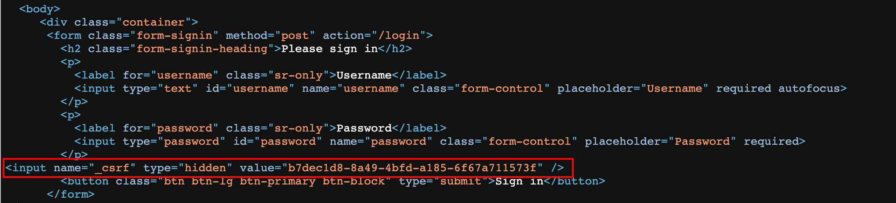
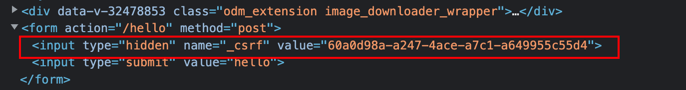
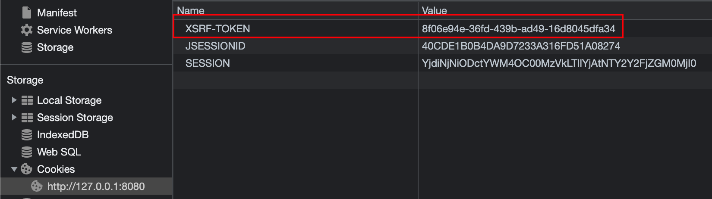

#  CSRF 漏洞保护

- CSRF 简介

- CSRF 防御&基本配置
- 实战

### 简介

CSRF (Cross-Site Request Forgery 跨站请求伪造)，也可称为一键式攻击 (one-click-attack），通常缩写为 `CSRF` 或者 `XSRF`。

`CSRF` 攻击是一种挟持用户在当前已登录的浏览器上发送恶意请求的攻击方法。相对于XSS利用用户对指定网站的信任，CSRF则是利用网站对用户网页浏览器的信任。简单来说，CSRF是致击者通过一些技术手段欺骗用户的浏览器，去访问一个用户曾经认证过的网站并执行恶意请求，例如发送邮件、发消息、甚至财产操作 (如转账和购买商品）。由于客户端(浏览器)已经在该网站上认证过，所以该网站会认为是真正用户在操作而执行请求（实际上这个并非用户的本意）。

**举个简单的例子：**

假设 blr 现在登录了某银行的网站准备完成一项转账操作，转账的链接如下：

**https: //bank .xxx .com/withdraw?account=blr&amount=1000&for=zhangsan**

可以看到，这个链接是想从 blr 这个账户下转账 1000 元到 zhangsan 账户下，假设blr 没有注销登录该银行的网站，就在同一个浏览器新的选项卡中打开了一个危险网站，这个危险网站中有一幅图片，代码如下：

****

一旦用户打开了这个网站，这个图片链接中的请求就会自动发送出去。由于是同一个浏览器并且用户尚未注销登录，所以该请求会自动携带上对应的有效的 Cookie 信息，进而完成一次转账操作。这就是跨站请求伪造。

### CSRF攻击演示

#### 创建银行应用

- 引入依赖

  ```xml
  <dependency>
     <groupId>org.springframework.boot</groupId>
     <artifactId>spring-boot-starter-security</artifactId>
  </dependency>
  <dependency>
    <groupId>org.springframework.boot</groupId>
    <artifactId>spring-boot-starter-web</artifactId>
  </dependency>
  ```

- 修改配置

  ```java
  @Configuration
  public class SecurityConfig extends WebSecurityConfigurerAdapter {
  
      @Bean
      public UserDetailsService userDetailsService() {
          InMemoryUserDetailsManager inMemoryUserDetailsManager = new InMemoryUserDetailsManager();
          inMemoryUserDetailsManager.createUser(User.withUsername("root").password("{noop}123").roles("admin").build());
          return inMemoryUserDetailsManager;
      }
  
      @Override
      protected void configure(AuthenticationManagerBuilder auth) throws Exception {
          auth.userDetailsService(userDetailsService());
      }
  
      @Override
      protected void configure(HttpSecurity http) throws Exception {
          http.authorizeRequests().anyRequest().authenticated()
                  .and().formLogin().and().csrf().disable();
      }
  }
  ```

- 创建 controller 并启动启动

  ```java
  @RestController
  public class HelloController {
  
      @PostMapping("/withdraw")
      public String withdraw() {
          System.out.println("执行一次转账操作");
          return "执行一次转账操作";
      }
  }
  ```

#### 创建恶意应用

- 创建简单 springboot 应用

- 修改配置

  ```yml
  server:
    port: 8081
  ```

- 准备攻击页面

  ```html
  <form action="http://127.0.0.1:8080/withdraw" method="post">
      <input name="name" type="hidden" value="blr"/>
      <input name="money" type="hidden" value="10000">
      <input type="submit" value="点我">
  </form>
  ```


### CSRF 防御

**CSRF**攻击的根源在于浏览器默认的身份验证机制(自动携带当前网站的Cookie信息)，这种机制虽然可以保证请求是来自用户的某个浏览器，但是无法确保这请求是用户授权发送。攻击者和用户发送的请求一模一样，这意味着我们没有办法去直接拒绝这里的某一个请求。如果能在合法清求中额外携带一个攻击者无法获取的参数，就可以成功区分出两种不同的请求，进而直接拒绝掉恶意请求。在 SpringSecurity 中就提供了这种机制来防御 CSRF 攻击，这种机制我们称之为`令牌同步模式`。

#### 令牌同步模式

这是目前主流的 CSRF 攻击防御方案。具体的操作方式就是在每一个 HTTP 请求中，除了默认自动携带的 Cookie 参数之外，再提供一个安全的、随机生成的宇符串，我们称之为 CSRF 令牌。这个 CSRF 令牌由服务端生成，生成后在 HtpSession 中保存一份。当前端请求到达后，将请求携带的 CSRF 令牌信息和服务端中保存的令牌进行对比，如果两者不相等，则拒绝掉该 HITTP 请求。

> **注意:** 考虑到会有一些外部站点链接到我们的网站，所以我们要求请求是幂等的，这样对子HEAD、OPTIONS、TRACE 等方法就没有必要使用 CSRF 令牌了，强行使用可能会导致令牌泄露！

#### 开启 CSRF 防御

```java
@Configuration
public class SecurityConfig extends WebSecurityConfigurerAdapter {
    @Override
    protected void configure(HttpSecurity http) throws Exception {
        http.
          ...
          formLogin()
          .and()
          .csrf(); //开启 csrf
    }
}
```

#### 查看登录页面源码



### 传统web开发使用CSRF

开启CSRF防御后会自动在提交的表单中加入如下代码，如果不能自动加入，需要在开启之后手动加入如下代码，并随着请求提交。获取服务端令牌方式如下:

```html
<input type="hidden" th:name="${_csrf.parameterName}" th:value="${_csrf.token}"/>
```

#### 开发测试 controller

```java
@Controller
public class HelloController {
    @PostMapping("/hello")
    @ResponseBody
    public String hello() {
        System.out.println("hello success");
        return "hello success";
    }

    @GetMapping("/index.html")
    public String index() {
        return "index";
    }
}
```

#### 创建 html

```html
<html lang="en">
<head>
    <meta charset="UTF-8">
    <title>测试 CSRF 防御</title>
</head>
<body>
<form th:action="@{/hello}" method="post">
    <input type="submit" value="hello"/>
</form>
</body>
</html>
```

#### 测试查看index.html源码



### 前后端分离使用 CSRF

前后端分离开发时，只需要将生成 csrf 放入到cookie 中，并在请求时获取 cookie 中令牌信息进行提交即可。

#### 修改 CSRF 存入 Cookie

```java
@Configuration
public class SecurityConfig extends WebSecurityConfigurerAdapter {
    @Override
    protected void configure(HttpSecurity http) throws Exception {
        http.authorizeRequests().anyRequest().authenticated()
                .and()
                .formLogin()
                .and()
                .csrf()
                .csrfTokenRepository(CookieCsrfTokenRepository.withHttpOnlyFalse());
    }
}
```

#### 访问登录界面查看 cookie



#### 发送请求携带令牌即可

- 请求参数中携带令牌

```yml
key: _csrf  
value:"xxx"
```

- 请求头中携带令牌

```http
X-XSRF-TOKEN:value
```

# 