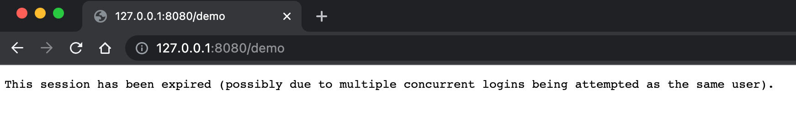

# 会话管理

- 简介
- 会话并发管理
- 会话共享实战

## 简介

当浏览器调用登录接口登录成功后，服务端会和浏览器之间建立一个会话 (Session) 浏览器在每次发送请求时都会携带一个 Sessionld，服务端则根据这个 Sessionld 来判断用户身份。当浏览器关闭后，服务端的 Session 并不会自动销毁，需要开发者手动在服务端调用 Session销毁方法，或者等 Session 过期时间到了自动销毁。在Spring Security 中，与HttpSession相关的功能由 SessionManagementFiter 和SessionAutheaticationStrateey 接口来处理，SessionManagomentFilter 过滤器将 Session 相关操作委托给 SessionAuthenticationStrateey 接口去完成。

## 会话并发管理

### 简介

会话并发管理就是指在当前系统中，同一个用户可以同时创建多少个会话，如果一个设备对应一个会话，那么也可以简单理解为同一个用户可以同时在多少台设备上进行登录。默认情况下，同一用户在多少台设备上登录并没有限制，不过开发者可以在 Spring Security 中对此进行配置。

### 开启会话管理

```java
@Configuration
public class SecurityConfig extends WebSecurityConfigurerAdapter {

  	//...
    @Override
    protected void configure(HttpSecurity http) throws Exception {
        http.authorizeRequests()
                .anyRequest().authenticated()
                .and()
                .formLogin()
                .and()
                .rememberMe()
                .and()
                .csrf().disable()
                .sessionManagement()  //开启会话管理
                .maximumSessions(1);  //设置会话并发数为 1
    }

    @Bean
    public HttpSessionEventPublisher httpSessionEventPublisher() {
        return new HttpSessionEventPublisher();
    }
}
```

1. sessionManagement() 用来开启会话管理、maximumSessions 指定会话的并发数为 1。
2. HttpSessionEventPublisher 提供一一个Htp SessionEvenePubishor-实例。Spring Security中通过一个 Map 集合来集护当前的 Http Session 记录，进而实现会话的并发管理。当用户登录成功时，就向集合中添加一条Http Session 记录；当会话销毁时，就从集合中移除一条 Httpsession 记录。HtpSesionEvenPublisher 实现了 Fttp SessionListener 接口，可以监听到 HtpSession 的创建和销毀事件，并将 Fltp Session 的创建/销毁事件发布出去，这样，当有 HttpSession 销毀时，Spring Security 就可以感知到该事件了。

### 测试会话管理

配置完成后，启动项目。这次测试我们需要两个浏览器，如果使用了 Chrome 浏览器，可以使用 Chrome 浏览器中的多用户方式（相当于两个浏览器）先在第一个浏览器中输入 http://localhost:8080，此时会自动跳转到登录页面，完成登录操作，就可以访问到数据了；接下来在第二个浏览器中也输入 http://localhost:8080，也需要登录，
完成登录操作；当第二个浏览器登录成功后，再回到第一个浏览器，刷新页面。结果出现下图：

## 会话失效处理

### 传统 web 开发处理

```java
protected void configure(HttpSecurity http) throws Exception {
  http.authorizeRequests()
    .anyRequest().authenticated()
    .and()
    ....
    .sessionManagement()  //开启会话管理
    .maximumSessions(1)  //允许同一个用户只允许创建一个会话
    .expiredUrl("/login");//会话过期处理
}
```

### 前后端分离开发处理

```java
@Override
protected void configure(HttpSecurity http) throws Exception {
  http.authorizeRequests()
    .anyRequest().authenticated()
    .....
    .sessionManagement()  //开启会话管理
    .maximumSessions(1)  //允许同一个用户只允许创建一个会话
    //.expiredUrl("/login")//会话过期处理  传统 web 开发
    .expiredSessionStrategy(event -> {
      HttpServletResponse response = event.getResponse();
      response.setContentType("application/json;charset=UTF-8");
      Map<String, Object> result = new HashMap<>();
      result.put("status", 500);
      result.put("msg", "当前会话已经失效,请重新登录!");
      String s = new ObjectMapper().writeValueAsString(result);
      response.setContentType("application/json;charset=UTF-8");
      response.getWriter().println(s);
      response.flushBuffer();
    });//前后端分离开发处理
}
```

## 禁止再次登录

默认的效果是一种被 “挤下线”的效果，后面登录的用户会把前面登录的用户 “挤下线”。还有一种是禁止后来者登录，即一旦当前用户登录成功，后来者无法再次使用相同的用户登录，直到当前用户主动注销登录，配置如下：

```java
@Override
protected void configure(HttpSecurity http) throws Exception {
  http.authorizeRequests()
    .anyRequest().authenticated()
    .and()
    ....
    .sessionManagement()  //开启会话管理
    .maximumSessions(1)  //允许同一个用户只允许创建一个会话
    //.expiredUrl("/login")//会话过期处理  传统 web 开发
    .expiredSessionStrategy(event -> {
      HttpServletResponse response = event.getResponse();
      response.setContentType("application/json;charset=UTF-8");
      Map<String, Object> result = new HashMap<>();
      result.put("status", 500);
      result.put("msg", "当前会话已经失效,请重新登录!");
      String s = new ObjectMapper().writeValueAsString(result);
      response.getWriter().println(s);
      response.flushBuffer();
    })//前后端分离开发处理
    .maxSessionsPreventsLogin(true);//登录之后禁止再次登录
}
```

## 会话共享

前面所讲的会话管理都是单机上的会话管理，如果当前是集群环境，前面所讲的会话管
理方案就会失效。此时可以利用 spring-session 结合 redis 实现 session 共享。

### 实战

###### 引入依赖 

```xml
<dependency>
  <groupId>org.springframework.boot</groupId>
  <artifactId>spring-boot-starter-data-redis</artifactId>
</dependency>
<dependency>
  <groupId>org.springframework.session</groupId>
  <artifactId>spring-session-data-redis</artifactId>
</dependency>
```

###### 编写配置

```properties
spring.redis.host=localhost
spring.redis.port=6379
```

###### 配置Security

```java
package com.blr.config;

import com.fasterxml.jackson.databind.ObjectMapper;
import org.springframework.beans.factory.annotation.Autowired;
import org.springframework.context.annotation.Bean;
import org.springframework.context.annotation.Configuration;
import org.springframework.security.config.annotation.authentication.builders.AuthenticationManagerBuilder;
import org.springframework.security.config.annotation.web.builders.HttpSecurity;
import org.springframework.security.config.annotation.web.configuration.WebSecurityConfigurerAdapter;
import org.springframework.security.core.userdetails.User;
import org.springframework.security.core.userdetails.UserDetailsService;
import org.springframework.security.provisioning.InMemoryUserDetailsManager;
import org.springframework.session.FindByIndexNameSessionRepository;
import org.springframework.session.security.SpringSessionBackedSessionRegistry;

import javax.servlet.http.HttpServletResponse;
import java.util.HashMap;
import java.util.Map;

@Configuration
public class SecurityConfig extends WebSecurityConfigurerAdapter {


    private final FindByIndexNameSessionRepository sessionRepository;


    @Autowired
    public SecurityConfig(FindByIndexNameSessionRepository sessionRepository) {
        this.sessionRepository = sessionRepository;
    }

    @Bean
    public UserDetailsService userDetailsService() {
        ....
    }

    @Override
    protected void configure(AuthenticationManagerBuilder auth) throws Exception {
        auth.userDetailsService(userDetailsService());
    }

    @Override
    protected void configure(HttpSecurity http) throws Exception {
        http.authorizeRequests()
                .anyRequest().authenticated()
                .and()
                .formLogin()
                .and()
                .rememberMe()
                .and()
                .csrf().disable()
                .sessionManagement()  //开启会话管理
                .maximumSessions(1)  //允许同一个用户只允许创建一个会话*/
                .expiredUrl("/login")//会话过期处理  传统 web 开发
                .expiredSessionStrategy(event -> {
                    HttpServletResponse response = event.getResponse();
                    response.setContentType("application/json;charset=UTF-8");
                    Map<String, Object> result = new HashMap<>();
                    result.put("status", 500);
                    result.put("msg", "当前会话已经失效,请重新登录!");
                    String s = new ObjectMapper().writeValueAsString(result);
                    response.getWriter().println(s);
                    response.flushBuffer();
                }).sessionRegistry(sessionRegistry());//前后端分离开发处理
        //.maxSessionsPreventsLogin(true);//登录之后禁止再次登录*/
    }

    @Bean
    public SpringSessionBackedSessionRegistry sessionRegistry() {
        return new SpringSessionBackedSessionRegistry(sessionRepository);
    }

}
```

###### 