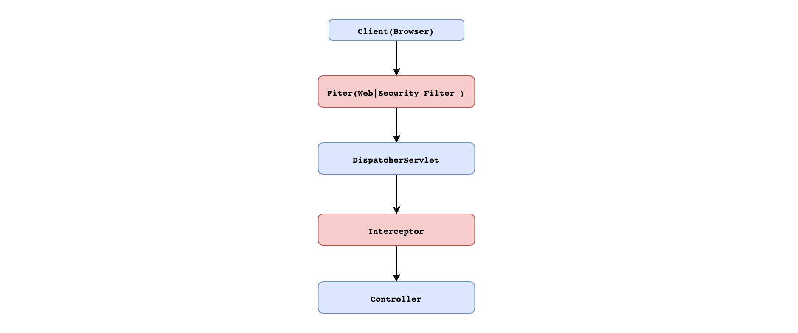

# 跨域

- Spring 处理方案。
- Spring Security 处理方案。

## 简介

跨域问题是实际应用开发中一个非常常见的需求，在 Spring 框架中对于跨域问题的处理方案有好几种，引 了 Spring Security 之后，跨域问题的处理方案又增加了。

## 什么是 CORS 

CORS (Cross-Origin Resource Sharing ）是由 W3C制定的一种跨域资源共享技术标准，其目的就是为了解决前端的跨域请求。在JavaEE 开发中，最常见的前端跨域请求解决方案是早期的JSONP，但是 JSONP 只支持 GET 请求，这是一个很大的缺陷，而 CORS 则支特多种 HTTTP请求方法，也是目前主流的跨域解决方案。

CORS 中新增了一组HTTP 请求头字段，通过这些字段，服务器告诉浏览器，那些网站通过浏览器有权限访问哪些资源。同时规定，对那些可能修改服务器数据的HTTP请求方法 （如GET以外的HTTP 请求等)，浏览器必须首先使用 OPTIONS 方法发起一个预检请求(prenightst），预检请求的目的是查看服务端是否支持即将发起的跨域请求，如果服务端允许，才发送实际的 HTTP 请求。在预检请求的返回中，服务器端也可以通知客户端，是否需要携带身份凭证（如 Cookies、HTTP 认证信息等）。

>  CORS: 同源/同域 = 协议+主机+端口

### 简单请求

GET 请求为例，如果需要发起一个跨域请求，则请求头如下：

```http
Host: localhost:8080
Origin: http://localhost:8081
Referer:http://localhost:8081/index.html
```

如果服务端支持该跨域请求，那么返回的响应头中将包含如下字段：

```http
Access-Control-Allow-Origin:http://localhost: 8081
```

Access-Control-Allow-Origin 字段用来告诉浏览器可以访问该资源的域，当浏览器收到这样的响应头信息之后，提取出 Access-Control-Allow-Origin 字段中的值， 发现该值包含当前页面所在的域，就知道这个跨域是被允许的，因此就不再对前端的跨域请求进行限制。这属于简单请求，即不需要进行预检请求的跨域。

### 非简单请求

对于一些非简单请求，会首先发送一个预检请求。预检请求类似下面这样：

```http
OPTIONS /put HTTP/1.1
Host: localhost:8080
Connection: keep-alive
Accept: */*
Access-Control-Request-Method:PUT
Origin: http://localhost: 8081
Referer:http://localhost:8081/index.html
```

请求方法是 OPTIONS，请求头Origin 就告诉服务端当前页面所在域，请求头 Access-Control-Request-Methods 告诉服务器端即将发起的跨域请求所使用的万法。服务端对此进行判断，如果允许即将发起的跨域请求，则会给出如下响应：

```http
HTTP/1.1 200
Access-Control-Allow-Origin:http://localhost: 8081
Access-Control-Request-Methods: PUT
Access-Control-Max-Age: 3600
```

Access-Control-Allow-Metbods 字段表示允许的跨域方法：Access-Control-Max-Age 字段表示预检请求的有效期，单位为秒，在有效期内如果发起该跨域请求，则不用再次发起预检请求。预检请求结朿后，接下来就会发起一个真正的跨域请求，跨域请求和前面的简单请求跨域步骤类似。

## Spring 跨域解决方案

### @CrossOrigin

Spring 中第一种处理跨域的方式是通过@CrossOrigin 注解来标记支持跨域，该注解可以添加在方法上，也可以添加在 Controller 上。当添加在 Controller 上时，表示 Controller 中的所

有接口都支持跨域，具体配置如下：

```java
@RestController
public Class HelloController{
	@CrossOrigin (origins ="http://localhost:8081")
	@PostMapping ("/post")
	public String post (){
		return "hello post";
	}
}
```

@CrossOrigin 注解各属性含义如下：

- alowCredentials：浏览器是否应当发送凭证信息，如 Cookie。

- allowedHeaders： 请求被允许的请求头字段，`*`表示所有字段。

- exposedHeaders：哪些响应头可以作为响应的一部分暴露出来。

  `注意，这里只可以一一列举，通配符 * 在这里是无效的。`

- maxAge：预检请求的有效期，有效期内不必再次发送预检请求，默认是`1800 `秒。

- methods：允许的请求方法，`*` 表示允许所有方法。

- origins：允许的域，`*`表示允许所有域。

### addCrosMapping

@CrossOrigin 注解需要添加在不同的 Controller 上。所以还有一种全局配置方法，就是通过重写 WebMvcConfigurerComposite#addCorsMappings方法来实现，具体配置如下：

```java
Configuration
public class WebMvcConfig implements WebMvcConfigurer{
  Override
  public void addCorsMappings (CorsRegistry registry){
    registry.addMapping("/**") //处理的请求地址
    .allowedMethods ("*")
    •allowedorigins("*")
    .allowedHeaders ("*")
    .allowCredentials (false)
    •exposedHeaders ("")
    .maxAge (3600) ;
  }
}
```

### CrosFilter

Cosr Filter 是Spring Web 中提供的一个处理跨域的过滤器，开发者也可以通过该过该过滤器处理跨域。

```java
@Configuration
public class WebMvcConfig {
    @Bean
    FilterRegistrationBean<CorsFilter> corsFilter() {
        FilterRegistrationBean<CorsFilter> registrationBean = new FilterRegistrationBean<>();
        CorsConfiguration corsConfiguration = new CorsConfiguration();
        corsConfiguration.setAllowedHeaders(Arrays.asList("*"));
        corsConfiguration.setAllowedMethods(Arrays.asList("*"));
        corsConfiguration.setAllowedOrigins(Arrays.asList("*"));
        corsConfiguration.setMaxAge(3600L);
        UrlBasedCorsConfigurationSource source = new UrlBasedCorsConfigurationSource();
        source.registerCorsConfiguration("/**", corsConfiguration);
        registrationBean.setFilter(new CorsFilter(source));
        registrationBean.setOrder(-1);//filter 0 1
        return registrationBean;
    }
}
```

## Spring Security 跨域解决方案

### 原理分析

当我们为项目添加了 Spring Security 依赖之后，发现上面三种跨域方式有的失效了，有
则可以继续使用，这是怎么回事？

通过@CrossOrigin 注解或者重写 addCorsMappings 方法配置跨域，统统失效了，通
CorsFilter 配置的跨域，有没有失效则要看过滤器的优先级，如果过滤器优先级高于 Sp
Security 过滤器，即先于 Spring Security 过滤器执行，则 CorsFiter 所配置的跨域处理依然有效；如果过滤器优先级低于 Spring Security 过滤器，则 CorsFilter 所配置的跨域处理就会失效。

为了理清楚这个问题，我们先简略了解一下 Filter、DispatchserServlet 以及Interceptor 执行顺序。



理清楚了执行顺序，我们再来看跨域请求过程。由于非简单请求都要首先发送一个预检请求
request），而预检请求并不会携带认证信息，所以预检请求就有被 Spring Security 拦截的可能。因此通过@CrossOrigin 注解或者重写 addCorsMappings 方法配置跨域就会失效。如果使用 CorsFilter 配置的跨域，只要过滤器优先级高于 SpringSecurity 过滤器就不会有问题。反之同样会出现问题。

### 解决方案

Spring Security 中也提供了更专业的方式来解决预检请求所面临的问题。如：

```java
@Configuration
public class SecurityConfig extends WebSecurityConfigurerAdapter {
		@Override
    protected void configure(HttpSecurity http) throws Exception {
        http.authorizeRequests().anyRequest()
                .authenticated()
                .and()
                .formLogin()
                .and()
                .cors() //跨域处理方案
                .configurationSource(configurationSource())
                .and()
                .csrf().disable();
    }

    CorsConfigurationSource configurationSource() {
        CorsConfiguration corsConfiguration = new CorsConfiguration();
        corsConfiguration.setAllowedHeaders(Arrays.asList("*"));
        corsConfiguration.setAllowedMethods(Arrays.asList("*"));
        corsConfiguration.setAllowedOrigins(Arrays.asList("*"));
        corsConfiguration.setMaxAge(3600L);
        UrlBasedCorsConfigurationSource source = new UrlBasedCorsConfigurationSource();
        source.registerCorsConfiguration("/**", corsConfiguration);
        return source;
    }
}
```

# 