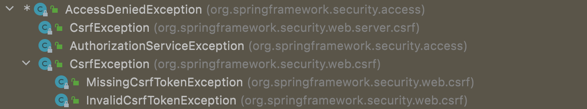

# 异常处理

- Spring Security 异常体系
- 自定义异常配置

### 异常体系

Spring Security 中异常主要分为两大类:

- AuthenticationException:  认证异常
- AccessDeniedException:    授权异常

其中认证所涉及异常类型比较多，默认提供的异常类型如下：


相比于认证异常，权限异常类就要少了很多，默认提供的权限异常如下：



在实际项目开发中，如果默认提供异常无法满足需求时，就需要根据实际需要来自定义异常类。

### 自定义异常处理配置

```java
@Configuration
public class SecurityConfig extends WebSecurityConfigurerAdapter {
    @Override
    protected void configure(HttpSecurity http) throws Exception {
        http.authorizeRequests().anyRequest()
                .authenticated()
          			//.....
                .and()
                .exceptionHandling()//异常处理
                .authenticationEntryPoint((request, response, e) -> {
                  response.setContentType("application/json;charset=UTF-8");
                  response.setStatus(HttpStatus.UNAUTHORIZED.value());
                  response.getWriter().write("尚未认证，请进行认证操作！");
                })
                .accessDeniedHandler((request, response, e) -> {
                  response.setContentType("application/json;charset=UTF-8");
                  response.setStatus(HttpStatus.FORBIDDEN.value());
                  response.getWriter().write("无权访问!");
                });
    }
}
```

# 