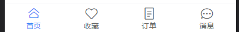

# 首页搭建

### tabbar

tabbar 标签栏  复用组件

components/tab-bar/tab-bar.vue

```vue
<script setup>
import { ref } from 'vue'
const active = ref(0);
</script>
<template>
  <van-tabbar v-model="active">
    <van-tabbar-item icon="home-o">首页</van-tabbar-item>
    <van-tabbar-item icon="like-o">收藏</van-tabbar-item>
    <van-tabbar-item icon="orders-o">订单</van-tabbar-item>
    <van-tabbar-item icon="chat-o">消息</van-tabbar-item>
  </van-tabbar>
</template>

<style lang="less" scoped>

</style>

```




抽离组件数据—>  assets/data/tabbar.js

```js
const tabbarData = [
  {
    text: "首页",
    home:'home',
    icon: "home-o",
    path: "/home"
  },
  {
    text: "收藏",
    home:'favor',
    icon: "like-o",
    path: "/favor"
  },
  {
    text: "订单",
    home:'order',
    icon: "orders-o",
    path: "/order"
  },
  {
    text: "消息",
    home:'message',
    icon: "chat-o",
    path: "/message"
  }
]

export default tabbarData 

```

### varlet 封装tabbar

```vue
<script setup>
// 底部导航栏数据
import tabbarData from '@/assets/data/tabbar'
import { ref } from 'vue'
import { useRouter } from 'vue-router'

const active = ref(0);
const route = useRouter()
const clickbtn = (path) => {
  route.push(path)
}

</script>
<template>

  <var-bottom-navigation active-color="#ff9854" v-model:active="active" fixed>
    <template v-for="(item, index) in tabbarData" :key="index">
      <var-bottom-navigation-item @click="clickbtn(item.path)" :label="item.text" :icon="item.icon2"
        :name="item.text" />
    </template>
  </var-bottom-navigation>

</template>
<style lang="less" scoped>

</style>

```


### home 导航栏

src\views\home\cpns\homeNavBar.vue

```vue
<template>
  <div class="navBar">
    <!-- varlet导航栏  https://varlet.gitee.io/varlet-ui/#/zh-CN/app-bar -->
    <var-app-bar title="标题" title-position="center" color="#00c48f" />
  </div>
</template>
```

src\views\home\home.vue

```js
import homeNarBar from './cpns/homeNavBar.vue'
```

```vue
   <!-- 导航栏 -->
   <homeNarBar></homeNarBar>
```


### 轮播

src\views\home\home.vue

```vue
    <!-- 轮播 -->
    <div class="banner">
      <var-swipe class="swipe-banner" :loop="false">
        <var-swipe-item>
          
        </var-swipe-item>
        <var-swipe-item>
          
        </var-swipe-item>
        <var-swipe-item>
          
        </var-swipe-item>
      </var-swipe>
    </div>
```

```css
// 轮播start
.banner {
  .swipe-banner {
    height: 160px;
  }

  .swipe-banner-image {
    width: 100%;
    height: 100%;
    object-fit: cover;
    pointer-events: none;
  }

}

// 轮播end
```

### home搜索组件

src\views\home\cpns\homeSearchBox.vue

```vue

<template>
  <div class="SearchBox">
    <div class="location">
      <div class="city">广州</div>
      <div class="position">
        <span class="text" @click="positionClick">我的位置</span>
        
      </div>
    </div>
  </div>
</template>
<style lang="less" scoped>
// 位置信息start
.location {
  display: flex;
  align-items: center;
  height: 44px;
  padding: 0 20px;

  .city {
    flex: 1;
  }

  .position {
    width: 74px;
    display: flex;
    align-items: center;

    .text {
      position: relative;
      top: 2px;
      font-size: 12px;
    }

    img {
      margin-left: 5px;
      width: 18px;
      height: 18px;
    }
  }
}

// 位置信息end
</style>

```

#### 点击获取位置事件

[调用地理位置API](https://developer.mozilla.org/zh-CN/docs/Web/API/Geolocation_API)

```js
<script setup>
/**位置城市点击事件
 * 调用地理位置API    检索设备的当前位置    
 * https://developer.mozilla.org/zh-CN/docs/Web/API/Geolocation_API
 */
const positionClick = () => {

  navigator.geolocation.getCurrentPosition(res => {
    console.log('获取位置成功：', res);
  }, err => {
    console.log('获取位置失败：', res);
  },{
    enableHighAccuracy:true, // 高精度
    timeout:5000,    // 超时时间
    maximumAge:0     // 用户位置信息缓存的最大时间（ms），默认为0
  })
} 
</script>
```

### 点击获取城市信息

1. 创建 src\views\city\city.vue

2. 路由注册 

   ```js
       {
         path: '/city',
         component: () => import('@/views/city/city.vue'),
         meta:{
           hideTabBar:true  // 需要隐藏底栏
         }
       },
   ```

3. 绑定点击事件

```js
const cityClick = () => {
  router.push("/city")
}

```


隐藏底边栏

hy-trip02\src\assets\css\common.css

```css
/* 隐藏底边栏 */
.top-page {
  position: relative;
  z-index: 9;
  height: 100vh;
  background-color: #fff;

  overflow-y: auto;
}
```

在city.vue 中绑定 样式 top-page

  所有需要隐藏底边栏的组件只需要加上此样式即可


#### 搜索框


```vue
    <!-- 输入框 -->
    <van-search v-model="value" shape="round" placeholder="请输入搜索关键词" show-action @search="inputSearch"
      @cancel="inputCancel" />
```

```js
import { ref } from 'vue'
import { useRouter } from 'vue-router';
const router = useRouter()
const value = ref('')

const inputSearch = () => {
  console.log('search');
}
const inputCancel = () => {
  router.back()
}

```

**搜索框图标颜色修改**

src\assets\css\common.css

```css
  /* 搜索框图标颜色修改 */
  --van-search-left-icon-color: var(--primary-color) !important;
```

#### 标签栏

```vue
      <!-- tab标签栏 -->
    <var-tabs elevation active-color="#fff" inactive-color="hsla(0, 0%, 100%, .6)"
      v-model:active="tabsActive">
      <var-tab>国内·港澳台</var-tab>
      <var-tab>海外</var-tab>
    </var-tabs>
```

```js
let tabsActive = ref(0)
```

公共样式修改

```css
  --tabs-background: var(--primary-color) !important
```

安装axios

```sh
npm install axios
```


```js
import axios from 'axios'
import { BASE_URL, TIMEOUT } from './config'
class HwRequest {
  constructor(BASE_URL, TIMEOUT = 10000) {
    this.instance = axios.create({
      baseURL: BASE_URL,
      timeout: TIMEOUT
    })
  }

  request(config) {
    return new Promise((resolve, reject) => {
      this.instance.request(config).then(res => {
        resolve(res.data)
      }).catch(err => {
        reject(err)
      })
    })
  }

  get(config) {
    return this.request({ ...config, method: "get" })
  }

  post(config) {
    return this.request({ ...config, method: "post" })
  }
}

export default new HwRequest(BASE_URL, TIMEOUT)


```

**创建网络请求配置文件**

src\services\request\config.js

```js
export const BASE_URL = 'http://123.207.32.32:1888/api'
export const TIMEOUT = 10000
```

**单独模块写入api地址，可以快速管理api**

src\services\modules\city.js

```js
import hwRequest from '../request'

export function getCityAll(){
  return hwRequest.get({
    url:'/city/all'
  })
}

```

**导出文件统一**

src\services\index.js

```js
export * from './modules/city'
```

##### **发送网络请求**   

1. **不推荐**

src\views\city\city.vue

```vue
      <!-- tabActive -->
      <van-tabs v-model:active="tabsActive" color="#ff9854" line-height="3">
        <template v-for="(value, key, index) in allCities" :key="key">
          <van-tab :title="value.title" :name="key"></van-tab>
        </template>
      </van-tabs>
```

```js
import { getCityAll } from "@/services"
// 发送网络请求获取城市数据
const allCity = ref({})
getCityAll().then(res => {
  allCity.value = res.data
})
```

这个位置发送网络请求有两个缺点:

   1.如果网络请求太多, 那么页面组件中就包含大量的对于网络请求和数据的处理逻辑

   2.如果页面封装了很多的子组件, 子组件需要这些数据, 我们必须一步步将数据传递过去(props)


2. **推荐**  pinia 管理网络请求

src\stores\modules\city.js

```js
import { getCityAll } from '@/services'
import { defineStore } from 'pinia'


const cityStore = defineStore("city", {
  state: () => ({
    allCities: {}
  }),
  actions: {
    async fetchAllCitiesData(){
      const res = await getCityAll()
      this.allCities = res.data
    }
  }
})

export default cityStore

```

**发送网络请求**

src\views\city\city.vue

```js
import useCityStore from '@/stores/modules/city'
import { storeToRefs } from 'pinia';
// 从store中获取数据
const cityStore = useCityStore()
const { allCities } = storeToRefs(cityStore)
// 发送网络请求
cityStore.fetchAllCitiesData()

```

```vue
    <!-- tab标签栏 -->
    <var-tabs elevation active-color="#fff" inactive-color="hsla(0, 0%, 100%, .6)" v-model:active="tabsActive">
      <template v-for="(value, key, index) in allCities" :key="key">
        <var-tab>{{ value.title }}</var-tab>
      </template>
    </var-tabs>
```

### 内容区页面布局

src\views\city\city.vue

建立top 和 content 两个div

将搜索框，标签栏放入top中

```vue
  <div class="city top-page">
    <div class="top">
      <!-- 输入框 -->
      <van-search v-model="value" shape="round" placeholder="请输入搜索关键词" show-action @search="inputSearch"
        @cancel="inputCancel" />
      <!-- tabActive默认索引 -->
      <van-tabs v-model:active="tabsActive" color="#ff9854" line-height="3">
        <template v-for="(value, key, index) in allCities" :key="key">
          <van-tab :title="value.title" :name="key"> </van-tab>
        </template>
      </van-tabs>
    </div>
    <div class="content">
      <template v-for="item in 100">
        <div>列表数据{{ item }}</div>
      </template>
    </div>
  </div>
```

#### 设置局部滚动

```css
.top {
  position: relative;
  z-index: 9;
}

// 布局滚动
.content {
  height: calc(100vh - 98px);
  overflow-y: auto;
}
```


#### 获取数据

1. ```vue
       <div class="content">
         <template v-for="item in allCities[tabsActive]?.cities">
           <div>{{ item }}</div>
         </template>
       </div>
   ```

   

2. ```vue
       <div class="content">
         <template v-for="(group, index) in currentGroup?.cities" :key="index">
           <div class="group-item">
             <b>标题:{{ group.group }}</b>
             <div class="list">
               <template v-for="(city, index) in group.cities" : key="index">
                 <div class="city">{{ city.cityName }}</div>
               </template>
             </div>
           </div>
         </template>
       </div>
   ```

   


