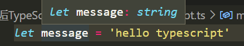
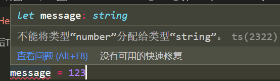

# 变量

## 变量的声明

声明了类型后TypeScript就会进行类型检测，声明的类型可以称之为类型注解

```
var/let/const 标识符: 数据类型 = 赋值;
```

**类型推论**：声明一个变量，但是没有定义类型，ts会在没有明确指定类型的时候推测一个类型


::: code-tabs#shell

@tab ts

```ts
let message: string = 'hello typescript'

function foo(payload: string) {
  console.log(payload.length)
}

// foo(123)
foo("aaa")
```

@tab js

```js
var message = 'hello typescript';
function foo(payload) {
    console.log(payload.length);
}
// foo(123)
foo("aaa");

```

:::


### 变量的类型推导（推断）

在开发中，有时候为了方便起见我们并不会在声明每一个变量时都写上对应的数据类型，我们更希望可以通过TypeScript本身的 特性帮助我们推断出对应的变量类型：



如果我们给message赋值123



这是因为在一个变量第一次赋值时，会根据后面的赋值内容的类型，来推断出变量的类型

## webpack下使用ts

```shell
npm install webpack webpack-cli -D
npm install ts-loader typescript -D
```

生成tsconfig.json文件

```shell
tsc --init
```

搭建本地服务

```shell
npm install webpack-dev-server -D
```

以html作为母版

```shell
npm install html-webpack-plugin -D
```

webpack.config.js

```js
const path = require('path')
const HtmlWebpackPlugin = require('html-webpack-plugin')

module.exports = {
  mode: "development",
  entry: "./src/main.ts",
  output: {
    path: path.resolve(__dirname, "./dist"),
    filename: "bundle.js"
  },
  devServer: {
  },
  resolve: {
    // 添加后缀
    extensions: [".ts", ".js", ".cjs", ".json"]
  },
  module: {
    rules: [
      {
        test: /\.ts$/,
        loader: 'ts-loader'
      }
    ]
  },
  plugins: [
    new HtmlWebpackPlugin({
      template: "./index.html"
    })
  ]
}

```


