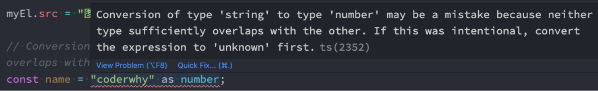

# 语法细节

### 联合类型

```ts
//1.联合类型的基本使用
let foo: number | string = "abc"
foo = 123

// 使用的时候要特别的小心
if (typeof foo === "string") {
  console.log(foo.length)
}

```

```ts
// 2.举个栗子: 打印id
function printID(id: number | string) {
  console.log("您的ID:", id)

  // 类型缩小
  if (typeof id === "string") {
    console.log(id.length)
  } else {
    console.log(id)
  }
}

printID("abc")
printID(123)
```


### 类型别名

```ts
// 类型别名: type
type MyNumber = number
const age: MyNumber = 18 

// 给ID的类型起一个别名
type IDType = number | string

function printID(id: IDType) {
  console.log(id)
}


// 打印坐标
type PointType = { x: number, y: number, z?: number }
function printCoordinate(point: PointType) {
  console.log(point.x, point.y, point.z)
}

```

### 接口声明

在前面我们通过type可以用来声明一个对象类型：

```
type Point = {
 x: number,
 y: number
}
```

对象的另外一种声明方式就是通过接口来声明：

```ts
type PointType = {
  x: number
  y: number
  z?: number
}

```

**那么它们有什么区别呢？** 

 类型别名和接口非常相似，在定义对象类型时，大部分时候，你可以任意选择使用。 

接口的几乎所有特性都可以在 type 中使用（后续我们还会学习interface的很多特性）；


### interface和type区别

我们会发现interface和type都可以用来定义对象类型，那么在开发中定义对象类型时，**到底选择哪一个呢**？ 

-  如果是定义非对象类型，通常推荐使用type，比如Direction、Alignment、一些Function； 

 **如果是定义对象类型，那么他们是有区别的：** 

-  interface 可以重复的对某个接口来定义属性和方法； 

-  而type定义的是别名，别名是**不能重复**的；

  所以，interface可以为现有的接口提供更多的扩展。


```ts
// 1.区别一: type类型使用范围更广, 接口类型只能用来声明对象
type MyNumber = number
type IDType = number | string


// 2.区别二: 在声明对象时, interface可以多次声明
// 2.1. type不允许两个相同名称的别名同时存在
// type PointType1 = {
//   x: number
//   y: number
// }

// type PointType1 = {
//   z?: number
// }
```

```ts

// 2.2. interface可以多次声明同一个接口名称
interface PointType2 {
  x: number
  y: number
}

interface PointType2 {
  z: number
}

const point: PointType2 = {
  x: 100,
  y: 200,
  z: 300
}

```

```ts
// 3.interface支持继承的
interface IPerson {
  name: string
  age: number
}
// 声明一个新接口
interface IKun extends IPerson {
  kouhao: string
}

const ikun1: IKun = {
  kouhao: "你干嘛, 哎呦",
  name: "kobe",
  age: 30
}

```

### 交叉类型

交叉类似表示需要满足多个类型的条件

 交叉类型使用 & 符号


```ts
type MyType = number & string
```

>表达的含义是number和string要同时满足；
>
>但是有同时满足是一个number又是一个string的值吗？其实是没有的，所以MyType其实是一个never类型；

```ts
// 回顾: 联合类型
type ID = number | string
const id1: ID = "abc"
const id2: ID = 123

// 交叉类型: 两种(多种)类型要同时满足
type NewType = number & string // 没有意义

interface IKun {
  name: string
  age: number
}

interface ICoder {
  name: string
  coding: () => void
}

type InfoType = IKun & ICoder

const info: InfoType = {
  name: "why",
  age: 18,
  coding: function() {
    console.log("coding")
  }
}
info.coding()

```

### 类型断言


有时候TypeScript无法获取具体的类型信息，这个我们需要使用类型断言（Type Assertions）

比如我们通过 document.getElementById，TypeScript只知道该函数会返回 HTMLElement ，但并不知道它具体的类型

```ts
// 获取DOM元素 
// const imgEl = document.querySelector(".img")
// if (imgEl !== null) { // 类型缩小
//   imgEl.src = "xxx"
//   imgEl.alt = "yyy"
// }

// 使用类型断言
const imgEl = document.querySelector(".img") as HTMLImageElement
imgEl.src = "xxx"
imgEl.alt = "yyy"
```

TypeScript只允许类型断言转换为 更具体 或者 不太具体 的类型版本，此规则可防止不可能的强制转换




```ts
// 类型断言的规则: 断言只能断言成更加具体的类型, 或者 不太具体(any/unknown) 类型
const age: number = 18
// 错误的做法
// const age2 = age as string
```

```ts
// TS类型检测来说是正确的, 但是这个代码本身不太正确
const age3 = age as any
const age4 = age3 as string
console.log(age4.split(" "))
```


### 非空类型断言

当我们编写下面的代码时，在执行ts的编译阶段会报错：

这是因为传入的message有可能是为undefined的，这个时候是不能执行方法的；

```ts
function printmessage(message?:string){
  console.log(message.toUpperCase());
  
}
printmessage("hello")
```

但是，我们确定传入的参数是有值的，这个时候我们可以使用非空类型断言： 

**非空断言使用的是 !** ，表示可以确定某个标识符是有值的，跳过ts在编译阶段对它的检测；


```ts
interface IPerson {
  name: string
  age: number
  friend?: {
    name: string
  }
}

const info: IPerson = {
  name: "why",
  age: 18
}
// 访问属性: 可选链: ?.
console.log(info.friend?.name)

```

属性赋值

```ts
// 解决方案一: 类型缩小
if (info.friend) {
  info.friend.name = "kobe"
}

// 解决方案二: 非空类型断言(有点危险, 只有确保friend一定有值的情况, 才能使用)
info.friend!.name = "james"
```

### 字面量类型

```ts
// 1.字面量类型的基本上
const name: "why" = "why"
let age: 18 = 18

```

**那么这样做有什么意义呢？** 

默认情况下这么做是没有太大的意义的，但是我们可以将多个类型联合在一起；

```ts
// 2.将多个字面量类型联合起来 |
type Direction = "left" | "right" | "up" | "down"
const d1: Direction = "left"

```

```ts
// 栗子: 封装请求方法
type MethodType = "get" | "post"
function request(url: string, method: MethodType) {
}

request("http://codercba.com/api/aaa", "post")
```

```ts
const info = {
  url: "xxxx",
  method: "post"
}
// 下面的做法是错误: info.method获取的是string类型
// request(info.url, info.method)

//解决方案：
// 解决方案一: info.method进行类型断言
// request(info.url, info.method as "post")

// 解决方案二: 直接让info对象类型是一个字面量类型
// const info2: { url: string, method: "post" } = {
//   url: "xxxx",
//   method: "post"
// }
const info2 = {
  url: "xxxx",
  method: "post"
} as const
// xxx 本身就是一个string
request(info2.url, info2.method)

```

### 类型缩小

类型缩小的英文是 Type Narrowing（也有人翻译成类型收窄）；
我们可以通过类似于 `typeof padding === "number"` 的判断语句，来改变TypeScript的执行路径；
在给定的执行路径中，我们可以缩小比声明时更小的类型，这个过程称之为 缩小（ Narrowing ）;
而我们编写的 `typeof padding === "number"`可以称之为 类型保护（type guards）；

常见的类型保护有如下几种：

- typeof
- 平等缩小 比如(` === `、 `!==`)

- instanceof
- in

在 TypeScript 中，检查返回的值typeof是一种类型保护：

```ts
// 1.typeof: 使用的最多
function printID(id: number | string) {
  if (typeof id === "string") {
    console.log(id.length, id.split(" "))
  } else {
    console.log(id)
  }
}

```

我们可以使用Switch或者相等的一些运算符来表达相等性（比如`===`, `!==`, `==`, `and !=` ）

```ts
// 2.===/!==: 方向的类型判断
type Direction = "left" | "right" | "up" | "down"
function switchDirection(direction: Direction) {
  if (direction === "left") {
    console.log("左:", "角色向左移动")
  } else if (direction === "right") {
    console.log("右:", "角色向右移动")
  } else if (direction === "up") {
    console.log("上:", "角色向上移动")
  } else if (direction === "down") {
    console.log("下:", "角色向下移动")
  }
}

```

JavaScript 有一个运算符来检查一个值是否是另一个值的“实例”：

```ts
// 3. instanceof: 传入一个日期, 打印日期
function printDate(date: string | Date) {
  if (date instanceof Date) {
    console.log(date.getTime())
  } else {
    console.log(date)
  }

  // if (typeof date === "string") {
  //   console.log(date)
  // } else {
  //   console.log(date.getTime())
  // }
}
```

Javascript 有一个运算符，用于确定对象是否具有带名称的属性：in运算符

- 如果指定的属性在指定的对象或其原型链中，则in 运算符返回true；


```ts
// 4.in: 判断是否有某一个属性
interface ISwim {
  swim: () => void
}

interface IRun {
  run: () => void
}

function move(animal: ISwim | IRun) {
  if ("swim" in animal) {
    animal.swim()
  } else if ("run" in animal) {
    animal.run()
  }
}

const fish: ISwim = {
  swim: function() {
    console.log("fish  swimming...");
  }
}

const dog: IRun = {
  run: function() {
    console.log("dog  running...");
  }
}

move(fish)
move(dog)
```


