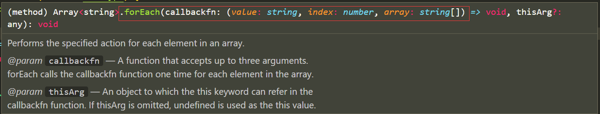
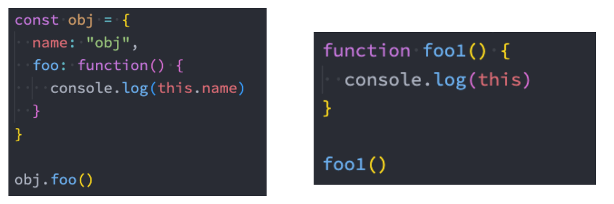
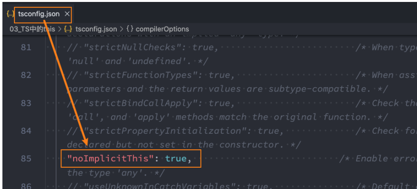
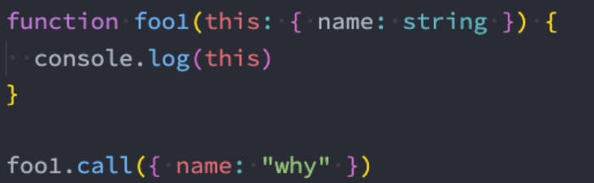
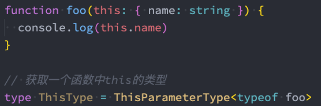
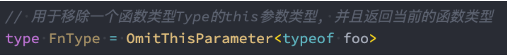
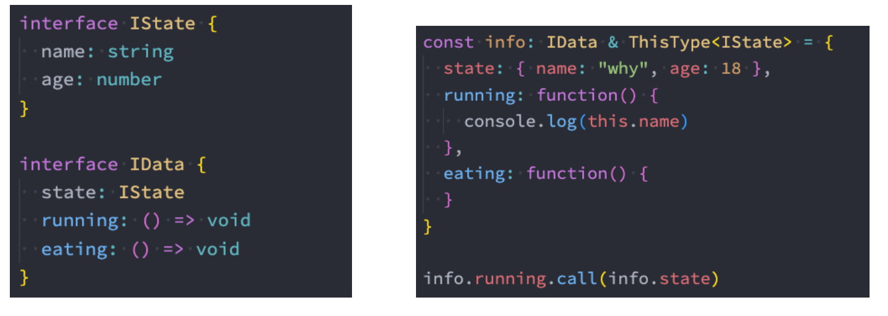

# 函数类型

### 函数类型表达式(掌握)

> 方案一: 函数类型表达式 function type expression
> 	     格式: (参数列表) => 返回值

```ts

type BarType = (num1: number) => number
const bar: BarType = (arg: number): number => {
  return 123
}

export {}

```

在上面的语法中 (num1: number) => number，代表的就是一个函数类型： 

接收1个number类型的参数，并且这个num1 是不能省略的

### 函数表达式练习

::: code-tabs#函数表达式练习

@tab js

```js
// js实现案例:
// 定义一个函数 接收一个函数作为参数，调用
function calc(calcFn) {
  const num1 = 10
  const num2 = 20

  const res = calcFn(num1, num2)
  console.log(res)
}


function add(num1, num2) {
  return num1 + num2
}
// 调用加法
calc(add)

function mul(num1, num2) {
  return num1 * num2
}
// 调用乘法
calc(mul)

```

@tab ts

```ts
// 定义函数类型   接收两个数字参数  返回数字类型
type CalcType = (num1: number, num2: number) => number

// 1.函数的定义
function calc(calcFn: CalcType) {
  const num1 = 10
  const num2 = 20
  const res = calcFn(num1, num2)
  console.log(res)
}


// 2.函数的调用
function sum(num1: number, num2: number) {
  return num1 + num2
}

function foo(num1: number) {
  return num1
}
calc(sum)  // 30
calc(foo)  // 10   传入一个参数不报错见下文

function mul(num1: number, num2: number) {
  return num1 * num2
}
calc(mul)   // 200

// 3.使用匿名函数
calc(function(num1, num2) {
  return num1 - num2
})
//  -10
export {}

```


:::

#### 补充

ts对传入的参数类型的参数个数不进行检测

```ts
type CalcType = (num1: number, num2: number) => number
function calc(calcFn: CalcType) {
  calcFn(10, 20)
}

calc(function(num) {
  return 123
})

```

```ts
// forEach栗子:
const names = ["abc", "cba", "nba"]
names.forEach(function(item) {
  console.log(item.length)
})

```




TS对于很多类型的检测报不报错, 取决于它的内部规则

TS版本在不断更新: 在进行合理的类型检测的情况, 让ts同时更好用(好用和类型检测之间找到一个平衡)

如果一个对象不是第一次定义赋值的话，并不会触发校验规则

```ts

// 举一个栗子:
interface IPerson {
  name: string
  age: number
}

const info: IPerson = {
  name: "why",
  age: 18,
  // height: 1.88,    会报错 ，不能直接在对象中添加
}

// 先把对象赋值一次   检测不报错
const p = {
  name: "why",
  age: 18,
  height: 1.88,
  address: "广州市"
}

const info2: IPerson = p
```


### 调用签名(掌握)

**在 JavaScript 中，函数除了可以被调用，自己也是可以有属性值的。**

然而前面讲到的函数类型表达式**并不能支持声明属性**；

如果我们想描述一个带有属性的函数，我们可以在一个对象类型中写一个**调用签名（call signature）**

```ts
// 1.函数类型表达式
type BarType = (num1: number) => number

// 2.函数的调用签名(从对象的角度来看待这个函数, 也可以有其他属性)
interface IBar {
  name: string
  age: number
// 这个函数可以调用: 函数调用签名   (参数列表): 返回值类型
  (num1: number): number
}

const bar: IBar = (num1: number): number => {
  return 123
}

bar.name = "aaa"
bar.age = 18
bar(123)
```

> 开发中如何选择:
>
> 1.如果只是描述函数类型本身(函数可以被调用), 使用函数类型表达式(Function Type Expressions)
>
> 2.如果在描述函数作为对象可以被调用, 同时也有其他属性时, 使用函数调用签名(Call Signatures)

### 构造签名(理解)

JavaScript 函数也可以使用 new 操作符调用，当被调用的时候，TypeScript 会认为这是一个构造函数(constructors)，因为 他们会产生一个新对象。

你可以写一个构造签名（ Construct Signatures ），方法是在调用签名前面加一个` new `关键词

```ts
class Person {
}

interface ICTORPerson {
  //意思是 可以通过new 调用   并且返回值是一个person
  new (): Person
}

function factory(fn: ICTORPerson) {
  const f = new fn()
  return f
}

factory(Person)

```

### 函数参数(掌握)

#### 可选参数

我们可以指定某个参数是可选的：

```ts
// y就是一个可选参数
// 可选参数类型是什么? number | undefined 联合类型
function foo(x: number, y?: number) {
  if (y !== undefined) {
    console.log(y + 10)
  }
}
foo(10)
foo(10, 20)

export {}

```

#### 默认参数

```ts
// 函数的参数可以有默认值
// 1.有默认值的情况下, 参数的类型注解可以省略
// 2.有默认值的参数, 是可以接收一个undefined的值
function foo(x: number, y = 100) {
  console.log(y + 10)
}

foo(10)
foo(10, undefined)
foo(10, 55)

export {}

```

#### 剩余的参数

从ES6开始，JavaScript也支持剩余参数，剩余参数语法允许我们将一个不定数量的参数放到一个数组中。

```ts
function foo(...args: (string | number)[]) {
}
foo(123, 321)
foo("abc", 111, "cba")
```


### 函数的重载(了解)

在TypeScript中，如果我们编写了一个add函数，希望可以对字符串和数字类型进行相加，应该如何编写呢？ 我们可能会这样来编写，但是其实是错误的：

```ts
function sum(a1: number | string,a2: number): number | string{
	return a1 + a2
}
```

需求: 只能将两个数字/两个字符串进行相加

```ts
// 案例分析: any实现   这样是错误的  参数是any，这样传入对象都不校验
function add(arg1, arg2) {
  return arg1 + arg2
}

add(10, 20)
add("abc", "cba")
add({aaa: "aaa"}, 123)
```

实现两个函数  这不现实

```ts
function add1(num1: number, num2: number) {
  return num1 + num2
}

function add2(str1: string, str2: string) {
  return str1 + str2
}

add1(10, 20)
add2("abc", "cba")
```

```ts
// 2.错误的做法: 联合类型是不可以
function add(arg1: number|string, arg2: number|string) {
  return arg1 + arg2
}
```


那么这个代码应该如何去编写呢？ 

在TypeScript中，我们可以去编写不同的重载签名（overload signatures）来表示函数可以以不同的方式进行调用

一般是编写两个或者以上的重载签名，再去编写一个通用的函数以及实现；

**TypeScript中函数的重载写法**

```ts
// 3.1.先编写重载签名
function add(arg1: number, arg2: number): number
function add(arg1: string, arg2: string): string

// 3.2.编写通用的函数实现
function add(arg1: any, arg2: any): any {
  return arg1 + arg2
}

add(10, 20)
add("aaa", "bbb")
```


### 联合类型和函数重载(理解)

我们现在有一个需求：定义一个函数，可以传入字符串或者数组，获取它们的长度

这里有两种实现方案： 

- 方案一：使用联合类型来实现； 
- 方案二：实现函数重载来实现；

```ts
// 1.普通的实现
// function getLength(arg) {
//   return arg.length
// }

// 2.函数的重载
// function getLength(arg: string): number
// function getLength(arg: any[]): number
// function getLength(arg) {
//   return arg.length
// }

// 3.联合类型实现(可以使用联合类型实现的情况, 尽量使用联合类型)
// function getLength(arg: string | any[]) {
//   return arg.length
// }

// 4.对象类型实现 补充
function getLength(arg: { length: number }) {
  return arg.length
}


console.log(getLength("aaaaa"));
console.log(getLength(["abc", "cba", "nba"]));
console.log(getLength({ length: 100 }));

```

### 可推导的this类型

this是JavaScript中一个比较难以理解和把握的知识点

[前端面试之彻底搞懂this指向 (qq.com)](https://mp.weixin.qq.com/s/hYm0JgBI25grNG_2sCRlTA)

当然在目前的Vue3和React开发中你不一定会使用到this：  Vue3的Composition API中很少见到this，React的Hooks开发中也很少见到this了；

 但是我们还是简单掌握一些TypeScript中的this，TypeScript是如何处理this呢？我们先来看两个例子：




```ts
// 在没有对TS进行特殊配置的情况下, this是any类型
// 1.对象中的函数中的this
const obj = {
  name: "why",
  studying: function() {
    // 默认情况下, this是any类型
    console.log(this.name.length, "studying")
  }
}
obj.studying()
// obj.studying.call({})
// 2.普通的函数
function foo() {
  console.log(this)
}
export {}
```


上面的代码默认情况下是可以正常运行的，也就是TypeScript在编译时，认为我们的this是可以正确去使用的：这是因为在没有指定this的情况，this默认情况下是any类型的；

#### this的编译选项

VSCode在检测我们的TypeScript代码时，默认情况下运行不确定的this按照any类型去使用

- ​	但是我们可以创建一个tsconfig.json文件

  ```shell
  tsc --init
  ```

并且在其中告知VSCodethis必须明确执行（不能是隐式的）；




### 指定this的类型

在开启`noImplicitThis`的情况下，我们必须指定this的类型。 

 如何指定呢？函数的第一个参数类型： 

 函数的第一个参数我们可以根据该函数之后被调用的情况，用于声明this的类型（名词必须叫this)

 在后续调用函数传入参数时，从第二个参数开始传递的，this参数会在编译后被抹除；




Typescript 提供了一些工具类型来辅助进行常见的类型转换，这些类型全局可用。

#### ThisParameterType

用于提取一个函数类型Type的this (opens new window)参数类型； 

 如果这个函数类型没有this参数返回unknown；




#### OmitThisParameter

用于移除一个函数类型Type的this参数类型, 并且返回当前的函数类型




this相关的内置工具 - ThisType

这个类型不返回一个转换过的类型，它被用作标记一个上下文的this类型




