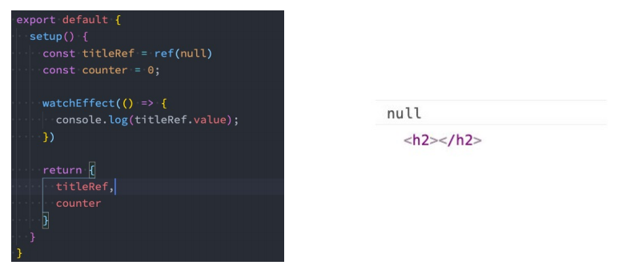

# watchEffect


在Composition API中，我们可以使用watchEffect和watch来完成响应式数据的侦听；

- watchEffect用于自动收集响应式数据的依赖；
- watch需要手动指定侦听的数据源；


立即执行传入的一个函数，同时响应式追踪其依赖，并在其依赖变更时重新运行该函数。

如果用到message 就只会监听message 就是用到几个监听几个 而且是非惰性 会默认调用一次


```vue
<template>
  <div>
    <h2>{{name}}-{{age}}</h2>
    <button @click="changeName">修改name</button>
    <button @click="changeAge">修改age</button>
  </div>
</template>

<script>
  import { ref, watchEffect } from 'vue';

  export default {
    setup() {
      // watchEffect: 自动收集响应式的依赖
      const name = ref("why");
      const age = ref(18);

      const changeName = () => name.value = "kobe"
      const changeAge = () => age.value++

      watchEffect(() => {
        console.log("name:", name.value, "age:", age.value);
      });

      return {
        name,
        age,
        changeName,
        changeAge
      }
    }
  }
</script>

<style scoped>

</style>
```


### 停止侦听

调用watchEffect的返回值函数，即可停止侦听

```js
const stop = watchEffect(() => {
  console.log("name:", name.value, "age:", age.value);
});
const changeName = () => name.value = "kobe"
const changeAge = () => {
  age.value++;
  if (age.value > 25) {
    stop();
  }
}
```

### 清除副作用

什么是清除副作用呢？

比如在开发中我们需要在侦听函数中执行网络请求，但是在网络请求还没有达到的时候，我们停止了侦听器，或者侦听器侦听函数被再次执行了。

那么上一次的网络请求应该被取消掉，这个时候我们就可以清除上一次的副作用；


在我们给watchEffect传入的函数被回调时，其实可以获取到一个参数：onInvalidate，当**副作用即将重新执行** 或者 **侦听器被停止** 时会执行该函数传入的回调函数；

我们可以在传入的回调函数中，执行一些清除工作


```js
<script>
  import { ref, watchEffect } from 'vue';

  export default {
    setup() {
      // watchEffect: 自动收集响应式的依赖
      const name = ref("why");
      const age = ref(18);

      const stop = watchEffect((onInvalidate) => {
        const timer = setTimeout(() => {
          console.log("网络请求成功~");
        }, 2000)

        // 根据name和age两个变量发送网络请求
        onInvalidate(() => {
          // 在这个函数中清除额外的副作用
          // request.cancel()
          clearTimeout(timer);
          console.log("onInvalidate");
        })
        console.log("name:", name.value, "age:", age.value);
      });

      const changeName = () => name.value = "kobe"
      const changeAge = () => {
        age.value++;
        if (age.value > 25) {
          stop();
        }
      }

      return {
        name,
        age,
        changeName,
        changeAge
      }
    }
  }
</script>
```


### 执行时机

默认情况下，组件的更新会在副作用函数执行之前：




我们会发现打印结果打印了两次： 

这是因为setup函数在执行时就会立即执行传入的副作用函数，这个时候DOM并没有挂载，所以打印为null； 

而当DOM挂载时，会给title的ref对象赋值新的值，副作用函数会再次执行，打印出来对应的元素；

​    因为默认执行时机是pre，它会在元素挂载或者更新之前执行


| 更新时机 | pre            | sync             | post           |
| :------- | -------------- | ---------------- | -------------- |
|          | 组件更新前执行 | 强制效果始终同步 | 组件更新后执行 |

```js

 watchEffect((oninvalidate) => {
    //console.log('message', message.value);
    oninvalidate(()=>{
 
    })
    console.log('message2', message2.value);
},{
    flush:"post",
    onTrigger () {
        
    }
})
```

### 侦听单个数据源

一个getter函数：但是该getter函数必须引用可响应式的对象（比如reactive或者ref）；

直接写入一个可响应式的对象，reactive或者ref（比较常用的是ref）

```js
const info = reactive({name: "why", age: 18});
```


```js
// 1.侦听watch时,传入一个getter函数
watch(() => info.name, (newValue, oldValue) => {
  console.log("newValue:", newValue, "oldValue:", oldValue);
})
```

```js
// 情况一: reactive对象获取到的newValue和oldValue本身都是reactive对象
watch(info, (newValue, oldValue) => {
  console.log("newValue:", newValue, "oldValue:", oldValue);
})

// 如果希望newValue和oldValue是一个普通的对象   将get解构出来再作为普通对象传入
watch(() => {
    return {...info}
}, (newValue, oldValue) => {
 console.log("newValue:", newValue, "oldValue:", oldValue);
})

```

```js
// 情况二: ref对象获取newValue和oldValue是value值的本身
const name = ref("why");
watch(name, (newValue, oldValue) => {
  console.log("newValue:", newValue, "oldValue:", oldValue);
})
```


