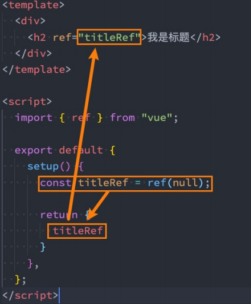

# 组合式API

---


## setup

### 参数


`props`:父组件传递过来的属性会被放到props对象中，可以直接通过参数来使用

::: warning

在setup函数中想要使用props，**不可以通过this去获取**

:::

 `context `:

属性：

- `attrs`
  - 所有非prop的attribute
- `slots`
  - 父组件传递过来的插槽
- `emit`
  - 当组件内部需要发出事件时会用到emit


```vue
<!-- App.vue -->
<div>
    <home message="hahahaha" id="aaa" class="bbbb"></home>
  </div>
```


```vue
<template>
  <div>
    Home Page
    <h2>{{message}}</h2>

    <h2>{{title}}</h2>
    <h2>当前计数: {{counter}}</h2>
    <button @click="increment">+1</button>
  </div>
</template>

<script>
  export default {
    props: {
      message: {
        type: String,
        required: true
      }
    },
    data() {
      return {
        counter: 100
      }
    },
    /**
     * 参数一: props, 父组件传递过来属性
     */
    // setup函数有哪些参数?
    // setup函数有什么样的返回值
    // setup(props, context) {
    setup(props, {attrs, slots, emit}) {
      console.log(props.message);
      console.log(attrs.id, attrs.class);
      console.log(slots);
      console.log(emit);

      return {
        title: "Hello Home",
        counter: 100
      }
    },
    methods: {
      btnClick() {
        this.$emit("")
      }
    }
  }
</script>

<style scoped>

</style>
```


### 返回值

作用：

- ​	setup返回值可以在模板template中被使用，**可以通过setup的返回值来替代data选项**
-    可以**返回一个执行函数**来**代替在methods中定义的方法**

::: info 注意

默认情况，Vue不会追踪界面的响应式操作

:::

### setup不可以使用this

this不能指向组件实例，因为在被setup调用之前，data、computed、methods等没有被解析，无法在setup中获取this

## ref

### ref

接受一个内部值并返回一个响应式且可变的 ref 对象。ref 对象仅有一个 `.value` property，指向该内部值。

数据写在data()外面是非响应式数据，无法更新页面

```vue
<template>
  <div>
    <button @click="changeMsg">change</button>
    <div>{{ message }}</div>
  </div>
</template>
 

<script setup lang="ts">
let message: string = "我是message"

const changeMsg = () => {
  message = "change msg"
  console.log(message)
}
</script>
 
<style>

</style>
```

普通用法引入ref，复制类型引用Ref，Ref是一个接口

```ts
import { ref,Ref} from 'vue'
```

ref返回的是es6的一个class类

被ref包装之后需要.value 来进行赋值

```vue
<template>
  <div>
    <button @click="changeMsg">change</button>
    <div>{{ message }}</div>
  </div>
</template>
 

<script setup lang="ts">

import { ref, Ref } from 'vue'

let message: Ref<string> = ref("我是message")

const changeMsg = () => {
  message.value = "change msg"
  console.log(message)
}
</script>
 
<style>

</style>
```


isRef 判断是否是ref对象

```ts
import { ref, Ref,isRef} from 'vue'

let message: Ref<string> = ref("我是message")

const changeMsg = () => {
  message.value = "change msg"
  console.log(isRef(message))
}
```


打印ref对象时，浏览器控制台打印显示结果优化

​	edge浏览器 –> 选定元素  打开设置 勾选自定义格式工具


`shallowRef`浅相应  只到.value


### triggerRef 

强制更新页面DOM  ref底层调用


### customRef

自定义ref

工厂函数，要求返回一个对象


```ts
function MyRef<T>(value:T){
  return customRef((track,trigger)=>{
    return{
      get(){
        // track 接收依赖
        track()
        return value
      },
      set(newVal){
        // 触发依赖
        value = newVal
        trigger()
      }
    }
  })
}

```


### ref读取dom元素

```vue
<template>
  <div>
    <button @click="click">click</button>
    <div ref="dom">message</div>
  </div>
</template>
 

<script setup lang="ts">

import { ref } from 'vue'

const dom = ref<HTMLDivElement>()
const click = () => {
  console.log(dom.value?.innerText)
}


</script>
 
<style>

</style>
```


#### 获取单个dom

```vue
<template>
  <div>
    <button @click="click">click</button>
    <div ref="dom">message</div>
  </div>
</template>
 

<script setup lang="ts">

import { ref } from 'vue'

const dom = ref(null)
const click = () => {

  console.dir(dom.value)
}

```


## reactive

ref支持所有类型

reactive支持引用类型，数组、对象、map、set

使用reactive 去修改值无须.value

```vue
<template>
  <div>
    <div ref="dom">{{person.name}}</div>
    <button @click="click">click</button>
  </div>
</template>

<script setup lang="ts">

import { reactive } from 'vue'

let person = reactive({
  name: "小明"
})

const click = () => {
  person.name = "小李"
  console.log(person.name)
}


</script>
 
<style>

</style>
```


### 数组异步赋值问题

这样赋值页面是不会变化的因为会脱离响应式

因为reactive 是一个proxy对象，异步操作会进行一个覆盖，不能直接赋值

```ts
let person = reactive<number[]>([])
setTimeout(() => {
  person = [1, 2, 3]
  console.log(person);
  
},1000)
```

#### 解决方案1

使用push

```ts
import { reactive } from 'vue'
let person = reactive<number[]>([])
setTimeout(() => {
  const arr = [1, 2, 3]
  person.push(...arr)
  console.log(person);
  
},1000)
```

#### 解决方案2

包裹一层对象

```ts
type Person = {
  list?:Array<number>
}
let person = reactive<Person>({
   list:[]
})
setTimeout(() => {
  const arr = [1, 2, 3]
  person.list = arr;
  console.log(person);
  
},1000)
```


## readonly

**readonly会返回原生对象的只读代理**

（也就是它依然是一个Proxy，这是一个**proxy的set方法被劫持**，并且不能对其进行修改）；

```ts
import { reactive ,readonly} from 'vue'
const person = reactive({count:1})
const copy = readonly(person)
 
 //person.count++
 
 copy.count++
```

**在开发中常见的readonly方法会传入三个类型的参数**

- 普通对象
- reactive返回的对象
- ref的对象


**在readonly的使用过程中，有如下规则：** 

​	readonly返回的对象都是**不允许修改**的；

但是经过readonly处理的**原来的对象**是允许被修改的；

 比如 `const info = readonly(obj)，info`对象是不允许被修改的；

 当obj被修改时，readonly返回的info对象也会被修改；

 但是我们不能去修改readonly返回的对象info； 

其实本质上就是readonly返回的对象的setter方法被劫持了而已；

#### 应用

当我们传递给其他组件数据时，往往希望其他组件使用我们传递的内容，但是不允许它们修改时，就可以使用readonly了


## Reactive判断API

**isProxy**

- 检查对象是否是由 reactive 或 readonly创建的 proxy。、

**isReactive**

- 检查对象是否是由 reactive创建的响应式代理： 

 - 如果该代理是 readonly 建的，但包裹了由 reactive 创建的另个代理，它也会返回 true； 

**isReadonly**

- 检查对象是否是由 readonly 创建的只读代理。 

 **toRaw**
- 返回 reactive 或 readonly 代理的原始对象（不建议保留对原始对象的持久引用。请谨慎使用）。

**shallowReactive**

- 创建一个响应式代理，它跟踪其自身 property 的响应性，但不执行嵌套对象的深层响应式转换 (深层还是原生对象)。  

**shallowReadonly**

 - 创建一个 proxy，使其自身的 property 为只读，但不执行嵌套对象的深度只读转换（深层还是可读、可写的）。


### shallowReactive 

只能对浅层的数据 如果是深层的数据只会改变值 不会改变视图

```vue
<template>
  <div>
    <div>{{ state }}</div>
    <button @click="change1">test1</button>
    <button @click="change2">test2</button>
  </div>
</template>
 
 
 
<script setup lang="ts">
import { shallowReactive } from 'vue'
 
 
const obj = {
  a: 1,
  first: {
    b: 2,
    second: {
      c: 3
    }
  }
}
 
const state = shallowReactive(obj)
 
function change1() {
  state.a = 7
}
function change2() {
  state.first.b = 8
  state.first.second.c = 9
  console.log(state);
}
 
 
 
 
</script> 
 
 
<style>
</style>
```


## ref

setup中使用ref ：定义一个ref对象，绑定到元素或者组件的ref属性上




### toRefs

如果我们使用**ES6的解构语法**，对**reactive返回的对象进行解构获取值**，那么之后无论是**修改结构后的变量**，还是**修改reactive**

**返回的state对象**，**数据都不再是响应式**的：

```js
cosnt state = reactive({
  name:'why',
  age: 18
})
const { name,age } = state
```

toRefs可以将reactive返回的对象中的属性都转为ref，结果出来的都是ref对象

这种做法相当于已经在state.name和ref.value之间建立了 链接，**任何一个修改都会引起另外一个变化**；

如果我们只希望转换一个**reactive对象中的属性为ref**, 那么可以**使用toRef的方法**


### ref其他API

**unref**

如果我们想要**获取一个ref引用中的value**，那么也可以**通过unref方法**： 

如果参数是一个 ref，则返回内部值，否则返回参数本身； 

这是` val = isRef(val) ? val.value : val `的语法糖函数；

**isRef**

判断值是否是一个ref对象。 

**shallowRef**

创建一个浅层的ref对象； 

**triggerRef**

手动触发和 shallowRef 相关联的副作用：

### customRef

[customRef](https://cn.vuejs.org/api/reactivity-advanced.html#customref)

创建一个**自定义的ref**，并**对其依赖项跟踪和更新触发**进行**显示控制**： 

- 它需要一个工厂函数，该函数接受 track 和 trigger 函数作为参数；

- 并且应该返回一个带有 get 和 set 的对象； 

 **这里我们使用一个的案例：**

- 对双向绑定的属性进行debounce(节流)的操作；


```js
import { customRef } from 'vue';

// 自定义ref
export default function(value, delay = 300) {
  let timer = null;
  return customRef((track, trigger) => {
    return {
      get() {
        track();
        return value;
      },
      set(newValue) {
        clearTimeout(timer);
        timer = setTimeout(() => {
          value = newValue;
          trigger();
        }, delay);
      }
    }
  })
}

```

```vue
<template>
  <div>
    <input v-model="message"/>
    <h2>{{message}}</h2>
  </div>
</template>

<script>
  import debounceRef from './hook/useDebounceRef';

  export default {
    setup() {
      const message = debounceRef("Hello World");

      return {
        message
      }
    }
  }
</script>

<style scoped>

</style>
```

ts 写法

```ts
function myRef<T = any>(value: T) {
  let timer:any;
  return customRef((track, trigger) => {
    return {
      get() {
        track()
        return value
      },
      set(newVal) {
        clearTimeout(timer)
        timer =  setTimeout(() => {
          value = newVal
          trigger()
        },500)
      }
    }
  })
}

```

## computed

方式一：接收一个getter函数，并为 getter 函数返回的值，返回一个不变的 ref 对象；

方式二：接收一个具有 get 和 set 的对象，返回一个可变的（可读写）ref 对象；

```js
const fullName = computed(() => firstName.value + " " + lastName.value);
```

```js
const fullName = computed({
  get: () => firstName.value + " " + lastName.value,
  set(newValue) {
    const names = newValue.split(" ");
    firstName.value = names[0];
    lastName.value = names[1];
  }
});
```


