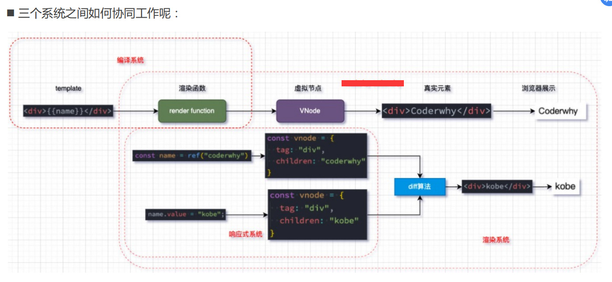

# vue3源码

---

### 虚拟DOM的优势

**目前框架都会引入虚拟DOM来对真实的DOM进行抽象，这样做有很多的好处：**

首先是可以对真实的元素节点进行抽象，抽象成VNode（虚拟节点），这样方便后续对其进行各种操作：

因为对于直接操作DOM来说是有很多的限制的，比如diff、clone等等，但是使用JavaScript编程语言来操作这些，就变得非常的简单；

我们可以使用JavaScript来表达非常多的逻辑，而对于DOM本身来说是非常不方便的；

其次是方便实现跨平台，包括你可以将VNode节点渲染成任意你想要的节点

如渲染在canvas、WebGL、SSR、Native（iOS、Android）上；

并且Vue允许你开发属于自己的渲染器（renderer），在其他的平台上渲染；

#### 虚拟DOM的渲染过程


#### 三大核心系统

事实上Vue的源码包含三大核心：

Compiler模块：编译模板系统；

Runtime模块：也可以称之为Renderer模块，真正渲染的模块；

Reactivity模块：响应式系统；





### 实现Mini-Vue

这里我们实现一个简洁版的Mini-Vue框架，该Vue包括三个模块：

- 渲染系统模块；
- 可响应式系统模块；
- 应用程序入口模块；


#### 渲染系统实现

**渲染系统**，该模块主要包含三个功能：

1. h函数，用于返回一个VNode对象；
2. mount函数，用于将VNode挂载到DOM上；
3. patch函数，用于对两个VNode进行对比，决定如何处理新的VNode；


##### h函数，用于返回一个VNode对象；

```html
<!DOCTYPE html>
<html lang="en">
<head>
  <meta charset="UTF-8">
  <meta http-equiv="X-UA-Compatible" content="IE=edge">
  <meta name="viewport" content="width=device-width, initial-scale=1.0">
  <title>Document</title>
</head>
<body>
  
  <div id="app"></div>

  <script src="./renderer.js"></script>
  <script>

    // 1.通过h函数来创建一个vnode
    const vnode = h('div', {class: "why", id: "aaa"}, [
      h("h2", null, "当前计数: 100"),
      h("button", {onClick: function() {}}, "+1")
    ]); // vdom
  </script>

</body>
</html>
```

```js
const h = (tag, props, children) => {
  // vnode -> javascript对象 -> {}
  return {
    tag,
    props,
    children
  }
}
```


##### mount函数，用于将VNode挂载到DOM上；

```js
// 2.通过mount函数, 将vnode挂载到div#app上
mount(vnode, document.querySelector("#app"))
```


```js
const mount = (vnode, container) => {
  // vnode -> element
  // 1.创建出真实的原生, 并且在vnode上保留el
  const el = vnode.el = document.createElement(vnode.tag);  // vnode.tag 创建对应的元素

  // 2.处理props
  if (vnode.props) {
    for (const key in vnode.props) {
      const value = vnode.props[key];

      if (key.startsWith("on")) { // 对事件监听的判断
        el.addEventListener(key.slice(2).toLowerCase(), value)
      } else {
        el.setAttribute(key, value);
      }
    }
  }

  // 3.处理children
  if (vnode.children) {
    if (typeof vnode.children === "string") {
      el.textContent = vnode.children;
    } else {
      vnode.children.forEach(item => {
        mount(item, el);
      })
    }
  }

  // 4.将el挂载到container上
  container.appendChild(el);
}
```


##### patch函数，用于对两个VNode进行对比，决定如何处理新的VNode；


