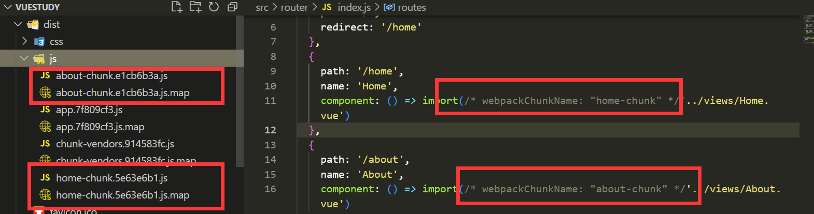
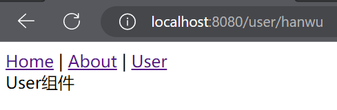
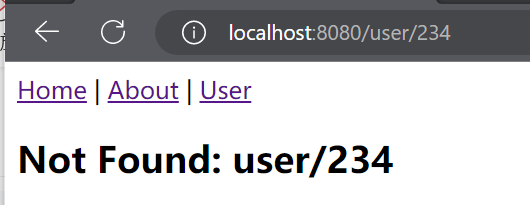
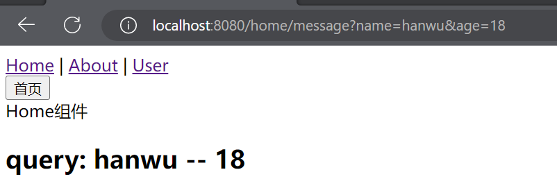

# vue-router

---

```sh
npm install vue-router@4
```


使用vue-router的步骤: 

第一步：创建路由组件的组件；

第二步：配置路由映射: 组件和路径映射关系的routes数组； 

第三步：通过`createRouter`创建路由对象，并且传入`routes`和`history`模式；

第四步：使用路由: 通过`<router-link>`和`<router-view>`；

```vue
<template>
  <div>
    About组件
  </div>
</template>
```

router/index.js

```js
import { createRouter, createWebHistory } from 'vue-router'
import Home from '../views/Home.vue'
import About from '../views/About.vue'

const routes = [
  {
    path: '/',
    name: 'Home',
    component: Home
  },
  {
    path: '/about',
    name: 'About',
    component: About
  }
]

const router = createRouter({
  history: createWebHistory(),
  routes
})

export default router

```

main.js

```js
import { createApp } from 'vue'
import App from './App.vue'
import router from './router'

createApp(App).use(router).mount('#app')

```

App.vue

```vue
<template>
  <div id="nav">
    <router-link to="/">Home</router-link> |
    <router-link to="/about">About</router-link>
  </div>
  <router-view/>
</template>
```


### 路由重定向

```js
const routes = [
  {
    path: '/',
    redirect: '/home'
  },
  {
    path: '/home',
    name: 'Home',
    component: Home
  },
  {
    path: '/about',
    name: 'About',
    component: About
  }
]
```


### router-link 属性

to属性： 

- 是一个字符串，或者是一个对象 

replace属性： 

- 设置 replace 属性的话，当点击时，会调用 router.replace()，而不是 router.push()； 
  - 不可返回

active-class属性： 

- 设置激活a元素后应用的class，默认是`router-link-active`

exact-active-class属性： 

- 链接精准激活时，应用于渲染的` <a>` 的 class，默认是`router-link-exact-active`；


```vue
  <div id="nav">
    <router-link to="/home" active-class="hanwu-active">Home</router-link> |
    <router-link to="/about" active-class="hanwu-active">About</router-link>
  </div>
  <router-view />
```


### 路由懒加载

当打包构建应用时，JavaScript 包会变得非常大，影响页面加载： 

如果我们能把不同路由对应的组件分割成不同的代码块，然后当路由被访问的时候才加载对应组件，这样就会
更加高效，也可以提高首屏的渲染效率； 

其实这里还是我们前面讲到过的webpack的分包知识，而Vue Router默认就支持动态来导入组件：
这是因为component可以传入一个组件，也可以接收一个函数，该函数 需要返回一个Promise； 

而import函数就是返回一个Promise；


```js
const routes = [
  {
    path: '/',
    redirect: '/home'
  },
  {
    path: '/home',
    name: 'Home',
    component: () => import('../views/Home.vue')
  },
  {
    path: '/about',
    name: 'About',
    component: () => import('../views/About.vue')
  }
]
```

路由懒加载分包    魔法注释




```js
const routes = [
  {
    path: '/',
    redirect: '/home'
  },
  {
    path: '/home',
    name: 'Home',
    component: () => import(/* webpackChunkName: "home-chunk" */'../views/Home.vue')
  },
  {
    path: '/about',
    name: 'About',
    component: () => import(/* webpackChunkName: "about-chunk" */'../views/About.vue')
  }
]
```


#### 路由的其他属性

- name属性：路由记录独一无二的名称； 
- meta属性：自定义的数据


### 动态路由的基本匹配


```vue
<template>
  <div>User组件</div>
</template>
```

```js
{
  path: '/user/:username',
  name: 'User',
  component: () => import('../views/User.vue')
}
```

```vue
<router-link to="/user/hanwu">User</router-link>
```




### 获取动态路由的值

在template中，直接通过 $route.params获取值； 

在created中，通过 this.$route.params获取值； 

```vue
<template>
  <div>User组件</div>
  User: {{ $route.params.username }}
</template>
<script>
export default {
  created() {
    console.log(this.$route.params.username);
  }
}
</script>

```

在setup中，我们要使用 vue-router库给我们提供的一个hook useRoute； 

该Hook会返回一个Route对象，对象中保存着当前路由相关的值；

```ts
<script>
import { useRoute } from 'vue-router';
  setup() {
    const route = useRoute()
    console.log(route);
    console.log(route.params.username);
  }
}
</script>
```


### 匹配多个参数

```js
{
    path: '/user/:username/id/:id',
    name: 'User',
    component: () => import('../views/User.vue')
}
```

```vue
<router-link to="/user/hanwu/111">User</router-link>
```


### NotFound

对于那些没有匹配到的路由，我们通常会匹配到固定的某个页面

比如NotFound的错误页面中，这个时候我们可编写一个动态路由用于匹配所有的页面；

我们可以通过 $route.params.pathMatch获取到传入的参数：

```vue
<template>
<h2>Not Found: {{ $route.params.pathMatch }}</h2>
</template>

```

```js
{
  path: "shops",
  component: () => import("../pages/HomeShops.vue")
}
```





### 路由嵌套

什么是路由的嵌套呢？

目前我们匹配的Home、About、User等都属于底层路由，我们在它们之间可以来回进行切换；

但是呢，我们Home页面本身，也可能会在多个组件之间来回切换：

比如Home中包括Product、Message，它们可以在Home内部来回切换；

这个时候我们就需要使用嵌套路由，在Home中也使用 router-view 来占位之后需要渲染的组件；


```vue
<template>
  <div>
    Home组件
  </div>

  <RouterLink to="/home/product">商品</RouterLink> |
  <RouterLink to="/home/message">消息</RouterLink>

  <router-view></router-view>
</template>

```

```js
  {
    path: '/home',
    name: 'Home',
    component: () => import('../views/Home.vue'),
    children: [
      {
        path: '',
        name: 'message',
        redirect: '/home/message'
      },
      {
        path: 'product',
        component: () => import('../views/HomeProduct.vue')
      },
      {
        path: 'message',
        component: () => import('../views/HomeMessage.vue')
      }
    ]
  },
```


### 代码的页面跳转

```vue
<button @click="jumpToHome">首页</button>
```

```js
<script>
export default {
 methods: {
    jumpToHome() {
      console.log("点击");
      this.$router.push({
        path: '/home'
      })
    }
  }
}
</script> -->
```


```js

<script setup>
import { useRouter } from 'vue-router';
const router = useRouter()

const jumpToHome = () => {
  console.log("点击2");
  router.push('/home')
}

</script>
```


### query方式的参数

home.vue   

```html
    <h2>
      query: {{ $route.query.name }} -- {{ $route.query.age }}
    </h2>
```

```js
jumpToProfile(){
	this.$router.push({
		path:'/profile',
    query:{
      name:'hanwu',
      age:18
    }
	})
}
```



```js
<script setup>
import { useRouter } from 'vue-router';
const router = useRouter()

const jumpToHome = () => {
  console.log("点击2");
  router.push({
    path: '/home',
    query: {
      name: 'hanwu',
      age:18
    }
  })
}

</script>
```


### 替换当前位置

使用push的特点是压入一个新的页面，那么在用户点击返回时，上一个页面还可以回退，但是如果我们希望当前页面是一个替换操作，那么可以使用replace：

声明式

```html
<router-clik :to="..." replate>
```

编程式

```js
router.replace(...)
```


### 路由前进后退

router的go方法：

​	

```js
router.go(1)  // 向前移动一条记录，与router.forward() 相同
router.go(-1)  // 后退一条
router.go(3)  // 前进3条
```

router也有back： 

- 通过调用 history.back() 回溯历史。相当于 router.go(-1)； 

router也有forward： 

- 通过调用 history.forward() 在历史中前进。相当于 router.go(1)；


### v-slot

在vue-router3.x的时候，router-link有一个tag属性，可以决定router-link到底渲染成什么元素：
		但是在vue-router4.x开始，该属性被移除了；
而给我们提供了更加具有灵活性的v-slot的方式来定制渲染的内容；
	v-slot如何使用呢？
		  首先，我们需要使用custom表示我们整个元素要自定义

​         如果不写，那么自定义的内容会被包裹在一个 a 元素中；

其次，我们使用v-slot来作用域插槽来获取内部传给我们的值： 

-  href：解析后的 URL； 
- route：解析后的规范化的route对象； 
- navigate：触发导航的函数；
- isActive：是否匹配的状态； 
- isExactActive：是否是精准匹配的状态


可以放元素和组件

```vue
    <router-link to="/home">
      <strong>首页</strong>
      <NavBar :title="123"></NavBar>
    </router-link>
```

```vue
    <router-link to="/home" v-slot="{ href, route, isActive, isExactActive }">
      <div>
        <p>href: {{ href }}</p>
        <p>route: {{ route }}</p>
        <p>isActive: {{ isActive }}</p>
        <p>isExactActive: {{ isExactActive }}</p>
      </div>
      
```


`<router-link>`加上custom后，跳转会失效，可以自定义跳转，使用 naviage跳转


```vue
<router-link to="/home" v-slot="props" custom>
      <div>
        <button> {{ props.href }}</button>
        <button @click="props.navigate">跳转</button>
      </div>
    </router-link>
```


router-view也提供给我们一个插槽，可以用于` <transition> `和 `<keep-alive> `组件来包裹你的路由组件

- Component：要渲染的组件；

- route：解析出的标准化路由对象；

  

  使用动态组件来切换

```vue
  <router-view v-slot="{ Component }">
    <transition>
      <component :is="Component"></component>
    </transition>
  </router-view>
```

添加动画并缓存

```vue
  <router-view v-slot="{ Component }">
    <transition name="hanwu">
      <keep-alive>
        <component :is="Component"></component>
      </keep-alive>
    </transition>
  </router-view>
```

```css
.hanwu-enter-from,
.hanwu-leave-to {
  opacity: 0;
}

.hanwu-enter-active,
.hanwu-leave-active {
  transition: opacity 1s ease;
}
```

作用域插槽：当前组件需要给插槽传递数据时使用


### 动态添加路由

[动态路由 | Vue Router (vuejs.org)](https://router.vuejs.org/zh/guide/advanced/dynamic-routing.html#添加路由)

某些情况下我们可能需要动态的来添加路由：

- 比如根据用户不同的权限，注册不同的路由；

- 这个时候我们可以使用一个方法 addRoute； 

如果我们是为route添加一个children路由，那么可以传入对应的name：


后台管理面板

​		不同账号–>  角色  –>  权限  –>  不同的路由

​		菜单 –>  动态生成路由

```js
if(管理员){
	router.addRouter({path:"/aaa",component:()=>import(...)})
}
```

```js
const categoryRoute = {
  path: '/category',
  component: () => import("../views/Category.vue")
}
router.addRoute(categoryRoute)
```

::: danger 未生效

```js
// 添加二级路由对象
router.addRoute('home', {
  path: "/moment",
  component: () => import("../views/HomeMoment.vue")
})

```

:::


### 动态删除路由

**删除路由有以下三种方式：**

1.  添加一个name相同的路由；
2.  通过removeRoute方法，传入路由的名称； 
3.  通过addRoute方法的返回值回调；

 路由的其他方法补充： 

-  router.hasRoute()：检查路由是否存在。
-  router.getRoutes()：获取一个包含所有路由记录的数组


### 路由导航守卫

vue-router 提供的导航守卫主要用来通过跳转或取消的方式守卫导航。

**全局的前置守卫beforeEach是在导航触发时会被回调的：**

它有两个参数：

- to：即将进入的路由Route对象；

- from：即将离开的路由Route对象；

  ```js
  router.beforeEach((to,from)=>{
  	console.log(to,from)
  })
  ```

  

 它有返回值：

- false：取消当前导航；

- 不返回或者undefined：进行默认导航；

- 返回一个路由地址：

  - 可以是一个string类型的路径；

  - 可以是一个对象，对象中包含path、query、params等信息；

```js
let counter = 0;
router.beforeEach((to,from)=>{
  console.log(`进行了${++counter}路由跳转`)
  return false
})

```

可选的第三个参数：next

- 在Vue2中我们是通过next函数来决定如何进行跳转的；
- 但是在Vue3中我们是通过返回值来控制的，**不再推荐**使用next函数，这是因为开发中很容易调用多次next；


```js
  {
    path: '/login',
    component: () => import('../views/Login.vue')
  }
```

```js
router.beforeEach((to, from) => {
  console.log(`进行了${++counter}路由跳转`)
  //如果有home 则跳转至login
  if(to.path.indexOf("/home") !== -1) {
    return '/login'
  }
})
```


### 登录守卫功能


```vue
<template>
  <h2>Login组件</h2>
  <button @click="loginClick">登录</button>
</template>
<script setup>
import { useRouter } from 'vue-router'
import router from '../router';

const loginClick = () => {
  window.localStorage.setItem('token','hanwu')
  router.push({
    path: '/home'
  })
}
</script>

```

```js
//main.js
router.beforeEach((to, from) => {
  if (to.path !== '/login') {
    const token = window.localStorage.getItem('token')
    if (!token) {
      return '/login'
    }
  }
})
```


其他导航守卫

[导航守卫 | Vue Router (vuejs.org)](https://router.vuejs.org/zh/guide/advanced/navigation-guards.html#全局后置钩子)


