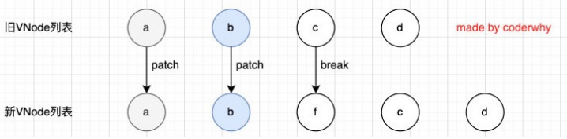

# vue3基本指令

---


### 模板语法

-  **React的开发模式：**
  - React使用的jsx，所以对应的代码都是编写的类似于js的一种语法； 
  - 之后通过Babel将jsx编译成 React.createElement 函数调用；

- **Vue也支持jsx的开发模式（后续有时间也会讲到）：**

  - 但是大多数情况下，使用基于HTML的模板语法； 

  - 在模板中，允许开发者以声明式的方式将DOM和底层组件实例的数据绑定在一起；


## 基本指令

### v-once

**用于指定元素或者组件只渲染一次**

当数据发生变化时，元素或者组件以及其所有的子元素将视为静态内容并且跳过，该指令用于==性能优化==

```vue
  <template id="my-app">
    <h2>{{counter}}</h2>
    <div v-once>
      <h2>{{counter}}</h2>
      <h2>{{message}}</h2>
    </div>
    <button @click="increment">+1</button>
  </template>

```


### v-text

用于更新元素的 textContent


### v-html

默认情况下，如果我们展示的内容本身是 html 的，那么vue并不会对其进行特殊的解析。 

如果我们希望这个内容被Vue可以解析出来，那么可以使用 v-html 来展示；

```vue
  <template id="my-app">
    <div>{{msg}}</div>
    <div v-html="msg"></div>
  </template>
```

```ts
data() {
  return {
    msg: '<span style="color:red; background: blue;">哈哈哈</span>'
   }
}
```


### v-pre

v-pre用于跳过元素和它的子元素的编译过程，显示原始的Mustache标签： 

跳过不需要编译的节点，加快编译的速度； 

```vue
<h2 v-pre>{{message}}</h2>
```

### v-clock

这个指令保持在元素上直到关联组件实例结束编译。

和 CSS 规则如` [v-cloak] { display: none }` 一起用时，这个指令可以隐藏未编译的 Mustache 标签直到组件实例准备完毕。

`div`不会显示，直到编译结束。

```css
  <style>
    [v-cloak] {
      display: none;
    }
  </style>
  
```

```vue
 <h2 v-cloak>{{message}}</h2>
```

## 常用指令

### v-bind

#### 绑定基本属性

```vue
  <div id="app"></div>

  <!-- vue2 template模板中只能有一个根元素 -->
  <!-- vue3 是允许template中有多个根元素 -->
  <template id="my-app">
    <!-- 1.v-bind的基本使用 -->
    
    <a v-bind:href="link">百度一下</a>

    <!-- 2.v-bind提供一个语法糖 : -->
    
    
  </template>
```

#### 绑定class

##### 对象语法

```vue
<template id="my-app">
      <div :class="className">哈哈哈哈</div>
      <!-- 对象语法: {'active': boolean} -->
      <div :class="{'active': isActive}">呵呵呵呵</div>
      <button @click="toggle">切换</button>

      <!-- 也可以有多个键值对 -->
      <div :class="{active: isActive, title: true}">呵呵呵呵</div>

      <!-- 默认的class和动态的class结合 -->
      <div class="abc cba" :class="{active: isActive, title: true}">
        呵呵呵呵
      </div>

      <!-- 将对象放到一个单独的属性中 -->
      <div class="abc cba" :class="classObj">呵呵呵呵</div>

      <!-- 将返回的对象放到一个methods(computed)方法中 -->
      <div class="abc cba" :class="getClassObj()">呵呵呵呵</div>      
    </template>
```


##### 数组语法

```vue
  <template id="my-app">
    <div :class="['abc', title]">哈哈哈哈</div>
    <div :class="['abc', title, isActive ? 'active': '']">哈哈哈哈</div>
    <div :class="['abc', title, {active: isActive}]">哈哈哈哈</div>
  </template>
```

#### 绑定style

我们可以利用v-bind:style来绑定一些CSS内联样式

某些样式我们需要根据数据**动态**来决定

##### 对象语法

```vue
  <template id="my-app">
    <!-- :style="{cssPropertyName: cssPropertyValue}" -->
    <div :style="{color: finalColor, 'font-size': '30px'}">哈哈哈哈</div>
    <div :style="{color: finalColor, fontSize: '30px'}">哈哈哈哈</div>
    <div :style="{color: finalColor, fontSize: finalFontSize + 'px'}">哈哈哈哈</div>

    <!-- 绑定一个data中的属性值, 并且是一个对象 -->
    <div :style="finalStyleObj">呵呵呵呵</div>
    <!-- 调用一个方法 -->
    <div :style="getFinalStyleObj()">呵呵呵呵</div>
  </template>
```

```js
    const App = {
      template: '#my-app',
      data() {
        return {
          message: "Hello World",
          finalColor: 'red',
          finalFontSize: 50,
          finalStyleObj: {
            'font-size': '50px',
            fontWeight: 700,
            backgroundColor: 'red'
          }
        }
      },
      methods: {
        getFinalStyleObj() {
          return {
            'font-size': '50px',
            fontWeight: 700,
            backgroundColor: 'red'
          }
        }
      }
    }
```


##### 数组语法

```vue
  <template id="my-app">
    <div :style="[style1Obj, style2Obj]">哈哈哈</div>
    
    <a :href=""></a>
    <div :class></div>
  </template>
```

```js
    const App = {
      template: '#my-app',
      data() {
        return {
          message: "Hello World",
          style1Obj: {
            color: 'red',
            fontSize: '30px'
          },
          style2Obj: {
            textDecoration: "underline"
          }
        }
      }
    }
```

#### 动态绑定属性

```vue
<div :[name]="value">哈哈哈</div>
```

#### 绑定一个对象

将一个对象的素有属性，绑定到元素上

```vue
  <template id="my-app">
    <div v-bind="info">哈哈哈哈</div>
    <div :="info">哈哈哈哈</div>
  </template>
```

```js
    const App = {
      template: '#my-app',
      data() {
        return {
          info: {
            name: "why",
            age: 18,
            height: 1.88
          }
        }
      }
    }
```


### v-on

 **v-on的使用：**

 **缩写**：@ 

 **预期**：Function | Inline Statement | Object

**参数**：event

 **用法**：绑定事件监听

#### v-on 基本使用

```vue
 <template id="my-app">
    <!-- 完整写法: v-on:监听的事件="methods中方法" -->
    <button v-on:click="btn1Click">按钮1</button>
    <div class="area" v-on:mousemove="mouseMove">div</div>
    <!-- 语法糖 -->
    <button @click="btn1Click">按钮1</button>
    <!-- 绑定一个表达式: inline statement -->
    <button @click="counter++">{{counter}}</button>
    <!-- 绑定一个对象 -->
    <div class="area" v-on="{click: btn1Click, mousemove: mouseMove}"></div>
    <div class="area" @="{click: btn1Click, mousemove: mouseMove}"></div>
  </template>
```

#### v-on 参数传递


当通过methods中定义方法，以供@click调用时，需要注意参数问题： 

- 情况一：如果该方法不需要额外参数，那么方法后的`()`可以不添加。
  但是注意：如果方法本身中有一个参数，那么会默认将原生事件event参数传递进去 

- 情况二：如果需要同时传入某个参数，同时需要event时，可以通过$event传入事件


```vue
  <template id="my-app">
    <!-- 默认传入event对象, 可以在方法中获取 -->
    <button @click="btn1Click">按钮1</button>
    <!-- $event可以获取到事件发生时的事件对象 -->
    <button @click="btn2Click($event, 'coderwhy', 18)">按钮2</button>
  </template>
```

#### 修饰符

 .stop - 调用 event.stopPropagation()。 

 .prevent - 调用 event.preventDefault()。 

 .capture - 添加事件侦听器时使用 capture 模式。

 .self - 只当事件是从侦听器绑定的元素本身触发时才触发回调。

 .{keyAlias} - 仅当事件是从特定键触发时才触发回调。

 .once - 只触发一次回调。

 .left - 只当点击鼠标左键时触发。

 .right - 只当点击鼠标右键时触发。

 .middle - 只当点击鼠标中键时触发。

 .passive - { passive: true } 模式添加侦听器

```vue
  <template id="my-app">
    <div @click="divClick">
      <button @click.stop="btnClick">按钮</button>
    </div>
    <input type="text" @keyup.enter="enterKeyup">
  </template>
```


### 条件渲染

`v-show` `v-if` `v-else-if`  `v-else`

```vue
  <template id="my-app">
    <input type="text" v-model="score">
    <h2 v-if="score > 90">优秀</h2>
    <h2 v-else-if="score > 60">良好</h2>
    <h2 v-else>不及格</h2>
  </template>
```

#### template和v-if的结合使用

```vue
  <template id="my-app">
    <template v-if="isShowHa">
      <h2>哈哈哈哈</h2>
    </template>

    <template v-else>
      <h2>呵呵呵呵</h2>
    </template>
  </template>

```

#### v-show的条件渲染

```vue
  <template id="my-app">
    <h2 v-if="isShow">哈哈哈哈</h2>
    <button @click="toggle">切换</button>
  </template>
```

v-if 的渲染原理：

 v-if是惰性的：

- 当条件为false时，其判断的内容完全不会被渲染或者会被销毁掉； 

- 当条件为true时，才会真正渲染条件块中的内容； 

#### v-show和v-if的区别

首先，在用法上的区别： 

- v-show是不支持template； 

- v-show不可以和v-else一起使用；

 其次，本质的区别： 

v-show元素无论是否需要显示到浏览器上，它的DOM实际都是有渲染的，只是通过CSS的display属性来进行切换； 

v-if当条件为false时，其对应的原生压根不会被渲染到DOM中；


>如果我们的原生需要在显示和隐藏之间频繁的切换，那么使用v-show； 
>
>如果不会频繁的发生切换，那么使用v-if； 


### 列表渲染v-for


v-for的基本格式是 `item in 数组`

数组通常是来自data或者prop，也可以是其他方式；

item是我们给每项元素起的一个别名，这个别名可以自定来定义；

 我们知道，在遍历一个数组的时候会经常需要拿到数组的索引： 

如果我们需要索引，可以使用格式： `(item, index) in 数组`； 

注意上面的顺序：数组元素项item是在前面的，索引项index是在后面的

```vue
 <template id="my-app">
    <h2>电影列表</h2>
    <ul>
      <!-- 遍历数组 -->
      <li v-for="(movie, index) in movies">{{index+1}}.{{movie}}</li>
    </ul>
    <h2>个人信息</h2>
    <ul>
      <!-- 遍历对象 -->
      <li v-for="(value, key, index) in info">{{value}}-{{key}}-{{index}}</li>
    </ul>
    <h2>遍历数字</h2>
    <ul>
      <li v-for="(num, index) in 10">{{num}}-{{index}}</li>
    </ul>
  </template>
```


```vue
  <template id="my-app">
    <ul>
      <template v-for="(value, key) in info">
        <li>{{key}}</li>
        <li>{{value}}</li>
        <li class="divider"></li>
      </template>
    </ul>
  </template>
```

#### v-for中的key是什么作用

在使用v-for进行列表渲染时，我们通常会给元素或者组件绑定一个**key属性**。 

这个key属性有什么作用呢？我们先来看一下官方的解释： 

- key属性主要用在Vue的虚拟DOM算法，在新旧nodes对比时辨识VNodes； 

- 如果不使用key，Vue会使用一种最大限度减少动态元素并且尽可能的尝试就地修改/复用相同类型元素的算法；

- 而使用key时，它会基于key的变化重新排列元素顺序，并且会移除/销毁key不存在的元素；

 官方的解释对于初学者来说并不好理解，比如下面的问题： 

- 什么是新旧nodes，什么是VNode？ 

- 没有key的时候，如何尝试修改和复用的？

- 有key的时候，如何基于key重新排列的？


### vNode

Virtual Node，也就是虚拟节点,事实上，无论是组件还是元素，它们最终在Vue中表示出来的都是一个个VNode,本质上就是一个javascript对象。如果我们不只是一个简单的div，而是有一大堆的元素，那么它们应该会形成一个VNode Tree

### 插入F案例

```vue
<template id="my-app">
    <ul>
      <li v-for="item in letters" :key="item">{{item}}</li>
    </ul>
    <button @click="insertF">插入F元素</button>
  </template>
```

```js
 const App = {
      template: '#my-app',
      data() {
        return {
          letters: ['a', 'b', 'c', 'd']
        }
      },
      methods: {
        insertF() {
          this.letters.splice(2, 0, 'f')
        }
      }
    }
```

有key，使用 `patchKeyedChildren`方法

没有key，使用 `patchUnkeyedChildren`方法


#### 无key执行操作源码

```ts
  const patchUnkeyedChildren = (
    c1: VNode[],
    c2: VNodeArrayChildren,
    container: RendererElement,
    anchor: RendererNode | null,
    parentComponent: ComponentInternalInstance | null,
    parentSuspense: SuspenseBoundary | null,
    isSVG: boolean,
    slotScopeIds: string[] | null,
    optimized: boolean
  ) => {
    c1 = c1 || EMPTY_ARR
    c2 = c2 || EMPTY_ARR
    // 获取旧节点长度
    const oldLength = c1.length
    const newLength = c2.length
    // 获取最小的长度
    const commonLength = Math.min(oldLength, newLength)
    let i
    // 从0位置开始依次patch比较
    for (i = 0; i < commonLength; i++) {
      const nextChild = (c2[i] = optimized
        ? cloneIfMounted(c2[i] as VNode)
        : normalizeVNode(c2[i]))
      patch(
        c1[i],
        nextChild,
        container,
        null,
        parentComponent,
        parentSuspense,
        isSVG,
        slotScopeIds,
        optimized
      )
    }
    // 如果旧的节点数大于新的节点数
    if (oldLength > newLength) {
      // remove old
      // 移出旧的节点
      unmountChildren(
        c1,
        parentComponent,
        parentSuspense,
        true,
        false,
        commonLength
      )
    } else {
      // mount new
      // 创建新的节点
      mountChildren(
        c2,
        container,
        anchor,
        parentComponent,
        parentSuspense,
        isSVG,
        slotScopeIds,
        optimized,
        commonLength
      )
    }
  }
```

c和d来说它们事实上并不需要有任何的改动，

但是因为c被f所使用了，所有后续所有的内容都要一次进行改动，并且最后进行新增，**效率低下**


#### 有key执行操作源码


### 有key的diff算法

第一步的操作是从头开始进行遍历、比较： 

- a和b是一致的会继续进行比较； 

- c和f因为key不一致，所以就会break跳出循环



第二步的操作是从尾部开始进行遍历、比较：


第三步是如果旧节点遍历完毕，但是依然有新的节点，那么就新增节点


第四步是如果新的节点遍历完毕，但是依然有旧的节点，那么就移除旧节点：


第五步是最特色的情况，中间还有很多未知的或者乱序的节点：


### 数组更新检测


Vue 将被侦听的数组的变更方法进行了包裹，所以它们也将会触发视图更新。这些被包裹过的方法包括： 

- push()
- pop()
- shift()
- unshift()
- splice()
- sort()
- reverse()

**替换数组的方法**

上面的方法会直接修改原来的数组，但是某些方法不会替换原来的数组，而是会生成新的数组，比如 filter()、

concat() 和 slice()。


