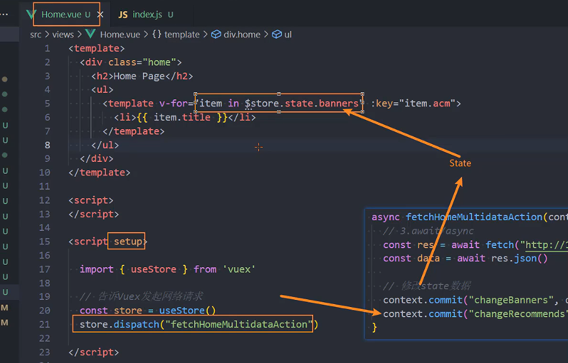

# Vuex

[Vuex 是什么？ | Vuex (vuejs.org)](https://vuex.vuejs.org/zh/)


```sh
npm install vuex@next
```


在开发中，我们会的应用程序需要处理各种各样的数据，这些数据需要保存在我们应用程序中的某一个位置，对于这些数据的管理我们就称之为是 **状态管理**。 

我们是如何管理自己的状态呢？

在Vue开发中，我们使用组件化的开发方式；

而在组件中我们定义data或者在setup中返回使用的数据，这些数据我们称之为state； 

在模块template中我们可以使用这些数据，模块最终会被渲染成DOM，我们称之为View； 

在模块中我们会产生一些行为事件，处理这些行为事件时,有可能会修改state，这些行为事件我们称之为actions；


管理不断变化的state本身是非常困难的：
状态之间相互会存在依赖，一个状态的变化会引起另一个状态的变化，View页面也有可能会引起状态的变化；
当应用程序复杂时，state在什么时候，因为什么原因而发生了变化，发生了怎么样的变化，会变得非常难以控制和追踪；
 因此，我们是否可以考虑将组件的内部状态抽离出来，以一个全局单例的方式来管理呢？
在这种模式下，我们的组件树构成了一个巨大的 “视图View”,不管在树的哪个位置，**任何组件都能获取状态或者触发行为**

通过定义和隔离状态管理中的各个概念，并通过**强制性的规则来维护视图和状态间的独立性**，我们的代码边会变得更加结构化和易于维护、跟踪；
这就是Vuex背后的基本思想，它借鉴了Flux、Redux、Elm（纯函数语言，redux有借鉴它的思想）；
 当然，目前Vue官方也在推荐使用Pinia进行状态管理


---

### 基本使用

计数器案例   将 counter抽离到vuex中

```vue
<template>
  <div class="app">
    <h2>App 当前计数：{{ counter }}</h2>
  </div>
</template>
<script setup>
import { ref } from 'vue'
const counter = ref(100)
</script>
```


1. store/index.js

```js
import  { createStore } from 'vuex'

const store = createStore({
  state:() =>({
    counter: 0
  })
})

export default store
```

2. main.js

```js
import { createApp } from 'vue'
import App from './App.vue'
import store from './store'

createApp(App).use(store).mount('#app')

```

3. app.vue

```vue
<template>
  <div class="app">
    <h2>App 当前计数：{{ $store.state.counter }}</h2>
  </div>
</template>
```

4. views/Home.vue

```vue
<template>
  <div class="app">
    <h2>Home 当前计数：{{ $store.state.counter }}</h2>
  </div>
</template>
<script setup>
```

5. app.vue

```vue
<template>
  <div class="app">
    <h2>App 当前计数：{{ $store.state.counter }}</h2>
  </div>
  <br>
  <Home></Home>
</template>
<script setup>
import Home from './views/Home.vue'

</script>
```


一旦绑定了store，在哪个组件都可以使用`$store`

## Store

### 创建Store

**每一个Vuex应用的核心就是store（仓库）：**

store本质上是一个容器，它包含着你的应用中大部分的状态（state）；

**Vuex和单纯的全局对象有什么区别呢？**

第一：Vuex的状态存储是响应式的

当Vue组件从store中读取状态的时候，若store中的状态发生变化，那么相应的组件也会被更新；

 第二：你不能直接改变store中的状态

 改变store中的状态的唯一途径就显示**提交 (commit) mutation**； 

这样使得我们可以方便的跟踪每一个状态的变化，从而让我们能够通过一些工具帮助我们更好的管理应用的状态；

 **使用步骤：**

创建Store对象；

在app中通过插件安装；


### 组件中使用store

- 在模板中使用

  - ```vue
    {{ $store.state.counter }}
    ```

- 在options api中使用，比如computed

  - ```vue
    <script>
      export default{
        computed:{
          storeCounter(){
            return this.$store.state.counter
          }
        }
      }
    </script>
    ```

    

- 在setup中使用

  - ```js
    import { toRefs } from 'vue';
    import { useStore } from 'vuex'
    const store = useStore()
    // const setupCounter = store.state.counter //非响应式
    const { counter } = toRefs(store.state)
    ```


#### 改变组件值

```vue
<button @click="increment">count+1</button>
```

```js
function increment(){
  store.commit("increment")
}
```

store/index.js

```js
const store = createStore({
  state:() =>({
    counter: 0
  }),
  mutations:{
    increment(state){
      state.counter++
    }
  }
})
```


### 单一状态树

**Vuex 使用单一状态树：**

- 用一个对象就包含了全部的应用层级的状态； 
- 采用的是SSOT，Single Source of Truth，也可以翻译成单一数据源；

**这也意味着，每个应用将仅仅包含一个** **store 实例**

- 单状态树和模块化并不冲突，后面我们会讲到module的概念；

**单一状态树的优势：**

- 如果你的状态信息是保存到多个Store对象中的，那么之后的管理和维护等等都会变得特别困难；
- 所以Vuex也使用了单一状态树来管理应用层级的全部状态；
- 单一状态树能够让我们最直接的方式找到某个状态的片段； 
- 而且在之后的维护和调试过程中，也可以非常方便的管理和维护


### 组件获取状态

state/index.js

```js
state:() =>({
    counter: 0,
    name:'hanwu',
    level:100,
    avatarURL:'http://xxxxx'
  }),
```


1. 在模板中直接使用多个状态

```vue
    <h2>name: {{ $store.state.name }}</h2>
    <h2>level: {{ $store.state.level }}</h2>
    <h2>avatar: {{ $store.state.avatarURL }}</h2> 
```

2. 计算属性(映射状态: 数组语法)

```vue
    <h2>name: {{ name }}</h2>
    <h2>level: {{ level }}</h2>
```

```js
import { mapState } from 'vuex'

export default {
  computed: {
    ...mapState({
      sName: state => state.name,
      sLevel: state => state.level
    })
  }
}
```

3. 计算属性(映射状态: 对象语法)

```vue
    <h2>name: {{ sName }}</h2>
    <h2>level: {{ sLevel }}</h2>
```

```js
import { mapState } from 'vuex'

export default {
  computed: {
    ...mapState(["name", "level", "avatarURL"]),// 数组映射可能会与组件数据名字冲突
  }
}
```

4. setup计算属性(映射状态: 对象语法)

```vue
    <h2>name: {{ cName }}</h2>
    <h2>level: {{ cLevel }}</h2>
```

```js
<script setup>
import { computed } from 'vue';
import { mapState, useStore } from 'vuex'

const { name, level } = mapState(["name", "level"])
const store = useStore()
const cName = computed(name.bind({ $store: store }))
const cLevel = computed(level.bind({ $store: store }))
</script>
```

5. 使用自定义hooks/useState  

hooks/useState.js

```js
import { computed } from 'vue'
import { useStore, mapState } from 'vuex'

export default function useState(mapper) {
  const store = useStore()
  const stateFnsObj = mapState(mapper)
  
  const newState = {}
  Object.keys(stateFnsObj).forEach(key => {
    newState[key] = computed(stateFnsObj[key].bind({ $store: store }))
  })

  return newState
}


```

setup计算属性(映射状态: 对象语法)

```vue
    <h2>name: {{ name }}</h2>
    <h2>level: {{ level }}</h2>
```


```js
import useState from '../hooks/useState'

const { name,level } = useState(['name','level'])
```

6. 直接使用useState解构   **推荐** 

```js
  const store = useStore()
  const { name, level } = toRefs(store.state) // 直接解构不是响应式对象，需要toRefs
```

## getters

### getters的基本使用

**某些属性我们可能需要经过变化后来使用，这个时候可以使用getters**

#### 	获取counter的两倍

```js
const store = createStore({
  state: () => ({
    counter: 100,
  }),
  getters: {
    doubleCounter(state) {
      return state.counter * 2
    }
  },
}
```

```vue
<template>
  <div>
    <h2>counter: {{ counter }}</h2>
    <h2>doubleCounter: {{ $store.getters.doubleCounter }}</h2>
  </div>
</template>
<script setup>
import { computed, toRefs } from 'vue'
import { mapState, useStore } from 'vuex'

const store = useStore()
const { counter } = toRefs(store.state)

function incrementLevel() {
  store.state.level++
}

</script>
```


#### 获取用户年龄的和

```js
const store = createStore({
  state: () => ({
    friends: [
      { id: 111, name: 'hanwu', age: 20 },
      { id: 112, name: 'pite', age: 30 },
      { id: 113, name: 'link', age: 15 }
    ]
  }),
  getters: {
    totalAge(state) {
      return state.users.reduce((preValue, item) => preValue + item.age, 0)
    }
  },
}
```

```vue
<h2>friendsTotalAge: {{ $store.getters.totalAge }}</h2>
```

#### 显示一条信息

```vue
<h2>message: {{ $store.getters.message }}</h2>
```

```js
    message(state){
      return `name:${state.name}  level: ${state.level}`
    }
```

### getters第二个参数

显示信息中获取已处理过的值

```js
    message(state, getters) {
      return `name:${state.name}  level: ${state.level}  FriendsTotalAge: ${getters.totalAge}`
    }
```

### getters的返回函数

**getters中的函数本身，可以返回一个函数，那么在使用的地方相当于可以调用这个函数**

```vue
    <!-- 根据id获取某一个朋友的信息 -->
    <h2>id-111的朋友信息: {{ $store.getters.getFriendById(111) }}</h2>
    <h2>id-112的朋友信息: {{ $store.getters.getFriendById(112) }}</h2>
```

```js
    getFriendById(state) {
      // 返回一个函数
      return function (id) {
        return state.friends.find(item => item.id === id)
      }
    }
```


### mapGetters的辅助函数

```vue
<template>
  <div>
    <h2>doubleCounter: {{ doubleCounter }}</h2>
    <h2>friendsTotalAge: {{ totalAge }}</h2>
    <h2>message: {{ message }}</h2>
    <!-- 根据id获取某一个朋友的信息 -->
    <h2>id-111的朋友信息: {{ $store.getters.getFriendById(111) }}</h2>
    <h2>id-112的朋友信息: {{ $store.getters.getFriendById(112) }}</h2>
  </div>
</template>
<script>
import { mapGetters } from 'vuex'

export default {
  computed: {  //  数组形式
    ...mapGetters(['doubleCounter', 'totalAge', 'getFriendById', 'message'])
  }
}
</script>
```

**setup**

1. 一步步解构   不推荐

```js
import { computed } from 'vue';
import { mapGetters, useStore } from 'vuex'
const store = useStore()
const { message: messageFn } = mapGetters(["message"])
const message = computed(messageFn.bind({ $store: store }))
```

2. 推荐

```js
import { computed,toRefs } from 'vue';
import { mapGetters, useStore } from 'vuex'
const store = useStore()
// const { message: messageFn } = mapGetters(["message"])
// const message = computed(messageFn.bind({ $store: store }))
  // 直接解构, 并且包裹成ref
const { message } = toRefs(store.getters)
```

3. 针对某一个getters属性使用computed

```js
  const message = computed(() => store.getters.message)
```


## Mutation

### Mutation基本使用

 更改 Vuex 的 store 中的状态的唯一方法是提交 mutation：

```vue
<template>
  <div>
    <button @click="changeName">修改name</button>
    <h2>Store Name: {{ $store.state.name }}</h2>
  </div>
</template>
<script>
export default {
  methods:{
    changeName(){
      this.$store.commit('changeName')
    }
  }
}
</script>
```

### Mutation携带数据

```js
  mutations: {
	 changeName(state, payload) {
      state.name = payload
    }
  }
```

```js
    changeName(){
      this.$store.commit('changeName','Jack')
    }
```

**数据为对象类型**

```js
  mutations: {   
			changeInfo(state,newValue){
        state.level = newValue.level
        state.name = newValue.name
    }
  }
```

```js
    changeInfo() {
      this.$store.commit('changeInfo', {
        level: 300,
        name: 'lisa'
      })
    }
```


### Mutation常量类型

vue 推荐我们mutation定义常量名字

mutation_type.js

```JS
export const CHANGE_INFO = "changeInfo"
```

state/index.js

```js
import { CHANGE_INFO } from './mutation_type'
...
  mutation:{
      [CHANGE_INFO](state,newValue){
      state.level = newValue.level
      state.name = newValue.name
    }
  }

```

app.vue

```js
changeInfo() {
  this.$store.commit(CHANGE_INFO, {
    level: 300,
    name: 'lisa'
  })
}
```


### mapMutations辅助函数

```vue
    <button @click="changeName('lisa')">修改name</button>
    <button @click="changeInfo({name:'Jaca',level:50})">修改Info</button>
```

```js
<script>
import { CHANGE_INFO } from '@/store/mutation_type.js'
import { mapMutations } from 'vuex'
export default {
  methods: {
    ...mapMutations(['changeName',CHANGE_INFO])
  }
}
</script>
```

```js
<script setup> 
  // 不推荐
import { useStore } from 'vuex'

const store = useStore()
const mutations = mapMutations(['changeName', CHANGE_INFO])

const newMutitions = {}
Object.keys(mutations).forEach(key => {
  newMutitions[key] = mutations[key].bind({ $store: store })
})
const { changeName,changeInfo } = newMutitions

</script>
```


### mutation重要原则

一条重要的原则就是要记住 **mutation 必须是同步函数**

这是因为devtool工具会记录mutation的日记； 

每一条mutation被记录，devtools都需要捕捉到前一状态和后一状态的快照； 

但是在mutation中执行异步操作，就无法追踪到数据的变化； 

 **所以Vuex的重要原则中要求 mutation必须是同步函数；**

但是如果我们希望在Vuex中发送网络请求的话需要如何操作呢？


## Action

[Action](https://vuex.vuejs.org/zh/guide/actions.html)

Action 类似于 mutation，不同在于：

- Action 提交的是 mutation，而不是直接变更状态。
- Action 可以包含任意异步操作。


这里有一个非常重要的参数context： 

 context是一个和store实例均有相同方法和属性的context对象；
 所以我们可以从其中获取到commit方法来提交一个mutation，或者通过 context.state 和 context.getters 来获取state 和getters；

### 基本使用

Action 通过 `store.dispatch` 方法触发：


```js
  actions: {
    incrementAction(context) {
      context.commit('increment')
    }
  }
```

```js
store.dispatch('incrementAction')
```

```vue
<template>
  <div>
    <h2>当前计数: {{ $store.state.counter }}</h2>
    <button @click="actionBtnClick">发起action修改counter</button>
  </div>
</template>
<script>

export default {
  methods: {
    actionBtnClick(){
      this.$store.dispatch("incrementAction")
    }
  }
}
```

### 携带参数

```js
add(){
	this.$store.dispatch("increment",{count:100})
}
```

对象写法

```js
add(){
	this.$store.dispatch({
		type:'increment',
		count:100
	})
}
```

### Action辅助函数

```js
export default {
  methods: {
    actionBtnClick() {
      this.$store.dispatch("incrementAction")
    },

    ...mapActions(['incrementAction', 'changeNameAction'])
  }
}
```


### 异步操作

我们可以通过让action返回Promise，在Promise的then中来处理完成后的操作；

```js
    fetchHomeMultidataAction(context) {
      // 1.返回Promise, 给Promise设置then
      fetch("http://123.207.32.32:8000/home/multidata").then(res => {
        res.json().then(data => {
          console.log(data)
        })
      })
    }
```

```js
  // 告诉Vuex发起网络请求
  const store = useStore()
  store.dispatch("fetchHomeMultidataAction").then(res => {
    console.log("home中的then被回调:", res)
  })
```

**优化**

```js
// 2.Promise链式调用
    fetchHomeMultidataAction(context) {
      fetch("http://123.207.32.32:8000/home/multidata").then(res => {
        return res.json()
      }).then(data => {
        console.log(data)
      })
    }
```

使用await/async

```js
// 3.await/async
async fetchHomeMultidataAction(context) {
  const res = await fetch("http://123.207.32.32:8000/home/multidata")
  const data = await res.json()
  console.log(data);
}
```


修改数据

```js
state:()=>{
	    // 服务器数据
    banner: [],
    recommends: []
},
 mutations:{
  changeBanners(state,banners){
      state.banners = banners
    }
 },
 actions:{
  async fetchHomeMultidataAction(context) {
      const res = await fetch("http://123.207.32.32:8000/home/multidata")
      const data = await res.json()
      console.log(data);
      context.commit("changeBanners", data.data.banner.list)
    },
 }

```

```vue
    <ul>
      <template v-for="item in $store.state.banners" :key="item.acm">
        <li>{{ item.title }}</li>
      </template>
    </ul>
```




优化promise回调

```js
    fetchHomeMultidataAction(context) {
      return new Promise(async(resolve,reject)=>{
        const res = await fetch("http://123.207.32.32:8000/home/multidata")
        const data = await res.json()
        console.log(data);
        context.commit("changeBanners", data.data.banner.list)
        resolve('获取到数据')
      })
    },
```


 

## Module


**什么是Module？** 

由于使用单一状态树，应用的所有状态会集中到一个比较大的对象，当应用变得非常复杂时，store 对象就有可能变得相当臃肿；

为了解决以上问题，Vuex 允许我们将 store 分割成**模块（module）**； 

每个模块拥有自己的 state、mutation、action、getter、甚至是嵌套子模块；

module/modules/index.js

```js
const counter = {
  namespaced: true,
  state: () => ({
    count: 99
  }),
  mutations: {
    incrementCount(state) {
      console.log(state)
      state.count++
    }
  },
  getters: {
    doubleCount(state, getters, rootState) {
      return state.count + rootState.rootCounter
    }
  },
  actions: {
    incrementCountAction(context) {
      context.commit("incrementCount")
    }
  }
}

export default counter

```

store/index.js

```js
import homeModule from './modules/home'

...

  modules: {
    home: homeModule
  }

...
```


获取数据需要在模块中获取   store.modulename.xxx

```vue
      <template v-for="item in $store.state.home.banners" :key="item.acm">
        <li>{{ item.title }}</li>
      </template>
```

### 局部状态

对于模块内部的 mutation 和 getter，接收的第一个参数是**模块的局部状态对象**

```js
const counter = {
  namespaced: true,
  state: () => ({
    count: 99
  }),
  mutations: {
    incrementCount(state) {
      console.log(state)
      state.count++
    }
  },
  getters: {
    doubleCount(state, getters, rootState) {
      return state.count + rootState.rootCounter
    }
  },
  actions: {
    incrementCountAction(context) {
      context.commit("incrementCount")
    }
  }
}

export default counter

```

### 命名空间

默认情况下，模块内部的action和mutation仍然是注册在全局的命名空间中的：

- 这样使得多个模块能够对同一个 action 或 mutation 作出响应；
- Getter 同样也默认注册在全局命名空间；

 如果我们希望模块具有更高的封装度和复用性，可以添加 namespaced: true 的方式使其成为带命名空间的模块

当模块被注册后，它的所有 getter、action 及 mutation 都会自动根据模块注册的路径调整命名；


