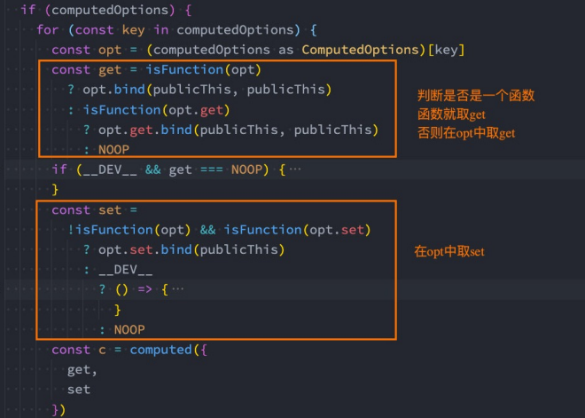

---

# 计算属性

---


**什么是计算属性呢？**

官方并没有给出直接的概念解释；

而是说：对于任何包含响应式数据的复杂逻辑，你都应该使用**计算属性**； 

计算属性将被混入到组件实例中。所有 getter 和 setter 的 this 上下文自动地绑定为组件实例；

计算属性就是当依赖的属性的值发生变化的时候，才会触发他的更改，如果依赖的值，不发生变化的时候，使用的是缓存中的属性值。


### 函数形式

```ts
let price = ref(0)//$0

let m = computed<string>(() => {
  return `$` + price.value
})
```


### 对象形式

```vue
<template>
   <div>{{ mul }}</div>
   <div @click="mul = 100">click</div>
</template>
 
<script setup lang="ts">
import { computed, ref } from 'vue'
let price = ref<number | string>(1)//$0
let mul = computed({
   get: () => {
      return price.value
   },
   set: (value) => {
      price.value = 'set' + value
   }
})
</script>
 
<style>
</style>

```


### 计算属性缓存

- 计算属性会基于它们的依赖关系进行缓存
- 在数据不发生变化时，计算属性是不需要重新计算的
- 如果依赖的数据发生变化，在使用时，计算属性依然会重新进行计算


### 计算属性的setter和getter

计算属性在大多数情况下，只需要一个**getter方法**即可，所以我们会将计算属性直接**写成一个函数**。 

 但是，如果我们确实想**设置计算属性的值**呢？

这个时候我们也可以给计算属性设置一个setter的方法；

```js
fullName: {
  get: function() {
    return this.firstName + " " + this.lastName;
  },
  set: function(newValue) {
    console.log(newValue);
    const names = newValue.split(" ");
    this.firstName = names[0];
    this.lastName = names[1];
  }
}
```

源码对setter和getter的处理




### 购物车案例

```vue
<template>
  <div>
    <table style="width:800px" border>
      <thead>
        <tr>
          <th>名称</th>
          <th>数量</th>
          <th>单价</th>
          <th>价格</th>
          <th>操作</th>
        </tr>
      </thead>
      <tbody>
        <tr :key="index" v-for="(item, index) in data">
          <td align="center">{{ item.name }}</td>
          <td align="center">
            <button @click="AddAnbSub(item, false)">-</button>
            {{ item.num }}
            <button @click="AddAnbSub(item, true)">+</button>
          </td>
          <td align="center">{{ item.price }}</td>
          <td align="center">{{ item.num * item.price }}</td>
          <td align="center">
            <button @click="del(index)">删除</button>
          </td>
        </tr>
      </tbody>
      <tfoot>
        <tr>
          <td></td>
          <td></td>
          <td></td>
          <td align="center">总价:{{ $total }}</td>
        </tr>
      </tfoot>
    </table>
  </div>
</template>

<script setup lang="ts">
import { computed, reactive, ref } from 'vue'
type Shop = {
  name: string,
  num: number,
  price: number
}
let $total = ref<number>(0)
const data = reactive<Shop[]>([
  {
    name: "样品1",
    num: 1,
    price: 100
  },
  {
    name: "样品2",
    num: 1,
    price: 200
  },
  {
    name: "样品3",
    num: 1,
    price: 300
  },
  {
    name: "样品4",
    num: 1,
    price: 400
  }
])

const AddAnbSub = (item: Shop, type: boolean = false): void => {
  if (item.num > 1 && !type) {
    item.num--
  }
  if (item.num <= 99 && type) {
    item.num++
  }
}
const del = (index: number) => {
  data.splice(index, 1)
}


$total = computed<number>(() => {
  return data.reduce((prev, next) => {
    return prev + (next.num * next.price)
  }, 0)
})


</script>

<style>

</style>

```


