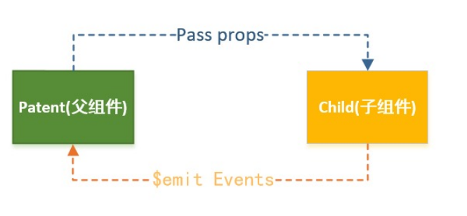
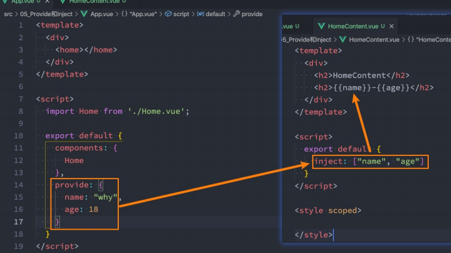
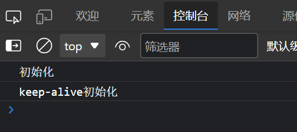
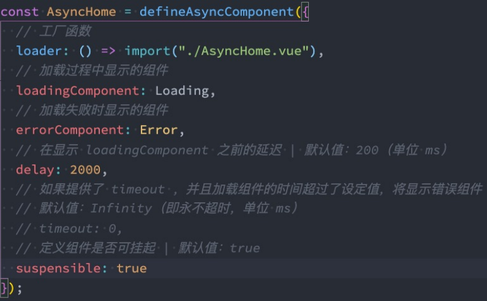

# 组件化开发

---

vue3组件开箱即用，引入后即可使用

```vue
<template>
  <div>App组件</div>

  <A></A>

</template>

<script setup lang='ts'>
import A from './components/A.vue'
</script>
<style lang='less' scoped>
</style>
```

## 组件通信


### 父子组件通信


父组件传递给子组件：**通过props属性**； 

子组件传递给父组件：**通过$emit触发事件**；




#### 什么是Props

Props是你可以在组件上注册一些自定义的`attribute`； 

父组件给这些attribute赋值，子组件通过attribute的名称获取到对应的值； 

Props有两种常见的用法：

- 方式一：字符串数组，数组中的字符串就是attribute的名称；

  - ```js
    export default {
        props: ['title', 'content']
    }    
    ```

    

- 方式二：对象类型，对象类型我们可以在指定attribute名称的同时，指定它需要传递的类型、是否是必须的、默认值等等

```js
props: {
  title: String,
  content: {
    type: String,
    required: true,
    default: "123"
  }
}  
```

::: type的类型可以是哪些？

String、Number、Boolean、Array、Object、Date、Function、Symbol

:::


#### 子传父

```js
 // emits: ["add", "sub", "addN"],
 // 对象写法的目的是为了进行参数的验证
 emits: {
   add: null,
   sub: null,
   addN: (num, name, age) => {
     console.log(num, name, age);
     if (num > 10) {
       return true
     }
     return false;
   }
 },
```


---


### 非父子组件通信

#### Provide/Inject

- Provide/Inject用于**非父子组件之间共享数据**： 

  - 比如有一些深度嵌套的组件，子组件想要获取父组件的部分内容； 

  -  在这种情况下，如果我们仍然将props沿着组件链逐级传递下去，就会非常的麻烦；

- 对于这种情况下，**我们可以使用 Provide 和 Inject ：** 
  - 无论层级结构有多深，父组件都可以作为其所有子组件的依赖提供者； 
  - 父组件有一个 provide 选项来提供数据；
  - 子组件有一个 inject 选项来开始使用这些数据；
- 实际上，你可以将依赖注入看作是“**long range props”**，除了：
  -  父组件不需要知道哪些子组件使用它 provide 的 property
  -  子组件不需要知道 inject 的 property 来自哪里



##### 处理响应式数据

computed返回的是一个ref对象，需要取出其中的value来使用

```js
provide() {
  return {
    name: "why",
    age: 18,
    length: computed(() => this.names.length) // ref对象 .value
  }
}
```


#### Mitt全局事件总线

Vue3从实例中移除了 `$on`、`$off` 和 `$once` 方法，所以我们如果希望继续使用全局事件总线，要通过第三方的库


Vue3官方有推荐一些库，例如 [mitt](https://github.com/developit/mitt) 

```sh
npm install mitt -S
```

其次，我们可以封装一个工具`eventbus.js`：

```js
import mitt from 'mitt';
const emitter = mitt();
export default emitter;

```

1.中监听事件

```js
    created() {
      emitter.on("why", (info) => {
        console.log("why:", info);
      });
  }
```

2.触发事件

```js
emitter.emit("why", {name: "why", age: 18});
```

监听所有类型

​	type 类型  info数据

```js
emitter.on('*',type,info)
```


在某些情况下我们可能希望**取消掉之前注册的函数监听**

```js
emitter.all.clear() // 取消所有监听
function onFoo(){}
emitter.on('foo',onFoo)  // 监听
emitter.off('foo',onFoo)  // 取消监听

```

### ts下使用mitt

```ts
// main.ts
import { createApp } from 'vue'
import App from './App.vue'
import mitt from 'mitt'
 
const Mit = mitt()
 
//TypeScript注册
// 由于必须要拓展ComponentCustomProperties类型才能获得类型提示
declare module "vue" {
    export interface ComponentCustomProperties {
        $Bus: typeof Mit
    }
}
 
const app = createApp(App)
 
//Vue3挂载全局API
app.config.globalProperties.$Bus = Mit
 
app.mount('#app')
```

A组件派发

```vue
<template>
    <div>
        <h1>我是A</h1>
        <button @click="emit1">emit1</button>
    </div>
</template>
 
<script setup lang='ts'>
import { getCurrentInstance } from 'vue'
const instance = getCurrentInstance();
const emit1 = () => {
    instance?.proxy?.$Bus.emit('on-num', 100)
}
</script>
 
<style>
</style>
```

B组件监听

```vue
<template>
    <div>
        <h1>我是B</h1>
    </div>
</template>
 
<script setup lang='ts'>
import { getCurrentInstance } from 'vue'
const instance = getCurrentInstance()
instance?.proxy?.$Bus.on('on-num', (num) => {
    console.log(num,'===========>B')
})
</script>
 
<style>
</style>
```

监听所有事件

```ts
instance?.proxy?.$Bus.on('*',(type,num)=>{
    console.log(type,num,'===========>B')
})
```

移出监听事件

```ts
const Fn = (num: any) => {
    console.log(num, '===========>B')
}
instance?.proxy?.$Bus.on('on-num',Fn)//listen
instance?.proxy?.$Bus.off('on-num',Fn)//unListen
```

清空所有监听

```ts
instance?.proxy?.$Bus.all.clear() 
```


## TS 传值

### 父子组件传值

传递字符串类型可直接传，传递非字符串类型需要加 v-bind

```vue
<template>
  <div class="layout">
    <div>
      <Menu :data="data" title="标题"></Menu>

    </div>
    <div class="layout-right">
      <Header></Header>
      <Content></Content>
    </div>
  </div>
```

```ts
const data = reactive<number[]>([1, 2, 3])
```

子组件接受值

通过`defineProps `来接受 `defineProps`是无须引入的直接使用即可

如果我们使用的TypeScript可以使用传递字面量类型的纯类型语法做为参数

```ts
//ts独有
type Props = {
  title: string
  data: number[]
}
defineProps<Props>()
```

```js
// js 
defineProps({
    title:{
        default:"",
        type:string
    },
    data:Array
})
```


### 子组件向父组件传值

我们在子组件绑定了一个click 事件 然后通过defineEmits 注册了一个自定义事件

点击click 触发 emit 去调用我们注册的事件 然后传递参数

```vue
<template>
    <div class="menu">
        <button @click="clickTap">派发给父组件</button>
    </div>
</template>
 
<script setup lang="ts">
import { reactive } from 'vue'
const list = reactive<number[]>([4, 5, 6])
 
const emit = defineEmits(['on-click'])
const clickTap = () => {
    emit('on-click', list)
}
</script>
```

父组件

```vue
<Menu @on-click="getList" :data="data" title="标题"></Menu>
```

```ts
const getList = (list: number[]) => {
  console.log(list, '父组件接收子组件的值');
}
```


### 子组件暴露给父组件内部属性

父

```vue
 <Menu ref="menus" @on-click="getList" :data="data" title="标题"></Menu>
```

```ts
const menus = ref(null)
const getList = (list: number[]) => {
  console.log(menus.value)
  console.log(list, '父组件接收子组件的值');
}
```

子

```ts
defineExpose({
  list
})
```


### 子组件接收值时设置默认值

加 `?`表示可以不接收

```ts
type Props = {
  title?: string
  data?: number[]
}
```

数组赋值不可以直接赋值

```ts
withDefaults(defineProps<Props>(), {
  title: '我是默认标题',
  data: () => [1, 2, 3, 4, 5]
})

```


## 插槽

在开发中，我们会经常封装一个个可复用的组件

 前面我们会通过props传递给组件一些数据，让组件来进行展示；

 但是为了让这个组件具备更强的通用性，我们不能将组件中的内容限制为固定的div、span等等这些元素；

 比如某种情况下我们使用组件，希望组件显示的是一个按钮，某种情况下我们使用组件希望显示的是一张图片； 

 我们应该让使用者可以决定某一块区域到底存放什么内容和元素； 


**举个栗子：假如我们定制一个通用的导航组件 - NavBar**

这个组件分成三块区域：左边-中间-右边，每块区域的内容是不固定；

左边区域可能显示一个菜单图标，也可能显示一个返回按钮，可能什么都不显示；

中间区域可能显示一个搜索框，也可能是一个列表，也可能是一个标题，等等；

 右边可能是一个文字，也可能是一个图标，也可能什么都不显示；


**这个时候我们就可以来定义插槽slot：** 

插槽的使用过程其实是抽取共性、预留不同； 

我们会将共同的元素、内容依然在组件内进行封装；

同时会将不同的元素使用slot作为占位，让外部决定到底显示什么样的元素；

 **如何使用slot呢？**

Vue中将 `<slot>` 元素作为承载分发内容的出口；

在封装组件中，使用特殊的元素`<slot>`就可以为封装组件开启一个插槽； 

该插槽插入什么内容取决于父组件如何使用；


### 插槽的基本使用

我们一个组件MySlotCpn.vue：该组件中有一个插槽，我们可以在插槽中放入需要显示的内容；

我们在App.vue中使用它们：我们可以插入普通的内容、html元素、组件元素，都可以是可以的；

```html
 <h2>组件开始</h2>
 <slot>
 </slot>
 <h2>组件结束</h2>
```

### 具名插槽

不带name的`<slot>`，默认名字是‘default’


```vue
    <div>
        <slot name="header"></slot>
        <slot></slot>
 
        <slot name="footer"></slot>
    </div>
```

```vue
        <Dialog>
            <template v-slot:header>
               <div>1</div>
           </template>
           <template v-slot>
               <div>2</div>
           </template>
           <template v-slot:footer>
               <div>3</div>
           </template>
        </Dialog>
```

### 插槽简写

```vue
        <Dialog>
            <template #header>
               <div>1</div>
           </template>
           <template #default>
               <div>2</div>
           </template>
           <template #footer>
               <div>3</div>
           </template>
        </Dialog>
```

### 作用域插槽

在子组件动态绑定参数 派发给父组件的slot去使用

```vue
    <main class="main">
      <div v-for="item in data">
        <slot :data="item"></slot>
      </div>
    </main>
```


```ts
type names = {
  name: string,
  age: number
}

const data = reactive<names[]>([
  {
    name: '小明',
    age: 20
  },
  {
    name: '小李',
    age: 15
  },
  {
    name: '小红',
    age: 17
  }
])
```

父组件  解构参数

```vue
  <Dialog>
    <template v-slot="{data}">
      <div>{{data}}</div>
    </template>
  </Dialog>
```

### 动态插槽

插槽可以是一个变量名

```vue
        <Dialog>
            <template #[name]>
                <div>
                    23
                </div>
            </template>
        </Dialog>
```

```ts
const name = ref('header')
```


```vue
    <header class="header">
      <slot name="header"></slot>
    </header>
    <main class="main">
    </main>
    <footer class="footer">
      <slot name="footer"></slot>
    </footer>
```


## 动态组件


什么是动态组件 就是：让多个组件使用同一个挂载点，并动态切换，这就是动态组件。

在挂载点使用`component`标签，然后使用`v-bind:is=”组件”`


```vue
<template>
  <div class="content">

    <div class="tab">
      <div v-for="item in data" :key="item.name">{{item.name}}</div>


    </div>
    <component :is="current.comName"></component>


  </div>
</template>
<script setup lang='ts'>

import { reactive, ref, markRaw, toRaw } from 'vue'
import A from './A.vue'
import B from './B.vue'
import C from './C.vue'

type Tabs = {
  name: string,
  comName: any
}

// Pick  从一组键中收集属性  收集conName属性
type Com = Pick<Tabs, 'comName'>

const data = reactive<Tabs[]>([
  {
    name: '我是A组件',
    comName: A
  }, {
    name: '我是B组件',
    comName: B
  }, {
    name: '我是C组件',
    comName: C
  },
])

let current = reactive<Com>({
  comName: data[0].comName
})

</script>
<style lang='less' scoped>
.content {
  flex: 1;
  margin: 20px;
  border: 1px solid #ccc;
  overflow: auto;
  .tab {
    display: flex;
    padding: 5px;

    div {
      margin: 10px;
      border: 1px solid #ccc;
    }
  }
}
</style>
```


::: warning

runtime-core.esm-bundler.js:38 [Vue warn]: Vue received a Component which was made a reactive object.  This can lead to unnecessary performance overhead, and should be avoided by marking the component with `markRaw` or using `shallowRef` instead of `ref`. Component that was made reactive

[Vue warn]: Vue接收到一个组件，该组件被设置为响应对象。这可能会导致不必要的性能开销，应该通过使用' markRaw '标记组件或使用' shallowRef '而不是' ref '来避免。

:::

这是因为reactive 会进行`proxy `代理 

而我们组件代理之后毫无用处 节省性能开销 推荐我们使用shallowRef 或者 markRaw 跳过proxy 代理

```ts
const data = reactive<Tabs[]>([
  {
    name: '我是A组件',
    comName: markRaw(A)
  }, {
    name: '我是B组件',
    comName: markRaw(B)
  }, {
    name: '我是C组件',
    comName: markRaw(C)
  },
])
```


### 实现动态组件

```vue
<div @click="switchCom(item)" v-for="item in data" :key="item.name">{{item.name}}</div>
```

```ts
const switchCom = (item: Tabs) => {
  current.comName = item.comName
}
```


## keep-alive

有时候我们不希望组件被重新渲染影响使用体验；或者处于性能考虑，避免多次重复渲染降低性能。而是希望组件可以缓存下来,维持当前的状态。这时候就需要用到`keep-alive`组件。

```vue
<template>
  <el-button type="primary" @click="flag = !flag">切换组件</el-button>
  <div>
    <A v-if="flag"></A>
    <B v-else></B>
  </div>
</template>

<script setup lang='ts'>
import A from "./components/A/index.vue";
import B from "./components/B/index.vue";
import { reactive, ref } from 'vue'

let flag = ref<boolean>(true)


</script>
<style lang='less' scoped>
html,
body,
#app {
  height: 100%;
  overflow: hidden
}
</style>
```


在A B 两个组件表单中写入值后，点击切换组件后，组件会被重置

将组件包裹在`<KeepAlive>`中则切换组件时不会重置值

```vue
    <KeepAlive>
      <A v-if="flag"></A>
      <B v-else></B>
    </KeepAlive>
```


### 指定缓存

```vue
    <keep-alive :include="['A','B']">
      <A v-if="flag"></A>
      <B v-else></B>
    </keep-alive>
```

注意：设置`:include` `:exclude`时，组件需要导出`name`属性

```ts
<script lang="ts">
export default{
  name:'A'
}

</script>
```

### 排除缓存

```vue
    <keep-alive :exclude="['A','B']">
      <A v-if="flag"></A>
      <B v-else></B>
    </keep-alive>
```


### 指定缓存组件数量

​	假设有十一个组件，vue3会剔除一个不活跃不常用的组件

```vue
    <keep-alive :max="10">
      <A v-if="flag"></A>
      <B v-else></B>
    </keep-alive>
```


### keep-alive生命周期

```ts
onMounted(() => {
  console.log("初始化")
})


onActivated(() => {
  console.log("keep-alive初始化")
})


onDeactivated(() => {
  console.log("keep-alive卸载")
})


onUnmounted(() => {
  console.log("卸载")
})

```





## 异步组件


在大型应用中，我们可能需要将应用分割成小一些的代码块 并且减少主包的体积

这时候就可以使用异步组件

`<script setup> `中可以使用顶层 `await`。结果代码会被编译成` async setup()`


```html
<script setup>
const post = await fetch(`/api/post/1`).then(r => r.json())
</script>
```

父组件引用子组件 通过`defineAsyncComponent`加载异步配合`import `函数模式便可以分包

```ts
<script setup lang="ts">
import { reactive, ref, markRaw, toRaw, defineAsyncComponent } from 'vue'
 
const Dialog = defineAsyncComponent(() => import('../../components/Dialog/index.vue'))
```


写法二：




### suspense

组件有两个插槽。它们都只接收一个直接子节点。`default` 插槽里的节点会尽可能展示出来。如果不能，则展示 `fallback` 插槽里的节点。

```vue
     <Suspense>
            <template #default>
                <A></A>
            </template>
 
            <template #fallback>
                <div>loading...</div>
            </template>
        </Suspense>
```


## `$ref` `$parent` `$root`

`$ref` 

给元素或者组件绑定一个ref属性后，该组件实例有一个$refs属性：

​	它一个对象Object，持有注册过 ref attribute 的所有 DOM 元素和组件实例


 `$parent` 

​	访问父元素

`$root`

访问根级元素


