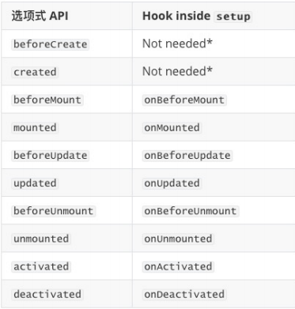

# 生命周期
**什么是生命周期呢？**

- 每个组件都可能会经历从创建、挂载、更新、卸载等一系列的过程； 
- 在这个过程中的某一个阶段，用于可能会想要添加一些属于自己的代码逻辑（比如组件创建完后就请求一些服务器数据）；
- 但是我们如何可以知道目前组件正在哪一个过程呢？Vue给我们提供了组件的生命周期函数； 

 **生命周期函数：**

- 生命周期函数是一些钩子函数，在某个时间会被Vue源码内部进行回调； 
- 通过对生命周期函数的回调，我们可以知道目前组件正在经历什么阶段； 
- 那么我们就可以在该生命周期中编写属于自己的逻辑代码了；

### ts

setup 可以用来替代 data 、 methods 、 computed 、watch 等等这些选项，也可以替代 生命周期钩子

onX 函数注册生命周期钩子

setup….

onBeforeMount   读取不到dom  

onMounted     可以读取dom

onBeforeUpdate

onUpdated

onBeforeUnmout

onUnmounted

