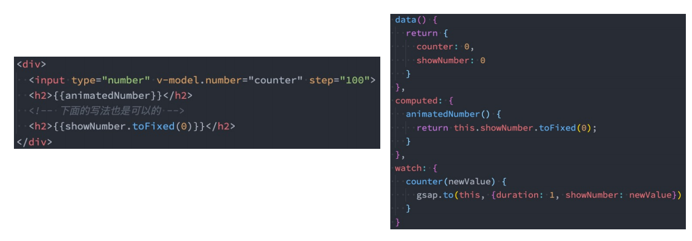

# 过渡与动画

---


Vue 提供了 transition 的封装组件，可以给任何元素和组件添加进入/离开过渡

```vue
<template>
  <div class="content">
    <el-button @click="flag = !flag" type="primary">switch</el-button>
    <div v-if="flag" class="box"></div>
  </div>

</template>
<script setup lang='ts'>
import { ref } from 'vue';
const flag = ref<boolean>(true)

</script>
<style lang="less" scoped>
.box {
  width: 200px;
  height: 200px;
  background-color: red;
}
</style>
```

此时切换显示和隐藏是非常生硬的，将元素用`<transition>`包裹起来

自定义名字为 `fade`

```vue
    <el-button @click="flag = !flag" type="primary">switch</el-button>
    <transition name="fade">
      <div v-if="flag" class="box"></div>
    </transition>
```


### 过渡的类名

在进入/离开的过渡中，会有 6 个 class 切换。

- `v-enter-from`：定义进入过渡的开始状态。在元素被插入之前生效，在元素被插入之后的下一帧移除。

- `v-enter-active`：定义进入过渡生效时的状态。在整个进入过渡的阶段中应用，在元素被插入之前生效，在过渡/动画完成之后移除。这个类可以被用来定义进入过渡的过程时间，延迟和曲线函数。

- `v-enter-to`：定义进入过渡的结束状态。在元素被插入之后下一帧生效 (与此同时 v-enter-from 被移除)，在过渡/动画完成之后移除。

- `v-leave-from`：定义离开过渡的开始状态。在离开过渡被触发时立刻生效，下一帧被移除。

- `v-leave-active`：定义离开过渡生效时的状态。在整个离开过渡的阶段中应用，在离开过渡被触发时立刻生效，在过渡/动画完成之后移除。这个类可以被用来定义离开过渡的过程时间，延迟和曲线函数。

- `v-leave-to`：离开过渡的结束状态。在离开过渡被触发之后下一帧生效 (与此同时 v-leave-from 被移除)，在过渡/动画完成之后移除。


```css
//开始过度
.fade-enter-from{
   background:red;
   width:0px;
   height:0px;
   transform:rotate(360deg)
}
//开始过度了
.fade-enter-active{
  transition: all 2.5s linear;
}
//过度完成
.fade-enter-to{
   background:yellow;
   width:200px;
   height:200px;
}
//离开的过度
.fade-leave-from{
  width:200px;
  height:200px;
  transform:rotate(360deg)
}
//离开中过度
.fade-leave-active{
  transition: all 1s linear;
}
//离开完成
.fade-leave-to{
  width:0px;
   height:0px;
}
```


### 自定义css类名

```vue
    <transition enter-from-class="e-flom">
      <div v-if="flag" class="box"></div>
    </transition>
```


### 同时设置过渡与动画


Vue为了知道过渡的完成，内部是在监听 `transitionend `或 `animationend`，到底使用哪一个取决于元素应用的CSS规则： 

如果我们只是使用了其中的一个，那么Vue能**自动识别类型并设置监听**； 

 但是如果我们同时使用了过渡和动画呢？

并且在这个情况下可能某一个动画执行结束时，另外一个动画还没有结束； 

在这种情况下，我们可以设置 type 属性为 `animation `或者 `transition `来明确的告知Vue监听的类型；


```vue
    <transition type="transition" enter-from-class="e-flom">
      <div v-if="flag" class="box"></div>
    </transition>
```


### 结合animate.css 使用

[Animate.css](https://animate.style/)

```shell
 npm install animate.css --save
```

```ts
import 'animate.css';
```


```vue
    <transition name="fade" leave-active-class="animate__animated animate__shakeX"
      enter-active-class="animate__animated animate__shakeY">
      <div v-if="flag" class="box"></div>
    </transition>
```


### 设置动画时长

```vue
<transition :duration="50"></transition>
```

单独设置

```vue
<transition :duration="{enter:50,leacve:500}"></transition>
```


### 过渡模式mode

默认情况下进入和离开的动画是**同时**发生的，这会发生两个状态是同时存在的画面

不希望同时执行进入和离开的动画，那么我们需要设置`transtion`的过渡模式

- `in-out`: 新元素先进行过渡，完成之后当前元素过渡离开；
- ` out-in`: 当前元素先进行过渡，完成之后新元素过渡进入；

```vue
<transtion mode="in-out" ><transtion />
```


### 生命周期

当只用 JavaScript 过渡的时候，在 **`enter` 和 `leave` 钩子中必须使用 `done` 进行回调**

```ts
  @before-enter="beforeEnter" //对应enter-from
  @enter="enter"//对应enter-active
  @after-enter="afterEnter"//对应enter-to
  @enter-cancelled="enterCancelled"//显示过度打断
  @before-leave="beforeLeave"//对应leave-from
  @leave="leave"//对应enter-active
  @after-leave="afterLeave"//对应leave-to
  @leave-cancelled="leaveCancelled"//离开过度打断
```


### appear

默认情况下，**首次渲染的时候是没有动画的**，如果我们**希望给他添加上去动画，那么就可以增加另外一个属性**

**appear**

通过这个属性可以设置初始节点过度 就是页面加载完成就开始动画 对应三个状态

```ts
appear-active-class=""
appear-from-class=""
appear-to-class=""
appear
```

```vue
    <transition appear-active-class="animate__animated  animate__bounceIn" appear>
```


### Js钩子

在使用动画之前，我们先来看一下**transition组件给我们提供的JavaScript钩子**，这些钩子可以帮助我们监听动画执行什么阶段了。 

- 当我们使用JavaScript来执行过渡动画时，需要**进行 done 回调**，否则它们将会被同步调用，过渡会立即完成。 

- 添加 **:css="false"**，也会让 Vue 会**跳过 CSS 的检测**，除了性能略高之外，这可以避免过渡过程中 CSS 规则的影响


## transition-group过渡列表

目前为止，过渡动画我们只要是**针对单个元素或者组件**的,要么是单个节点 ,要么是同一时间渲染多个节点中的一个

那么如果希望渲染的是**一个列表**，并且**该列表中添加删除数据也希望有动画执行**呢？

这个时候我们要使用 `<transition-group>` 组件来完成；

 **使用`<transition-group>` 有如下的特点：**

- 默认情况下，它不会渲染一个元素的包裹器，但是你可以指定一个元素并以 tag attribute 进行渲染； 
- 过渡模式不可用，因为我们不再相互切换特有的元素；
- 内部元素总是需要提供唯一的 key attribute 值； 
- CSS 过渡的类将会应用在内部的元素中，而不是这个组/容器本身


```vue
<template>
  <div class="content">

    <button @click="add">ADD</button>
    <button @click="pop">POP</button>

    <div class="wraps">
      <TransitionGroup leave-active-class="animate__animated animate__zoomOutDown"
        enter-active-class="animate__animated animate__slideInDown">
        <div class="item" :key="item" v-for="item in list">{{item}}</div>
      </TransitionGroup>
    </div>

  </div>

</template>
<script setup lang='ts'>
import 'animate.css';
import { ref, reactive } from 'vue';
const flag = ref<boolean>(true)

const list = reactive<number[]>([1, 2, 3, 4, 5, 6])


const add = () => {
  list.push(list.length + 1)
}
const pop = () => {
  list.pop()
}


</script>
<style lang="less" scoped>
.wraps {
  display: flex;
  flex-wrap: wrap;
  word-break: break-all; //自动换行

  border: 1px solid #ccc;

  .item {
    margin: 10px;
  }

}
</style>
```

### 列表的移动过渡


```ts
new Array(81)
```


```ts
Array.apply(null, { length: 81 } )
```


[分析Array.apply(null, { length: 20 })](https://blog.csdn.net/qq_35430000/article/details/115332139)


```ts
let list = ref(Array.apply(null, { length: 81 } as number[]).map((_, index) => {
  return {
    id: index,
    number: (index % 9) + 1
  }
}))

console.log(list.value)
```


```ts
let list = ref(Array(81).fill(undefined).map((_, index) => {
  return {
    id: index,
    number: (index % 9) + 1
  }
}))

console.log(list.value)
```


---

[Lodash 中文文档)](https://www.lodashjs.com/)

[lodash.shuffle](https://www.lodashjs.com/docs/lodash.shuffle#_shufflecollection)


```vue
<template>
  <div>
    <button @click="shuffle">Shuffle</button>
    <transition-group class="wraps" name="mmm" tag="ul">
      <li class="cell" v-for="item in list" :key="item.id">{{ item.number }}</li>
    </transition-group>
  </div>

</template>
<script setup lang='ts'>
import 'animate.css';
import { ref, reactive } from 'vue';
import _ from 'lodash'

// 创建一个9行9列的数组 值为undefin   转为map集合，自动赋值
let list = ref(Array(81).fill(undefined).map((_, index) => {
  return {
    id: index,
    number: (index % 9) + 1
  }
}))
// 将集合随机打乱
const shuffle = () => {
  list.value = _.shuffle(list.value)
}


console.log(list.value)

</script>
<style lang="less" scoped>
.wraps {
  display: flex;
  flex-wrap: wrap;
  width: calc(25px * 10 + 9px);

  .cell {
    width: 25px;
    height: 25px;
    border: 1px solid #ccc;
    list-style-type: none;
    display: flex;
    justify-content: center;
    align-items: center;
  }
}

.mmm-move {
  transition: transform 0.8s ease;
}
</style>
```


### 状态过渡-gasp数字变化

使用gsap给数字添加过渡动画

```sh
npm install gsap -S
```


```vue
<template>
  <div>
      <input step="20" v-model="num.current" type="number" />
      <div>{{ num.tweenedNumber.toFixed(0) }}</div>
  </div>
</template>
  
<script setup lang='ts'>
import { reactive, watch } from 'vue'
import gsap from 'gsap'
const num = reactive({
  tweenedNumber: 0,
  current:0
})

watch(()=>num.current, (newVal) => {
  gsap.to(num, {
      duration: 1,
      tweenedNumber: newVal
  })
})

</script>
  
<style>
</style>
```





### 列表交替动画

注：给li元素绑定`:data-index`后，gsap元素`el.dataset`会获取值


```vue
<template>
  <div>
    <input v-model="keyword">
    <transition-group tag="ul" name="why" :css="false"
                      @before-enter="beforeEnter"
                      @enter="enter"
                      @leave="leave">
      <li v-for="(item, index) in showNames" :key="item" :data-index="index">
        {{item}}
      </li>
    </transition-group>
  </div>
</template>

<script>
  import gsap from 'gsap';

  export default {
    data() {
      return {
        names: ["abc", "cba", "nba", "why", "lilei", "hmm", "kobe", "james"],
        keyword: ""
      }
    },
    computed: {
      showNames() {
        return this.names.filter(item => item.indexOf(this.keyword) !== -1)
      }
    },
    methods: {
      beforeEnter(el) {
        el.style.opacity = 0;
        el.style.height = 0;
      },
      enter(el, done) {
        gsap.to(el, {
          opacity: 1,
          height: "1.5em",
          delay: el.dataset.index * 0.5,
          onComplete: done
        })
      },
      leave(el, done) {
        gsap.to(el, {
          opacity: 0,
          height: 0,
          delay: el.dataset.index * 0.5,
          onComplete: done
        })
      }
    }
  }
</script>

<style scoped>
  /* .why-enter-from,
  .why-leave-to {
    opacity: 0;
  }

  .why-enter-active,
  .why-leave-active {
    transition: opacity 1s ease;
  } */
</style>
```


